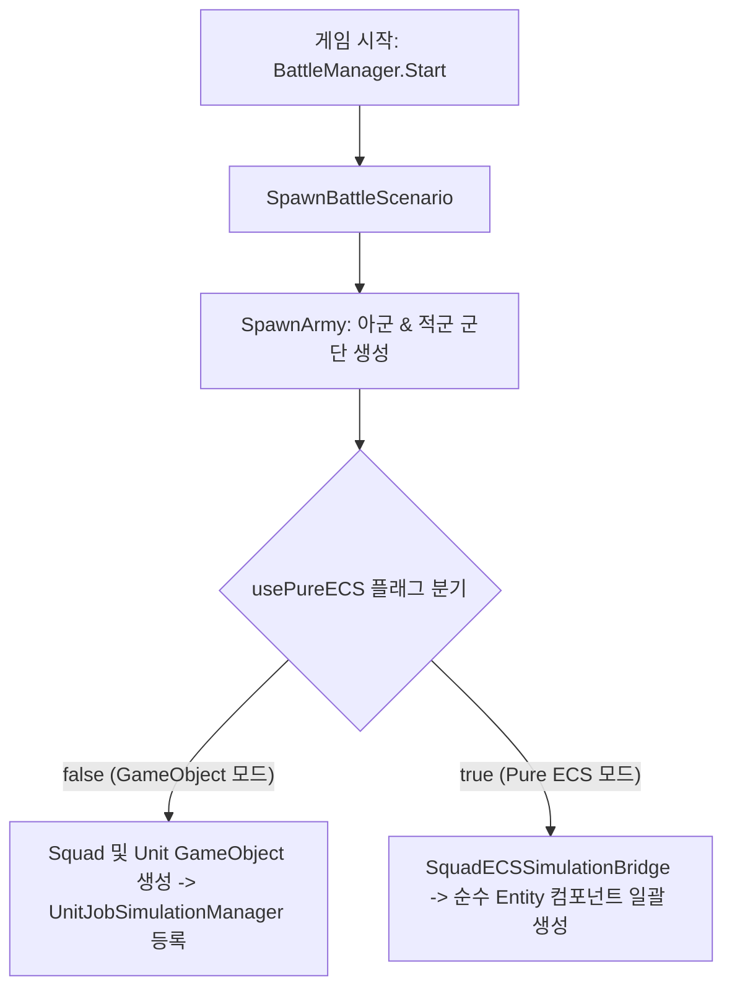

# 🚩 [BattleManager.cs] 전장 시나리오 & 군단 스폰 매니저 가이드

> **원본 소스 파일**: [BattleManager.cs](file:///c:/unityProject/MiniTotalWar2D/Assets/Scripts/BattleManager.cs) (총 줄 수: 약 480줄)

---

## 💡 1. 핵심 요약 & 역할
전투 시작 시 아군 및 적군 대규모 군단(Army)을 생성하고, **GameObject 모드 ⇄ Pure ECS 모드 전환 스위치(`usePureECS`) 관리 및 전장 전체 부대 목록 레지스트리** 역할을 수행합니다.

---

## 🌳 2. 아키텍처 트리 맵 (Architecture Tree Map)

- 📁 **1. 생명주기 및 모드 관리 (Lifecycle & Dual Mode)**
  - `Awake()`, `Start()`
  - `usePureECS`: 게임오브젝트 모드 vs 순수 ECS 모드 글로벌 전환 플래그
  - `GetAllSquads()`, `UnregisterSquad()`: 전장 부대 등록/해제 관리
- 📁 **2. 군단 스폰 파이프라인 (Army Spawning Pipeline)**
  - `SpawnBattleScenario()`: 전장 배치 시나리오 총괄 실행
  - `SpawnArmy()`: 진영별(아군/적군) 다중 부대 생성 및 배치
    - GameObject 모드: `Squad` GameObject 및 `Unit` Prefab 인스턴스화
    - Pure ECS 모드: `SquadECSSimulationBridge`를 통한 순수 ECS 엔티티 일괄 스폰
- 📁 **3. 디버그 및 기즈모 (Gizmos & Diagnostics)**
  - `OnDrawGizmosSelected()`, `DrawArmyGizmos()`: 에디터 씬 뷰 배치 프리뷰 박스 렌더링
  - `ResetAllUnitsPhysics()`: 물리 속도 강제 초기화

---

## 🗂️ 3. 해시 테이블 메서드 색인표 (Method Fast-Index Table)

> ⚡ **에이전트 지침**: 코드 수정 전 아래 색인표에서 줄 번호 링크를 확인하고, `view_file`로 해당 범위만 직접 조회하여 작업하십시오.

| 메서드 (Key) | 반환형 / 파라미터 | 핵심 역할 & 기능 요약 (Value) | 호출자 (Callers) | 소스 줄 번호 (Line Range) |
| :--- | :--- | :--- | :--- | :--- |
| `UnregisterSquad` | `void (Squad squad)` | 부대 전멸/해체 시 전체 목록에서 제거 | `Squad.OnDestroy` | [BattleManager.cs#L90-L99](file:///c:/unityProject/MiniTotalWar2D/Assets/Scripts/BattleManager.cs#L90-L99) |
| `SpawnBattleScenario` | `void ()` | 인스펙터 설정에 따른 전장 시나리오 군단 생성 | `Start()` | [BattleManager.cs#L122-L142](file:///c:/unityProject/MiniTotalWar2D/Assets/Scripts/BattleManager.cs#L122-L142) |
| `SpawnArmy` | `void (isPlayer, configs, center, angle)` | 진영별 다중 부대 및 병사 스폰 & 듀얼 모드 분기 | `SpawnBattleScenario` | [BattleManager.cs#L144-L409](file:///c:/unityProject/MiniTotalWar2D/Assets/Scripts/BattleManager.cs#L144-L409) |
| `ResetAllUnitsPhysics` | `void ()` | 전장 모든 유닛의 물리 속도 초기화 | 디버그 / UI | [BattleManager.cs#L411-L434](file:///c:/unityProject/MiniTotalWar2D/Assets/Scripts/BattleManager.cs#L411-L434) |

---

## 🔀 4. 유향 그래프 흐름도 (Data & Call Flow Graph)

---

## ⚙️ 5. 주요 설정 변수 및 인스펙터 옵션 (Inspector Fields)

| 변수명 | 타입 | 기본값 | 설명 |
| :--- | :--- | :--- | :--- |
| `usePureECS` | `bool` | `false` | `true` 시 게임오브젝트 없이 순수 ECS 엔티티로만 시뮬레이션 및 GPU 렌더링 구동 |
| `unitPrefab` | `GameObject` | - | GameObject 모드에서 개별 병사로 생성할 프리팹 (NavMeshAgent 및 콜라이더 포함) |
| `squadPrefab` | `GameObject` | - | 부대 지휘 및 대형 관리를 담당할 `Squad` 루트 프리팹 |
| `unitCount` | `int` | `60` | 부대 기본 병사 수 (60 ~ 200명) |
| `columns` | `int` | `15` | 부대 기본 가로 열 수 |
| `useCustomPosition` | `bool` | `false` | 체크 시 사전 정의된 시나리오 좌표 대신 사용자 지정 좌표에 스폰 |
| `customPosition` | `Vector3` | `(0, 0, 0)` | 사용자 지정 스폰 중심 좌표 |
| `customRotationY` | `float` | `0f` | 사용자 지정 스폰 부대 회전 각도 |

---

## 🛠️ 6. 상세 구현 메커니즘 & 듀얼 모드 아키텍처

### 1. GameObject 모드 (`usePureECS = false`) 스폰 동작
1. `squadPrefab`을 인스턴스화하여 `Squad` 컴포넌트를 획득합니다.
2. 부대 설정(가로 열 수 `columns`, 간격 `spacing`, 진형 형태 `currentFormationType`)을 적용합니다.
3. `unitCount`만큼 `unitPrefab`을 생성하여 `Squad.members`에 등록하고 부대 자식 계층으로 배치합니다.
4. 각 유닛은 `Unit.Start()` 시점에 `UnitJobSimulationManager`에 자동으로 등록되어 C# Job System 멀티코어 시뮬레이션에 참여합니다.

### 2. Pure ECS 모드 (`usePureECS = true`) 스폰 동작
1. 하이어라키에 `Squad`나 `Unit` 게임오브젝트를 일체 생성하지 않습니다.
2. `SquadECSSimulationBridge.Instance`를 통해 순수 Entity를 생성하고, `UnitEntityTag`, `UnitMovementData`, `UnitCombatData`, `UnitSeparationData`, `LocalTransform` 컴포넌트를 주입합니다.
3. GPU Instancing 렌더링 시스템(`UnitMeshInstanceRendererSystem`)을 통해 수만 개의 유닛 메쉬를 단일 드로우 콜로 고속 렌더링합니다.

---

## 🔗 7. 다른 스크립트와의 연동 관계 (Dependencies)

- **[Squad.cs](file:///c:/unityProject/MiniTotalWar2D/Docs/Squad.md)**: 생성된 부대 인스턴스들을 `allSquads` 리스트로 관리
- **[UnitJobSimulationManager.cs](file:///c:/unityProject/MiniTotalWar2D/Docs/UnitJobSimulationManager.md)**: GameObject 모드에서 생성된 모든 유닛의 물리/전투 연산 총괄
- **[SquadECSSimulationBridge.cs](file:///c:/unityProject/MiniTotalWar2D/Assets/Scripts/ECS/SquadECSSimulationBridge.cs)**: Pure ECS 모드 전환 시 엔티티 생성 및 부대 명령 브릿지 역할
- **[PlayerController.cs](file:///c:/unityProject/MiniTotalWar2D/Docs/PlayerController.md)**: `BattleManager.Instance.GetAllSquads()`를 참조하여 전장 전체 부대 탐색 및 명령 전달
