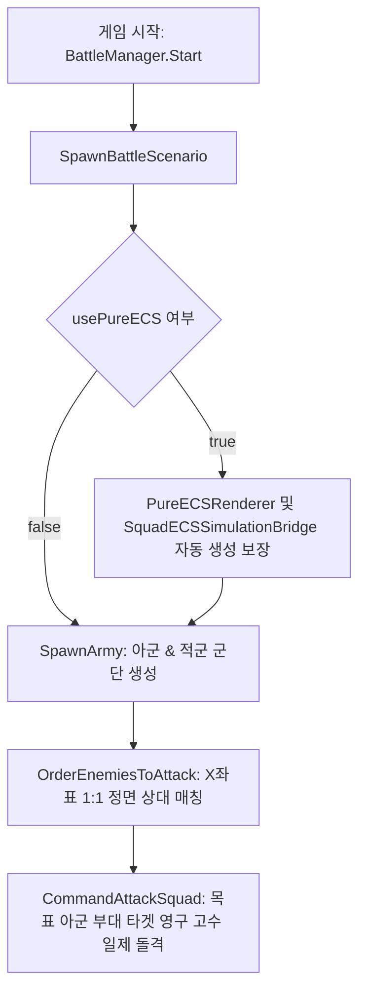

# 🚩 [BattleManager.cs] 전장 시나리오 & 군단 스폰 매니저 가이드

> **원본 소스 파일**: [BattleManager.cs](file:///c:/unityProject/MiniTotalWar2D/Assets/Scripts/BattleManager.cs) (총 줄 수: 약 480줄)

---

## 💡 1. 핵심 요약 & 역할
전투 시작 시 아군 및 적군 대규모 군단(Army)을 생성하고, **GameObject 모드 ⇄ Pure ECS 모드 전환 스위치(`usePureECS`) 관리 및 전장 전체 부대 목록 레지스트리** 역할을 수행합니다.

---

## 🌳 2. 아키텍처 트리 맵 (Architecture Tree Map)

- 📁 **1. 생명주기 및 모드 관리 (Lifecycle & Dual Mode)**
  - `Awake()`, `Start()`
  - `usePureECS`: 게임오브젝트 모드 vs 순수 ECS 모드 글로벌 전환 플래그
  - `GetAllSquads()`, `UnregisterSquad()`: 전장 부대 등록/해제 관리
- 📁 **2. 군단 스폰 및 자동 교전 파이프라인 (Army Spawning & Battle Pipeline)**
  - `SpawnBattleScenario()`: 전장 배치 시나리오 총괄 실행 (순수 ECS 모드 시 `PureECSRenderer` 및 `SquadECSSimulationBridge` 자동 생성 보장)
  - `SpawnArmy()`: 진영별(아군/적군) 다중 부대 생성 및 배치
    - GameObject 모드: `Squad` GameObject 및 `Unit` Prefab 인스턴스화
    - Pure ECS 모드: 순수 ECS 엔티티 일괄 스폰 및 `SquadECSSimulationBridge`를 통한 실시간 동기화
  - `OrderEnemiesToAttack()`: 스폰 직후 아군과 적군 부대를 X좌표 기준으로 1:1 평행 매칭하여 정면 돌격 명령 하달
- 📁 **3. 디버그 및 기즈모 (Gizmos & Diagnostics)**
  - `OnDrawGizmosSelected()`, `DrawArmyGizmos()`: 에디터 씬 뷰 배치 프리뷰 박스 렌더링
  - `ResetAllUnitsPhysics()`: 물리 속도 강제 초기화

---

## 🗂️ 3. 해시 테이블 메서드 색인표 (Method Fast-Index Table)

> ⚡ **에이전트 지침**: 코드 수정 전 아래 색인표에서 줄 번호 링크를 확인하고, `view_file`로 해당 범위만 직접 조회하여 작업하십시오.

| 메서드 (Key) | 반환형 / 파라미터 | 핵심 역할 & 기능 요약 (Value) | 호출자 (Callers) | 소스 줄 번호 (Line Range) |
| :--- | :--- | :--- | :--- | :--- |
| `UnregisterSquad` | `void (Squad squad)` | 부대 전멸/해체 시 전체 목록에서 제거 | `Squad.OnDestroy` | [BattleManager.cs#L90-L96](file:///c:/unityProject/MiniTotalWar2D/Assets/Scripts/BattleManager.cs#L90-L96) |
| `SpawnBattleScenario` | `void ()` | 인스펙터 설정에 따른 전장 군단 생성 & 렌더러/브릿지 보장 | `Start()` | [BattleManager.cs#L122-L148](file:///c:/unityProject/MiniTotalWar2D/Assets/Scripts/BattleManager.cs#L122-L148) |
| `OrderEnemiesToAttack` | `void ()` | 아군/적군 부대 X좌표 정렬 기반 1:1 정면 돌격 명령 하달 | `SpawnBattleScenario` | [BattleManager.cs#L150-L200](file:///c:/unityProject/MiniTotalWar2D/Assets/Scripts/BattleManager.cs#L150-L200) |
| `SpawnArmy` | `void (isPlayer, configs, center, angle)` | 진영별 다중 부대 및 병사 스폰 & 듀얼 모드 분기 (순수 ECS 프리팹 수치 1:1 주입) | `SpawnBattleScenario` | [BattleManager.cs#L202-L440](file:///c:/unityProject/MiniTotalWar2D/Assets/Scripts/BattleManager.cs#L202-L440) |
| `ResetAllUnitsPhysics` | `void ()` | 전장 모든 유닛의 물리 속도 초기화 | 디버그 / UI | [BattleManager.cs#L450-L480](file:///c:/unityProject/MiniTotalWar2D/Assets/Scripts/BattleManager.cs#L450-L480) |

---

## 🔀 4. 유향 그래프 흐름도 (Data & Call Flow Graph)

```mermaid
flowchart TD
    A[게임 시작: BattleManager.Start] --> B[SpawnBattleScenario]
    B --> B1{usePureECS 여부}
    B1 -- true --> B2[PureECSRenderer 및 SquadECSSimulationBridge 자동 생성 보장]
    B1 -- false --> C[SpawnArmy: 아군 & 적군 군단 생성]
    B2 --> C
    C --> D[OrderEnemiesToAttack: X좌표 1:1 정면 상대 매칭]
    D --> E[CommandAttackSquad: 목표 아군 부대 타겟 영구 고수 일제 돌격]
```

---

## ⚙️ 5. 주요 설정 변수 및 인스펙터 옵션 (Inspector Fields)

`BattleManagerEditor.cs` 커스텀 에디터를 통해 유니티 인스펙터에서 100% 직관적인 한국어 라벨과 요약 박스로 시각화됩니다:

| 분류 / 라벨 | 변수명 | 타입 | 기본값 | 상세 설명 |
| :--- | :--- | :--- | :--- | :--- |
| **⚡ 시뮬레이션 모드** | `usePureECS` | `bool` | `false` | `true` 시 게임오브젝트 없이 순수 GPU 인스턴싱 ECS 엔티티로만 5만 기 시뮬레이션 구동 |
| **📦 기본 프리팹** | `playerUnitPrefab` | `GameObject` | - | 아군 기본 근접 보병 프리팹 |
| | `playerMissilePrefab` | `GameObject` | - | 아군 기본 원거리 궁병 프리팹 |
| | `enemyUnitPrefab` | `GameObject` | - | 적군 기본 근접 보병 프리팹 |
| | `enemyMissilePrefab` | `GameObject` | - | 적군 기본 원거리 궁병 프리팹 |
| | `squadPrefab` | `GameObject` | - | 부대 관리자(`Squad`) 루트 프리팹 |
| **📍 진영 스폰 기준** | `playerSpawnCenter` | `Vector3` | `(0, 0, -60)` | 아군 군단 기본 스폰 중심 좌표 (120m 대치 간격) |
| | `playerFacingAngle` | `float` | `0f` | 아군 군단 기본 정면 각도 (0도 = 북쪽 정면) |
| | `enemySpawnCenter` | `Vector3` | `(0, 0, 60)` | 적군 군단 기본 스폰 중심 좌표 (120m 대치 간격) |
| | `enemyFacingAngle` | `float` | `180f` | 적군 군단 기본 정면 각도 (180도 = 남쪽 정면) |
| | `squadSpacing` | `float` | `4.0f` | 군단 횡대 자동 배치 시 인접 부대 간의 가로 여유 간격 (미터) |
| **🛡️ 전역 방진 튜닝** | `overrideSquadFormationSettings` | `bool` | `true` | 체크 시 아래의 전역 방진/산개도 스탯을 전체 부대에 강제 덮어쓰기 |
| | `globalLooseSpacingThreshold` | `float` | `2.2f` | 완전 산개 기준 간격 (이 거리 이상이면 밀집 보너스 0%) |
| | `globalTightSpacingThreshold` | `float` | `0.7f` | 최대 밀집 기준 간격 (이 거리 이하이면 밀집 보너스 100%) |
| | `globalNormalBonus` | `FormationStatModifier` | - | 일반 방진(Normal) 전역 보너스 계수 |
| | `globalWedgeBonus` | `FormationStatModifier` | - | 쐐기진(Wedge) 전역 보너스 계수 (돌격 특화) |
| | `globalSquareBonus` | `FormationStatModifier` | - | 사각방진(Square) 전역 보너스 계수 (방어 특화) |
| | `globalCircleBonus` | `FormationStatModifier` | - | 원형진(Circle) 전역 보너스 계수 (결사항전 특화) |
| | `globalDiamondBonus` | `FormationStatModifier` | - | 마름모진(Diamond) 전역 보너스 계수 (기동 돌파 특화) |
| **🚩 군단 편성 목록** | `playerArmyConfigs` | `List<SquadSpawnConfig>` | 2개 부대 | 아군 군단에 소속될 부대들의 개별 상세 설정 리스트 |
| | `enemyArmyConfigs` | `List<SquadSpawnConfig>` | 2개 부대 | 적군 군단에 소속될 부대들의 개별 상세 설정 리스트 |

### 📋 개별 부대 설정 속성 (`SquadSpawnConfig`)
* `squadName` (부대 명칭): UI 및 로그에 표기될 고유 이름 (예: "제1 보병대", "선봉 창병대")
* `unitType` (병과 종류): `MeleeInfantry`(보병), `SpearInfantry`(창병), `Archer`(궁병), `Cavalry`(기병)
* `unitCount` (총 인원 수): 부대원 수 (기본: 60명, 슬라이더: 1~200명)
* `columns` (가로 열 수): 횡대 열 수 (기본: 15열, 슬라이더: 1~50열)
* `formationType` (초기 진형): `Normal`, `Wedge`, `Square`, `Circle`, `Diamond`
* `useCustomPosition` (수동 좌표 사용 여부): 체크 시 진영 횡대 자동 배치를 건너뛰고 수동 지정 좌표에 스폰
* `customPosition` (수동 스폰 좌표): 월드 X, Y, Z 스폰 좌표
* `customRotationY` (수동 회전 각도): Y축 기준 회전 각도 (0~360도)
* `customUnitPrefab` (커스텀 프리팹): 특수 유닛 배치 시 지정 (미지정 시 진영 기본 프리팹 사용)

---

## 🛠️ 6. 상세 구현 메커니즘 & 듀얼 모드 아키텍처

### 1. GameObject 모드 (`usePureECS = false`) 스폰 동작
1. `squadPrefab`을 인스턴스화하여 `Squad` 컴포넌트를 획득합니다.
2. 부대 설정(가로 열 수 `columns`, 간격 `spacing`, 진형 형태 `currentFormationType`)을 적용합니다.
3. `unitCount`만큼 `unitPrefab`을 생성하여 `Squad.members`에 등록하고 부대 자식 계층으로 배치합니다.
4. 각 유닛은 `Unit.Start()` 시점에 `UnitJobSimulationManager`에 자동으로 등록되어 C# Job System 멀티코어 시뮬레이션에 참여합니다.

### 2. Pure ECS 모드 (`usePureECS = true`) 스폰 동작
1. 하이어라키에 `Squad`나 `Unit` 게임오브젝트를 일체 생성하지 않습니다.
2. `SquadECSSimulationBridge.Instance`를 통해 순수 Entity를 생성하고, `UnitEntityTag`, `UnitMovementData`, `UnitCombatData`, `UnitSeparationData`, `LocalTransform` 컴포넌트를 주입합니다.
3. GPU Instancing 렌더링 시스템(`UnitMeshInstanceRendererSystem`)을 통해 수만 개의 유닛 메쉬를 단일 드로우 콜로 고속 렌더링합니다.

---

## 🔗 7. 다른 스크립트와의 연동 관계 (Dependencies)

- **[Squad.cs](file:///c:/unityProject/MiniTotalWar2D/Docs/Squad.md)**: 생성된 부대 인스턴스들을 `allSquads` 리스트로 관리
- **[UnitJobSimulationManager.cs](file:///c:/unityProject/MiniTotalWar2D/Docs/UnitJobSimulationManager.md)**: GameObject 모드에서 생성된 모든 유닛의 물리/전투 연산 총괄
- **[SquadECSSimulationBridge.cs](file:///c:/unityProject/MiniTotalWar2D/Assets/Scripts/ECS/SquadECSSimulationBridge.cs)**: Pure ECS 모드 전환 시 엔티티 생성 및 부대 명령 브릿지 역할
- **[PlayerController.cs](file:///c:/unityProject/MiniTotalWar2D/Docs/PlayerController.md)**: `BattleManager.Instance.GetAllSquads()`를 참조하여 전장 전체 부대 탐색 및 명령 전달
