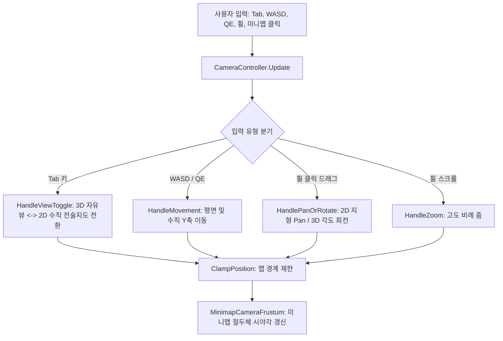

# 🎥 [CameraController.cs] 전장 전술 RTS 카메라 컨트롤러 가이드

> **원본 소스 파일**: [CameraController.cs](file:///c:/unityProject/MiniTotalWar2D/Assets/Scripts/CameraController.cs) (총 줄 수: 318줄)

---

## 💡 1. 핵심 요약 & 역할
토탈워 스타일의 전장 카메라 제어 시스템으로, **WASD 평면 이동, Q/E 수직 고도 조절, Tab키 3D 시점 ↔ 2D 탑다운 전술지도 전환, 마우스 휠 줌, 휠 클릭 궤도 회전/팬, 부대 더블클릭 화면 포커싱 및 맵 경계 제한(Clamping)**을 담당합니다.

---

## 🌳 2. 아키텍처 트리 맵 (Architecture Tree Map)

- 📁 **1. 생명주기 및 초기화 (Initialization)**
  - `Start()`: 메인 카메라 캐싱, 초기 3D/2D 높이 및 각도 백업
  - `Update()`: 시점 전환, 이동, 회전, 줌, 경계 제한 일괄 호출
- 📁 **2. 시점 모드 전환 (`HandleViewToggle`)**
  - `Tab 키`: **3D 자유 쿼터뷰** (기본 고도 5~150m, 피치 10~85도) ↔ **2D 전술지도 탑다운 뷰** (90도 완전 수직, 고도 20~350m) 전환
- 📁 **3. 조작 및 내비게이션 서브시스템 (Navigation Subsystems)**
  - `HandleMovement()`: `WASD` 평면 이동 + `Q/E` 수직 Y축 상승/하강 + `LeftShift` 2배 가속
  - `HandlePanOrRotate()`: 마우스 휠 클릭 드래그 시 (2D 모드: 화면 팬 Pan / 3D 모드: 360도 궤도 회전)
  - `HandleZoom()`: 마우스 휠 스크롤 시 고도 비례 부드러운 줌인/줌아웃
  - `ClampPosition()`: $1000 \times 1000$ 맵 바운드(`minXZ`, `maxXZ`) 및 최소/최대 고도 클램핑
- 📁 **4. 원격 포커싱 및 미니맵 연동 (Focus & Minimap)**
  - `FocusOnPosition(targetPos, dist, smooth)`: 부대 더블클릭 시 0.25초 부드러운 포커싱 코루틴 (`Co_FocusOn`)
  - `PanToWorldXZ(targetXZ, smooth)`: 미니맵 클릭 시 해당 지형 XZ 좌표로 카메라 지면 중심 이동

---

## 🗂️ 3. 해시 테이블 메서드 색인표 (Method Fast-Index Table)

> ⚡ **에이전트 지침**: 코드 수정 전 아래 색인표에서 줄 번호 링크를 확인하고, `view_file`로 해당 범위만 직접 조회하여 작업하십시오.

| 메서드 (Key) | 반환형 / 파라미터 | 핵심 역할 & 기능 요약 (Value) | 호출자 (Callers) | 소스 줄 번호 (Line Range) |
| :--- | :--- | :--- | :--- | :--- |
| `FocusOnPosition` | `void (targetPos, dist, smooth)` | 특정 3D 좌표로 시점 0.25초 부드러운 확대 이동 | `PlayerController` | [CameraController.cs#L75-L102](file:///c:/unityProject/MiniTotalWar2D/Assets/Scripts/CameraController.cs#L75-L102) |
| `PanToWorldXZ` | `void (targetXZ, smooth)` | 미니맵 클릭 시 지형 중심 XZ 좌표로 카메라 이동 | `MinimapManager` | [CameraController.cs#L107-L134](file:///c:/unityProject/MiniTotalWar2D/Assets/Scripts/CameraController.cs#L107-L134) |
| `HandleViewToggle` | `void ()` | `Tab` 키로 3D 뷰 ↔ 2D 탑다운 전술지도 뷰 전환 | `Update` | [CameraController.cs#L163-L194](file:///c:/unityProject/MiniTotalWar2D/Assets/Scripts/CameraController.cs#L163-L194) |
| `HandleMovement` | `void ()` | `WASD` 평면 이동 + `Q/E` 수직 이동 + `Shift` 가속 | `Update` | [CameraController.cs#L199-L243](file:///c:/unityProject/MiniTotalWar2D/Assets/Scripts/CameraController.cs#L199-L243) |
| `HandlePanOrRotate` | `void ()` | 휠 클릭 드래그 시 2D 화면 팬 / 3D 궤도 회전 | `Update` | [CameraController.cs#L248-L286](file:///c:/unityProject/MiniTotalWar2D/Assets/Scripts/CameraController.cs#L248-L286) |
| `HandleZoom` | `void ()` | 마우스 휠 스크롤 고도 비례 줌인/줌아웃 | `Update` | [CameraController.cs#L288-L300](file:///c:/unityProject/MiniTotalWar2D/Assets/Scripts/CameraController.cs#L288-L300) |
| `ClampPosition` | `void ()` | 맵 XZ 경계(-450~450) 및 Y축 고도 제한 | `Update` | [CameraController.cs#L302-L317](file:///c:/unityProject/MiniTotalWar2D/Assets/Scripts/CameraController.cs#L302-L317) |

---

## 🔀 4. 유향 그래프 흐름도 (Data & Call Flow Graph)

---

## ⌨️ 5. 카메라 단축키 및 조작 일람표 (소스 코드 100% 검증)

| 조작 키 / 마우스 | 기능 명칭 | 실제 동작 및 파라미터 |
| :--- | :--- | :--- |
| `W / A / S / D` | 전장 평면 이동 | 전/후/좌/우 카메라 수평 이동 (`moveSpeed = 40f`) |
| `Q / E` | 수직 고도 조절 | `Q`: 카메라 상승(+1), `E`: 카메라 하강(-1) |
| `LeftShift + 이동` | 고속 카메라 이동 | 이동 속도 2배 가속 (`fastMoveMultiplier = 2f`) |
| `Tab 키` | 2D/3D 시점 토글 | 3D 자유 쿼터뷰 ↔ 2D 전술지도 탑다운(90도 수직) 전환 |
| `마우스 휠 클릭 드래그` | 3D 회전 / 2D 팬 | 3D 모드: 360도 궤도 회전 / 2D 모드: 바닥 지형 드래그 팬 |
| `마우스 휠 스크롤` | 카메라 줌 | 고도(Y)에 비례한 부드러운 줌인/줌아웃 (`zoomSpeed = 20f`) |
| `부대 더블클릭` | 부대 시점 포커스 | 0.25초 부드러운 포커싱 확대 (`FocusOnPosition`) |

---

## 🔗 6. 다른 스크립트와의 연동 관계 (Dependencies)

- **[PlayerController.cs](file:///c:/unityProject/MiniTotalWar2D/Docs/PlayerController.md)**: 부대 더블클릭 시 `FocusOnPosition` 호출
- **[MinimapManager.cs](file:///c:/unityProject/MiniTotalWar2D/Docs/Minimap.md)**: 미니맵 클릭 시 `PanToWorldXZ` 호출
- **[MinimapCameraFrustum.cs](file:///c:/unityProject/MiniTotalWar2D/Assets/Scripts/MinimapCameraFrustum.cs)**: 메인 카메라의 변환 좌표를 참조하여 미니맵 시야각 투영
