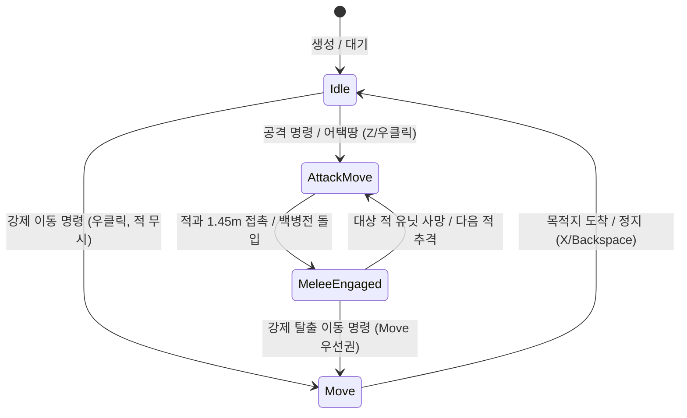

# 📜 [CommandTypes.cs] 전술 명령 & 대형 열거형(Enum) 데이터 사전

> **원본 소스 파일**: [CommandTypes.cs](file:///c:/unityProject/MiniTotalWar2D/Assets/Scripts/CommandTypes.cs) (총 줄 수: 38줄)

---

## 💡 1. 핵심 요약 & 역할
전체 프로젝트에서 공통으로 사용되는 **부대 명령 상태(`UnitCommandState`), 대형 형태(`SquadFormationType`), 부대 전투 태세(`UnitStance`), 우하단 UI 명령 버튼 데이터(`CommandButtonData`)** 등 핵심 공용 열거형(Enum) 및 데이터 클래스 정의 모음집입니다.

---

## 🗂️ 2. 해시 테이블 열거형 및 클래스 색인표 (Fast-Index Table)

> ⚡ **에이전트 지침**: 코드 수정 전 아래 색인표에서 줄 번호 링크를 확인하고, `view_file`로 해당 범위만 직접 조회하여 작업하십시오.

| 타입명 (Key) | 종류 | 멤버 값 및 정의 (Value) | 핵심 역할 & 사용처 | 소스 줄 번호 (Line Range) |
| :--- | :--- | :--- | :--- | :--- |
| `UnitCommandState` | `enum` | `Idle = 0` `Move = 1` `AttackMove = 2` `MeleeEngaged = 3` | 유닛 및 부대의 현재 이동/교전 지휘 상태 | [CommandTypes.cs#L4-L10](file:///c:/unityProject/MiniTotalWar2D/Assets/Scripts/CommandTypes.cs#L4-L10) |
| `UnitStance` | `enum` | `Aggressive = 0` `HoldPosition = 1` | 부대의 공격적 추격 / 제자리 진지 사수 태세 | [CommandTypes.cs#L12-L16](file:///c:/unityProject/MiniTotalWar2D/Assets/Scripts/CommandTypes.cs#L12-L16) |
| `SquadFormationType` | `enum` | `Normal = 0` `Loose = 1` `Diamond = 2` `Wedge = 3` `Square = 4` `Circle = 5` `Line = 6` | 부대의 기하학적 제식 진형 형태 | [CommandTypes.cs#L18-L27](file:///c:/unityProject/MiniTotalWar2D/Assets/Scripts/CommandTypes.cs#L18-L27) |
| `CommandButtonData` | `class` | `commandId`, `buttonName`, `hotkeyText`, `icon`, `onClickAction` | 우하단 `CommandUIManager`에 동적 바인딩되는 UI 버튼 데이터 모델 | [CommandTypes.cs#L29-L38](file:///c:/unityProject/MiniTotalWar2D/Assets/Scripts/CommandTypes.cs#L29-L38) |

---

## 🔀 3. 상태 전이 유향 그래프 (State Transition Graph)

### 1) 부대 명령 상태 (`UnitCommandState`) 전이 흐름

---

## 🔗 4. 다른 스크립트와의 연동 관계 (Dependencies)

- **[Squad.cs](file:///c:/unityProject/MiniTotalWar2D/Docs/Squad.md)**: `currentCommandState`, `currentFormationType`, `currentStance` 변수로 직접 사용
- **[PlayerController.cs](file:///c:/unityProject/MiniTotalWar2D/Docs/PlayerController.md)**: 단축키 입력에 따라 Enum 상태 전이 명령 전달
- **[UnitJobSimulationManager.cs](file:///c:/unityProject/MiniTotalWar2D/Docs/UnitJobSimulationManager.md)**: `UnitJobData.currentState`에 정수형 매핑
- **[CommandUIManager.cs](file:///c:/unityProject/MiniTotalWar2D/Docs/CommandUI.md)**: `CommandButtonData` 리스트를 받아 화면에 동적 버튼 생성
