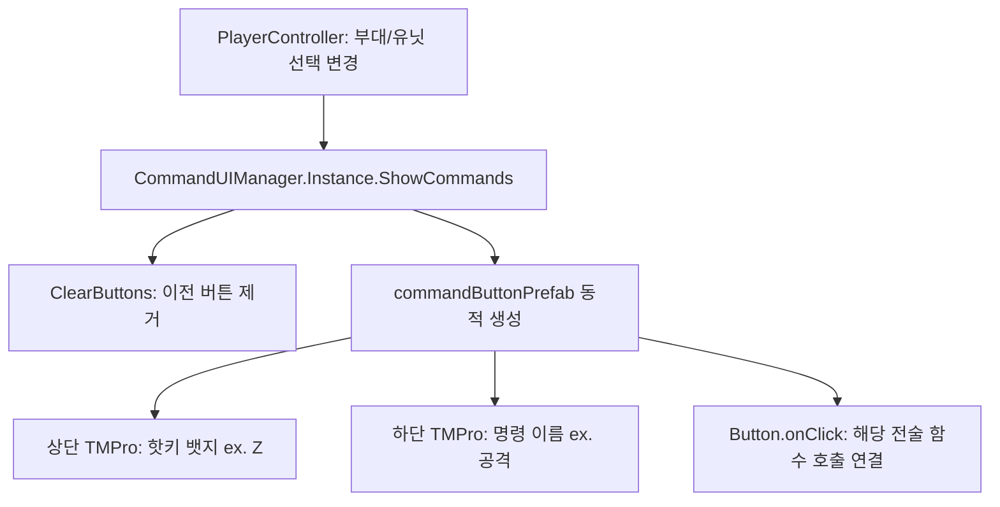

# 🎛️ [CommandUIManager.cs] 우하단 전술 명령 버튼 UI 가이드

> **원본 소스 파일**: [CommandUIManager.cs](file:///c:/unityProject/MiniTotalWar2D/Assets/Scripts/CommandUIManager.cs) (총 줄 수: 125줄)

---

## 💡 1. 핵심 요약 & 역할
유닛 및 부대 선택 시 화면 우측 하단 패널에 **전술 커맨드 버튼(어택, 정지, 산개진, 사각방진 등)을 동적으로 생성하고 핫키(Hotkey) 뱃지와 명령 이름을 표시**하는 싱글톤 UI 매니저입니다.

---

## 🌳 2. 아키텍처 트리 맵 (Architecture Tree Map)

- 📁 **1. 싱글톤 및 초기화 (Singleton & Init)**
  - `Awake()`: 싱글톤 인스턴스 등록 및 `buttonContainer` 자동 바인딩
- 📁 **2. 버튼 동적 렌더링 파이프라인 (Button Rendering)**
  - `ShowCommands(List<CommandButtonData>)`: 전달받은 명령 목록에 따라 프리팹 동적 인스턴스화
    - 버튼 리스너 바인딩 (`btn.onClick.AddListener`)
    - 아이콘 이미지 적용 (`iconImg.sprite = cmd.icon`)
    - 상하 2분할 텍스트 렌더링 (상단: `[Z]` 핫키 뱃지, 하단: `공격` 한글 명령 이름)
  - `ClearButtons()`: 기존 활성화된 버튼 오브젝트 일괄 파괴 및 리스트 클리어

---

## 🗂️ 3. 해시 테이블 메서드 색인표 (Method Fast-Index Table)

> ⚡ **에이전트 지침**: 코드 수정 전 아래 색인표에서 줄 번호 링크를 확인하고, `view_file`로 해당 범위만 직접 조회하여 작업하십시오.

| 메서드 (Key) | 반환형 / 파라미터 | 핵심 역할 & 기능 요약 (Value) | 호출자 (Callers) | 소스 줄 번호 (Line Range) |
| :--- | :--- | :--- | :--- | :--- |
| `Awake` | `void ()` | 싱글톤 등록 및 ButtonContainer 패널 탐색 | Unity Engine | [CommandUIManager.cs#L26-L41](file:///c:/unityProject/MiniTotalWar2D/Assets/Scripts/CommandUIManager.cs#L26-L41) |
| `ShowCommands` | `void (List<CommandButtonData> commands)` | 명령 데이터 리스트를 받아 동적 버튼 UI 일괄 생성 및 핫키 표시 | `PlayerController` | [CommandUIManager.cs#L43-L114](file:///c:/unityProject/MiniTotalWar2D/Assets/Scripts/CommandUIManager.cs#L43-L114) |
| `ClearButtons` | `void ()` | 현재 화면에 표시된 모든 전술 명령 버튼 제거 | `ShowCommands`, `Deselect` | [CommandUIManager.cs#L116-L123](file:///c:/unityProject/MiniTotalWar2D/Assets/Scripts/CommandUIManager.cs#L116-L123) |

---

## 🔀 4. 유향 그래프 흐름도 (Data & Call Flow Graph)

---

## 🔗 5. 다른 스크립트와의 연동 관계 (Dependencies)

- **[PlayerController.cs](file:///c:/unityProject/MiniTotalWar2D/Docs/PlayerController.md)**: 선택된 부대의 명령 가능 목록을 `ShowCommands`로 전달
- **[CommandTypes.cs](file:///c:/unityProject/MiniTotalWar2D/Docs/CommandTypes.md)**: `CommandButtonData` 구조체 참조
