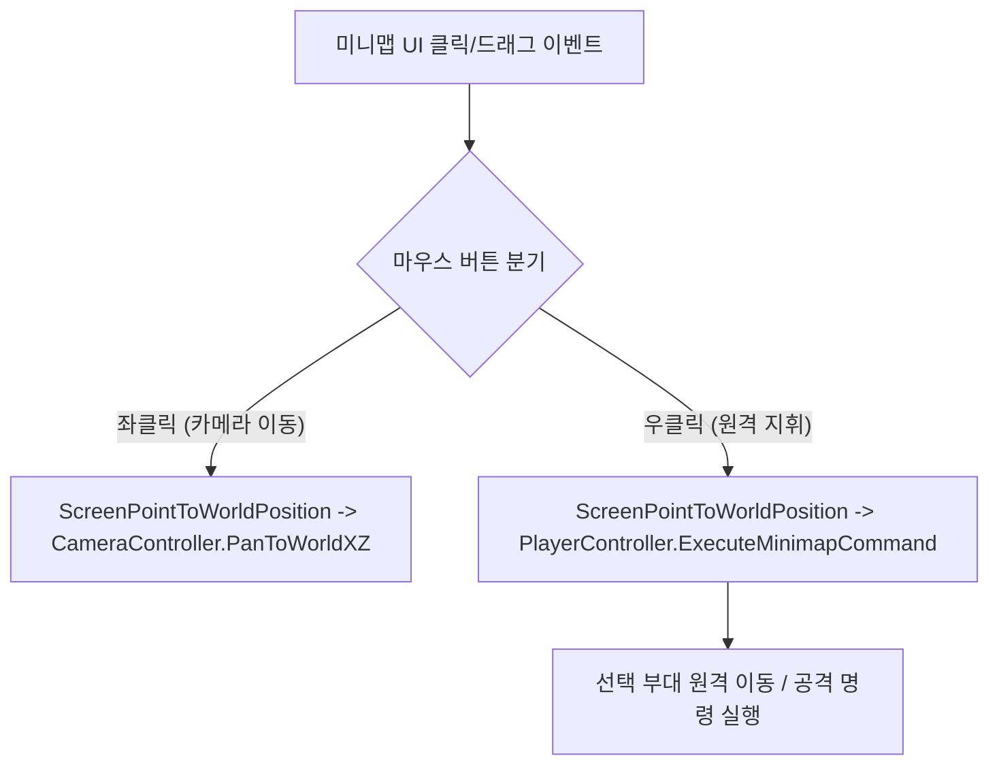

# 🗺️ [MinimapManager.cs] 실시간 전술 미니맵 시스템 아키텍처 가이드

> **원본 소스 파일**: [MinimapManager.cs](file:///c:/unityProject/MiniTotalWar2D/Assets/Scripts/MinimapManager.cs) (총 줄 수: 395줄), [MinimapSquadMarker.cs](file:///c:/unityProject/MiniTotalWar2D/Assets/Scripts/MinimapSquadMarker.cs), [MinimapCameraFrustum.cs](file:///c:/unityProject/MiniTotalWar2D/Assets/Scripts/MinimapCameraFrustum.cs)

---

## 💡 1. 핵심 요약 & 역할
전장 좌측 하단에 전체 전장을 한눈에 조망하는 정사각형 전술 미니맵(Tactical Minimap)의 총괄 관리자로, **월드 ↔ 미니맵 2D 좌표 변환 수학, 부대 마커 풀링 및 동기화, 카메라 절두체(Frustum) 시야각 투영, 미니맵 좌클릭 카메라 지형 이동 및 우클릭 원격 지휘**를 총괄합니다.

---

## 🌳 2. 아키텍처 트리 맵 (Architecture Tree Map)

- 📁 **1. 싱글톤 및 UI 계층 초기화 (Initialization & Hierarchy)**
  - `Awake()`, `Start()`: 싱글톤 인스턴스 등록 및 Terrain 지형 경계(`AutoDetectTerrainBounds`) 자동 측정
  - `InitializeMinimapUI()`: 배경 이미지, 마스크(`RectMask2D`), 마커 컨테이너, 프레임 테두리 동적 생성
- 📁 **2. 2D ↔ 3D 좌표 변환 수학 (Coordinate Transformation Math)**
  - `WorldToMinimapLocal(worldPos)`: 3D 월드 X-Z 좌표를 미니맵 중심(0,0) 기준 로컬 UI Rect 좌표로 정규화 변환
  - `MinimapLocalToWorld(localPos)`: 미니맵 로컬 좌표를 3D 지형 월드 좌표(Y=0)로 역변환
  - `ScreenPointToWorldPosition(screenPoint, cam, out worldPos)`: 스크린 마우스 클릭 좌표를 3D 월드 좌표로 정밀 투영
- 📁 **3. 부대 마커 서브시스템 (`MinimapSquadMarker.cs`)**
  - `RegisterSquad(squad)`, `UnregisterSquad(squad)`: 부대 생성/전멸 시 미니맵 마커 동적 생성 및 해제
  - 마커 렌더링: 진영별 색상(아군 청색 / 적군 적색), 부대 정면 회전각 화살표 및 선택 하이라이트 표시
- 📁 **4. 카메라 시야각 사각틀 (`MinimapCameraFrustum.cs`)**
  - 메인 카메라 4개 코너 레이캐스트를 지형(Y=0)과 교차시켜 미니맵 상에 사다리꼴 시야 영역 라인 실시간 드로우
- 📁 **5. 마우스 인터랙션 및 원격 지휘 (Mouse Interactions)**
  - `OnPointerDown()`, `OnDrag()`:
    - **좌클릭**: 해당 지형 XZ 좌표로 메인 카메라 즉시 이동 (`cameraController.PanToWorldXZ`)
    - **우클릭**: 선택된 부대들에게 해당 미니맵 목표 지점으로 원격 이동/공격 하달 (`playerController.ExecuteMinimapCommand`)

---

## 🗂️ 3. 해시 테이블 메서드 색인표 (Method Fast-Index Table)

> ⚡ **에이전트 지침**: 코드 수정 전 아래 색인표에서 줄 번호 링크를 확인하고, `view_file`로 해당 범위만 직접 조회하여 작업하십시오.

| 메서드 (Key) | 반환형 / 파라미터 | 핵심 역할 & 기능 요약 (Value) | 호출자 (Callers) | 소스 줄 번호 (Line Range) |
| :--- | :--- | :--- | :--- | :--- |
| `AutoDetectTerrainBounds` | `void ()` | 활성 Terrain 지형의 실제 월드 크기(X-Z) 자동 측정 | `Awake`, `Start` | [MinimapManager.cs#L89-L114](file:///c:/unityProject/MiniTotalWar2D/Assets/Scripts/MinimapManager.cs#L89-L114) |
| `WorldToMinimapLocal` | `Vector2 (Vector3 worldPos)` | 3D 월드 좌표를 미니맵 중심(0,0) 기준 로컬 UI Rect 좌표로 변환 | `MinimapSquadMarker`, `Frustum` | [MinimapManager.cs#L235-L249](file:///c:/unityProject/MiniTotalWar2D/Assets/Scripts/MinimapManager.cs#L235-L249) |
| `MinimapLocalToWorld` | `Vector3 (Vector2 localPos)` | 미니맵 로컬 좌표를 3D 월드 좌표로 역변환 | `CameraPan` | [MinimapManager.cs#L254-L270](file:///c:/unityProject/MiniTotalWar2D/Assets/Scripts/MinimapManager.cs#L254-L270) |
| `ScreenPointToWorldPosition` | `bool (screenPoint, cam, out worldPos)` | 마우스 클릭 스크린 좌표를 3D 지형 월드 좌표로 정밀 산출 | `OnPointerDown`, `OnDrag` | [MinimapManager.cs#L276-L301](file:///c:/unityProject/MiniTotalWar2D/Assets/Scripts/MinimapManager.cs#L276-L301) |
| `RegisterSquad` | `void (Squad squad)` | 부대 생성 시 미니맵 마커 오브젝트 인스턴스화 | `Squad.Start`, `Minimap.Start` | [MinimapManager.cs#L307-L323](file:///c:/unityProject/MiniTotalWar2D/Assets/Scripts/MinimapManager.cs#L307-L323) |
| `UnregisterSquad` | `void (Squad squad)` | 부대 전멸/해체 시 미니맵 마커 파괴 및 딕셔너리 제거 | `Squad.OnDestroy` | [MinimapManager.cs#L325-L337](file:///c:/unityProject/MiniTotalWar2D/Assets/Scripts/MinimapManager.cs#L325-L337) |
| `OnPointerDown` | `void (PointerEventData eventData)` | 미니맵 좌클릭(카메라 이동) / 우클릭(원격 명령) 디스패치 | 유니티 이벤트 시스템 | [MinimapManager.cs#L343-L353](file:///c:/unityProject/MiniTotalWar2D/Assets/Scripts/MinimapManager.cs#L343-L353) |

---

## 🔀 4. 유향 그래프 흐름도 (Data & Call Flow Graph)

---

## ⚙️ 5. 주요 인스펙터 설정 변수

| 변수명 | 타입 | 기본값 | 설명 |
| :--- | :--- | :--- | :--- |
| `worldMinXZ` | `Vector2` | `(-500, -500)` | 전장 지형의 좌하단 월드 좌표 (Terrain 감지 시 자동 갱신) |
| `worldMaxXZ` | `Vector2` | `(500, 500)` | 전장 지형의 우상단 월드 좌표 (Terrain 감지 시 자동 갱신) |
| `minimapRect` | `RectTransform` | - | 미니맵 루트 UI 패널 RectTransform (기본 크기 $210 \times 210$) |
| `markerContainer` | `RectTransform` | - | 부대 마커들이 배치되는 하위 UI 컨테이너 |
| `cameraFrustum` | `MinimapCameraFrustum` | - | 메인 카메라 시야각 라인 드로어 컴포넌트 |

---

## 🔗 6. 다른 스크립트와의 연동 관계 (Dependencies)

- **[CameraController.cs](file:///c:/unityProject/MiniTotalWar2D/Docs/CameraController.md)**: 미니맵 좌클릭 시 `PanToWorldXZ` 호출하여 카메라 시점 이동
- **[PlayerController.cs](file:///c:/unityProject/MiniTotalWar2D/Docs/PlayerController.md)**: 미니맵 우클릭 시 `ExecuteMinimapCommand` 호출하여 원격 이동 하달
- **[Squad.cs](file:///c:/unityProject/MiniTotalWar2D/Docs/Squad.md)**: 부대 생성/소멸 시 `RegisterSquad`, `UnregisterSquad` 호출
