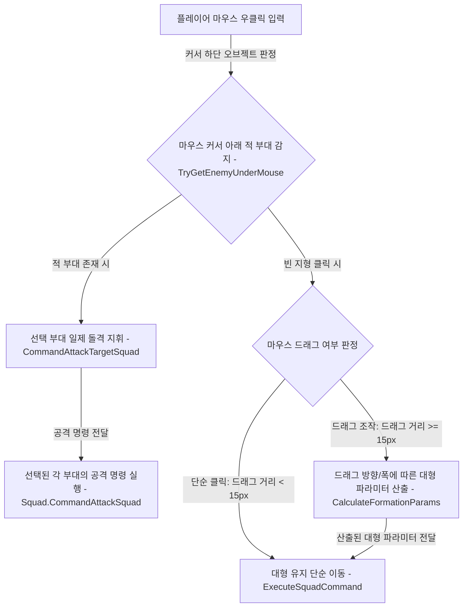
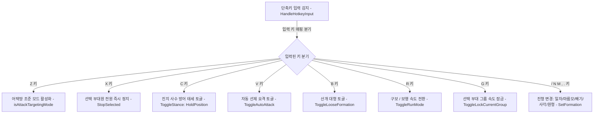

# 🎮 [PlayerController.cs] 플레이어 입력 & 전술 지휘 시스템 아키텍처 가이드

> **원본 소스 파일**: [PlayerController.cs](file:///c:/unityProject/MiniTotalWar2D/Assets/Scripts/PlayerController.cs) (총 줄 수: 3,430줄)

---

## 💡 1. 핵심 요약 & 역할
마우스 클릭/드래그, 단축키 입력, 부대 지정 그룹(Control Groups), 제식 대형 미리보기(Previewer) 및 다중 부대 통합 전선 배치(Grand Continuous Arc) 등 **플레이어의 모든 전술 지휘 명령을 해석하고 부대 및 유닛에 실시간 하달하는 종합 입력 컨트롤러**입니다.

---

## 🌳 2. 아키텍처 트리 맵 (Architecture Tree Map)

- 📁 **1. 초기화 및 선택 시스템 (Lifecycle & Selection System)**
  - `Awake()`, `EnsureLineRenderer()`, `Update()`
  - `SelectSquad()`, `DeselectSquad()`, `SelectUnit()`, `DeselectAll()`
  - `SelectSingleUnitOrSquad()`: 단일 유닛/부대 클릭 선택
  - `SelectUnitsInScreenRect()`: 화면 드래그 박스 영역 내 일괄 선택
  - `SelectAllPlayerSquads()`: `Ctrl+A` 전장의 모든 아군 부대 일괄 선택
- 📁 **2. 부대 편제 그룹 및 속도 잠금 (Control Groups & Locked Speed)**
  - `HandleControlGroups()`: 숫자키(1~9) 편제 등록(`Ctrl+1~9`) 및 선택(`1~9`)
  - `ToggleLockCurrentGroup()`: `G`키 그룹 잠금(Locked Group) 토글
  - `SyncLockedGroupSpeeds()`: 잠긴 그룹 내 부대 간 최저 속도 동기화
- 📁 **3. 마우스 드래그 대형 조작 (Formation Drag Manipulation)**
  - `HandleSelectionInput()`: 좌클릭 및 Alt/Ctrl 드래그 대형 변형
    - `Alt + 좌클릭 드래그`: 2차 포물선 곡선 대형(초승달호), 쐐기 길이, 방진 겹수 실시간 변형
    - `Ctrl + 좌클릭 드래그`: 대형 유지 상태 이동
  - `HandleCommandInput()`: 우클릭 및 Alt/Ctrl 드래그 이동/회전
    - `우클릭 드래그`: 가로 폭 및 방향 지정 대형 이동
    - `Ctrl + 우클릭 드래그`: 제자리 회전 조작
    - `Alt + 우클릭 드래그`: 대형 가로폭 / 방진 층간 거리 조절
- 📁 **4. 공격 및 타겟팅 명령 (Attack & Targeting Commands)**
  - `CommandAttackTargetSquad()`: 지정 적 부대 타겟팅 쇄도 공격
  - `CommandAttackTargetPosition()`: 어택땅(AttackMove) 좌표 공격
  - `TryGetEnemyUnderMouse()`: 마우스 아래 적 부대/엔티티 정밀 픽킹
- 📁 **5. 단축키 시스템 (`HandleHotkeyInput`) - 소스 코드 100% 팩트 매핑**
  - `[Z]`: 어택땅(AttackMove) 타겟팅 모드 활성화
  - `[X]`: 선택 부대 즉시 정지 (`StopSelected()`)
  - `[C]`: 제자리 사수 태세 토글 (`ToggleStance(UnitStance.HoldPosition)`)
  - `[V]`: 자동 선제 요격 토글 (`ToggleAutoAttack()`)
  - `[B]`: 산개진(Loose Formation) 토글 (`ToggleLooseFormation()`)
  - `[R]`: 달리기/걷기 모드 토글 (`ToggleRunMode()`)
  - `[G]`: 선택 부대 그룹 잠금 토글 (`ToggleLockCurrentGroup()`)
  - `[` / `]`: 부대 간격 축소(-0.04m) / 확대(+0.04m) (`AdjustSpacing`)
  - `[/]`: 기본 일자진 대형 (`SetFormation(SquadFormationType.Normal)`)
  - `[N]`: 마름모/다이아몬드진 (`SetFormation(SquadFormationType.Diamond)`)
  - `[M]`: 쐐기진 (`SetFormation(SquadFormationType.Wedge)`)
  - `[,]` (쉼표): 사각방진 (`SetFormation(SquadFormationType.Square)`)
  - `[.]` (마침표): 원형진 (`SetFormation(SquadFormationType.Circle)`)
- 📁 **6. 다중 부대 군단 통합 대형 (Grand Multi-Squad Formations)**
  - `ApplyGrandContinuousArcFormation()`: 군단 일체형 거대 초승달 전선 전개
  - `ArrangeGrandWedgeFormation()`: 다중 부대 거대 쐐기 군단 진형
  - `ArrangeGrandDiamondFormation()`: 다중 부대 다이아몬드 군단 진형
  - `ArrangeGrandSquareFormation()`: 다중 부대 대형 사각방진 군단
  - `ArrangeGrandCircleFormation()`: 다중 부대 대형 원형진 군단

---

## 🗂️ 3. 해시 테이블 메서드 색인표 (Method Fast-Index Table)

> ⚡ **에이전트 지침**: 코드 수정 전 아래 색인표에서 줄 번호 링크를 확인하고, `view_file`로 해당 범위만 직접 조회하여 작업하십시오.

| 메서드 / 프로퍼티 (Key) | 반환형 / 파라미터 | 핵심 역할 & 기능 요약 (Value) | 호출자 (Callers) | 소스 줄 번호 (Line Range) |
| :--- | :--- | :--- | :--- | :--- |
| `ToggleLockCurrentGroup` | `void ()` | `G`키 현재 선택 부대 그룹 잠금 및 속도 동기화 | `HandleHotkeyInput` | [PlayerController.cs#L51-L90](file:///c:/unityProject/MiniTotalWar2D/Assets/Scripts/PlayerController.cs#L51-L90) |
| `SelectAllPlayerSquads` | `void ()` | `Ctrl+A` 전장의 모든 아군 부대 일괄 선택 | `HandleSelectionInput` | [PlayerController.cs#L91-L106](file:///c:/unityProject/MiniTotalWar2D/Assets/Scripts/PlayerController.cs#L91-L106) |
| `HandleControlGroups` | `void ()` | 숫자키(1~9) 부대 편제 등록(`Ctrl+1~9`) 및 선택 | `Update` | [PlayerController.cs#L397-L472](file:///c:/unityProject/MiniTotalWar2D/Assets/Scripts/PlayerController.cs#L397-L472) |
| `HandleSelectionInput` | `void ()` | 좌클릭 선택 및 Alt/Ctrl 드래그 대형 변형 | `Update` | [PlayerController.cs#L546-L920](file:///c:/unityProject/MiniTotalWar2D/Assets/Scripts/PlayerController.cs#L546-L920) |
| `HandleCommandInput` | `void ()` | 우클릭 이동, 회전 및 적 부대 공격 지휘 | `Update` | [PlayerController.cs#L922-L1410](file:///c:/unityProject/MiniTotalWar2D/Assets/Scripts/PlayerController.cs#L922-L1410) |
| `ExecuteSquadCommand` | `void (center, rot, cols, isShift)` | 선택된 부대들에게 이동 및 대형 명령 전달 | `HandleCommandInput` | [PlayerController.cs#L1843-L1903](file:///c:/unityProject/MiniTotalWar2D/Assets/Scripts/PlayerController.cs#L1843-L1903) |
| `ExecuteMinimapCommand` | `void (worldPos, isAttackMove)` | 미니맵 클릭 시 선택 부대 원격 이동/공격 | `Minimap.cs` | [PlayerController.cs#L1905-L1932](file:///c:/unityProject/MiniTotalWar2D/Assets/Scripts/PlayerController.cs#L1905-L1932) |
| `SelectSingleUnitOrSquad` | `void ()` | 단일 유닛/부대 클릭 선택 판정 | `HandleSelectionInput` | [PlayerController.cs#L1976-L2137](file:///c:/unityProject/MiniTotalWar2D/Assets/Scripts/PlayerController.cs#L1976-L2137) |
| `SelectUnitsInScreenRect` | `void (start, end)` | 화면 드래그 박스 영역 내 유닛/부대 일괄 선택 | `HandleSelectionInput` | [PlayerController.cs#L2139-L2242](file:///c:/unityProject/MiniTotalWar2D/Assets/Scripts/PlayerController.cs#L2139-L2242) |
| `HandleHotkeyInput` | `void ()` | 실제 13개 단축키(Z, X, C, V, B, R, G, [, ], /, N, M, ,, .) 종합 처리 | `Update` | [PlayerController.cs#L2405-L2476](file:///c:/unityProject/MiniTotalWar2D/Assets/Scripts/PlayerController.cs#L2405-L2476) |
| `StopSelected` | `void ()` | 선택 부대/유닛 즉시 정지 명령 | `HandleHotkeyInput`, `X키` | [PlayerController.cs#L2759-L2830](file:///c:/unityProject/MiniTotalWar2D/Assets/Scripts/PlayerController.cs#L2759-L2830) |
| `ToggleRunMode` | `void ()` | `R`키 달리기/걷기 모드 일괄 전환 | `HandleHotkeyInput` | [PlayerController.cs#L2975-L3044](file:///c:/unityProject/MiniTotalWar2D/Assets/Scripts/PlayerController.cs#L2975-L3044) |
| `CommandAttackTargetSquad` | `void (Squad enemySquad)` | 적 부대 우클릭 시 선택 부대 일제 돌격 지휘 | `HandleCommandInput`, `UI` | [PlayerController.cs#L3164-L3227](file:///c:/unityProject/MiniTotalWar2D/Assets/Scripts/PlayerController.cs#L3164-L3227) |
| `TryGetEnemyUnderMouse` | `bool (out Squad, out pos)` | 마우스 커서 아래 적 부대/엔티티 정밀 픽킹 | `HandleCommandInput` | [PlayerController.cs#L3229-L3375](file:///c:/unityProject/MiniTotalWar2D/Assets/Scripts/PlayerController.cs#L3229-L3375) |

---

## 🔀 4. 유향 그래프 흐름도 (Data & Call Flow Graph)

### 1) 마우스 우클릭 명령 디스패치 파이프라인

### 2) 단축키 전술 모드 전환 흐름

---

## ⌨️ 5. 전술 단축키 & 마우스 조작 일람표 (소스 코드 100% 검증)

| 조작 키 / 마우스 | 기능 명칭 | 실제 코드 매핑 (`PlayerController.cs`) |
| :--- | :--- | :--- |
| `좌클릭` | 단일 선택 | 유닛 또는 부대 선택 (`SelectSingleUnitOrSquad`) |
| `좌클릭 드래그` | 영역 박스 선택 | 사각 영역 내 모든 아군 유닛/부대 다중 선택 (`SelectUnitsInScreenRect`) |
| `우클릭` | 단순 이동 / 공격 | 땅 클릭 시 이동, 적 부대 클릭 시 지정 공격 (`HandleCommandInput`) |
| `우클릭 드래그` | 대형 전개 이동 | 마우스 드래그 방향으로 대형 정면 각도 및 가로폭 설정 (`CalculateFormationParams`) |
| `Ctrl + 우클릭 드래그` | 제자리 회전 | 현재 위치를 유지하며 부대 정면 방향만 회전 |
| `Alt + 좌클릭 드래그` | 대형 기하학 변형 | 2차 곡선 대형(초승달호), 쐐기 길이, 방진 겹수 실시간 변형 (`HandleSelectionInput`) |
| `Alt + 우클릭 드래그` | 진형 간격 조절 | 유닛 간 횡간격/종간격 실시간 확대/축소 |
| `Ctrl + 1 ~ 9` | 부대 편제 지정 | 선택된 부대들을 번호 그룹에 저장 (`HandleControlGroups`) |
| `1 ~ 9 키` | 부대 편제 선택 | 지정된 번호 그룹 부대 선택 (`HandleControlGroups`) |
| `Ctrl + A` | 전체 아군 부대 선택 | 전장의 모든 아군 부대 일괄 선택 (`SelectAllPlayerSquads`) |
| `Z 키` | 어택땅(Attack) 모드 | 어택땅 조준 커서 활성화 (`isAttackTargetingMode = true`) |
| `X 키` | 즉시 정지 (Stop) | 선택 부대원 전원 즉시 정지 (`StopSelected()`) |
| `C 키` | 제자리 사수 태세 | 진지 사수 방어 태세 토글 (`ToggleStance(UnitStance.HoldPosition)`) |
| `V 키` | 자동 선제 요격 토글 | 12m 내 적 접근 시 자동 선제 돌격 ↔ 제자리 방어선 유지 (`ToggleAutoAttack()`) |
| `B 키` | 산개진(Loose) 토글 | 원거리 투석/사격 피해를 줄이기 위한 간격 2배 확대 (`ToggleLooseFormation()`) |
| `R 키` | 달리기 / 걷기 토글 | 구보(2.8m/s) ↔ 제식보행(1.2m/s) 전환 (`ToggleRunMode()`) |
| `G 키` | 그룹 속도 잠금 (Lock) | 선택 부대들을 이동 속도가 가장 느린 부대에 맞춰 동기화 (`ToggleLockCurrentGroup()`) |
| `[` / `] 키` | 대형 간격 미세조절 | 유닛 간 간격을 0.04m씩 축소/확대 (`s.AdjustSpacing`) |
| `/ 키` | 기본 일자진 대형 | 표준 직선 일자 대형 전개 (`SquadFormationType.Normal`) |
| `N 키` | 마름모 / 다이아몬드진 | 돌파/측면 방어용 다이아몬드 대형 (`SquadFormationType.Diamond`) |
| `M 키` | 쐐기진 (Wedge) | 중앙 돌격 돌파용 쐐기 대형 (`SquadFormationType.Wedge`) |
| `, 키` (쉼표) | 사각방진 (Square) | 4면 전방위 방어 사각방진 대형 (`SquadFormationType.Square`) |
| `. 키` (마침표) | 원형진 (Circle) | 360도 전방위 완전 포위 방어 원형진 (`SquadFormationType.Circle`) |

---

## 🔗 6. 다른 스크립트와의 연동 관계 (Dependencies)

- **[Squad.cs](file:///c:/unityProject/MiniTotalWar2D/Docs/Squad.md)**: `CommandMoveWithFormation`, `CommandAttackSquad`, `SetRunMode`, `SetFormationType` 호출
- **[FormationPreviewer.cs](file:///c:/unityProject/MiniTotalWar2D/Docs/FormationPreviewer.md)**: 드래그 중 실시간 슬롯 고스트 렌더링 요청
- **[CommandUI.cs](file:///c:/unityProject/MiniTotalWar2D/Docs/CommandUI.md)**: 단축키 조작 시 UI 버튼 하이라이트 동기화
- **[Minimap.cs](file:///c:/unityProject/MiniTotalWar2D/Docs/Minimap.md)**: 미니맵 원격 클릭 이동 명령 처리
