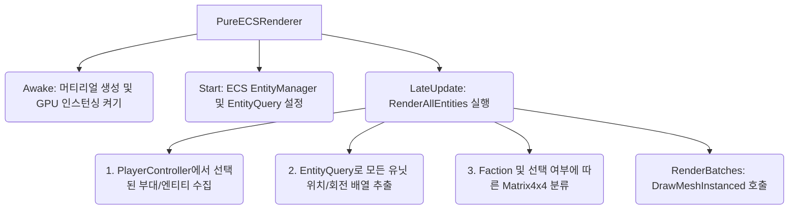
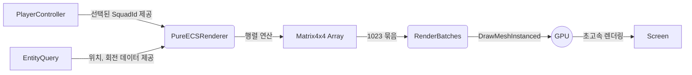

# 💡 PureECSRenderer.cs 핵심 요약 & 역할 (Summary & Role)

`PureECSRenderer`는 GameObject를 단 하나도 생성하지 않고(Zero-GameObject), Unity ECS의 엔티티(Entity) 데이터(`UnitMovementData`)만을 순수하게 읽어들여 수만 기의 유닛을 단 1~3개의 Draw Call로 일괄 렌더링하는 GPU Instancing 핵심 모듈입니다. O(N) 순회로 좌표를 추출하여 `Graphics.DrawMeshInstanced`에 밀어 넣으며, 플레이어가 선택한 부대(아군)의 경우 밝은 시안색(Cyan) 머티리얼로 동적 하이라이트 처리를 수행합니다.

## 🌳 1. 아키텍처 트리 맵 (Tree Map)

## 🗂️ 2. 해시 테이블 메서드/구조체 색인표 (Hash Table Index)

| Key (메서드) | Value (역할 및 특성) | Source |
| :--- | :--- | :--- |
| `Awake` | 렌더링용 기본 큐브 메시, 아군/적군/선택 머티리얼 생성 및 `enableInstancing` 적용 | `PureECSRenderer.cs` |
| `Start` | ECS `World`에서 `EntityManager`를 가져와 렌더링 대상(`UnitEntityTag`, `UnitMovementData`) Query 구축 | `PureECSRenderer.cs` |
| `LateUpdate` | ECS 물리 및 로직 연산이 완료된 프레임 후반에 `RenderAllEntities` 호출 | `PureECSRenderer.cs` |
| `RenderAllEntities` | 모든 엔티티를 순회하며 진영(Faction) 및 부대 선택 상태에 따라 `Matrix4x4` 행렬 배열에 적재 | `PureECSRenderer.cs` |
| `RenderBatches` | 1023개 단위로 분할하여 `Graphics.DrawMeshInstanced` API를 통해 GPU 일괄 렌더링 | `PureECSRenderer.cs` |

## 🔀 3. 유향 그래프 흐름도 (Directed Graph - Mermaid)

## ⚙️ 4. 주요 상태 변수, 데이터 구조체 & 인스펙터 옵션 (State, Structs & Inspector Fields)

*   **`Mesh unitMesh`**: 렌더링에 사용할 기본 메시 (비어있을 시 자동 Cube 생성)
*   **`Material playerMaterial` / `enemyMaterial`**: 진영별 식별 렌더링 머티리얼 (GPU Instancing 필수 활성화)
*   **`Material playerSelectedMaterial`**: 선택된 부대용 형광 청록색 하이라이트 머티리얼
*   **`Matrix4x4[] ...Matrices`**: GPU로 넘길 변환(Transformation) 행렬 배열. Unity `DrawMeshInstanced`의 제한에 맞춰 1023개 단위로 처리하기 위한 버퍼.
*   **`HashSet<int> selectedSquadIds`**: O(1) 조회를 위해 매 프레임 선택된 부대의 ID를 캐싱하는 자료구조.

## 🛠️ 5. 핵심 알고리즘, 물리/전투 수학 공식 & 조작법 (Algorithms, Math & Controls)

*   **GPU Instancing 병목 해소 (1023 Batching)**: `Graphics.DrawMeshInstanced`는 한 번의 Draw Call에 최대 1023개의 행렬(Matrix)만을 허용합니다. 따라서 수만 기의 엔티티를 렌더링하기 위해 `RenderBatches` 메서드에서 `Mathf.Min(1023, 남은 수)` 만큼 배열을 쪼개어(Slice) CPU->GPU 대역폭 병목을 최소화하며 전송합니다.
*   **변환 행렬 구축 (Transformation Matrix)**: `Matrix4x4.TRS(pos, rot, unitScale)` 공식을 사용하여 각 엔티티의 Translation(이동), Rotation(회전), Scale(크기) 정보를 하나의 4x4 행렬로 압축합니다.

## 🔗 6. 다른 스크립트와의 연동 관계 (Dependencies & Pipeline)

*   **`PlayerController.cs`**: 현재 플레이어가 드래그하거나 클릭하여 선택한 부대 목록(`GetSelectedSquads`) 및 단일 엔티티 목록을 제공받아 하이라이트 렌더링 여부를 결정합니다.
*   **ECS Systems (`UnitCombatAndMovementSystem.cs` 등)**: ECS 로직 시스템들이 프레임 내에서 유닛의 위치와 회전을 최종 업데이트하면, `LateUpdate` 시점에 렌더러가 이를 일괄적으로 화면에 투영합니다.
