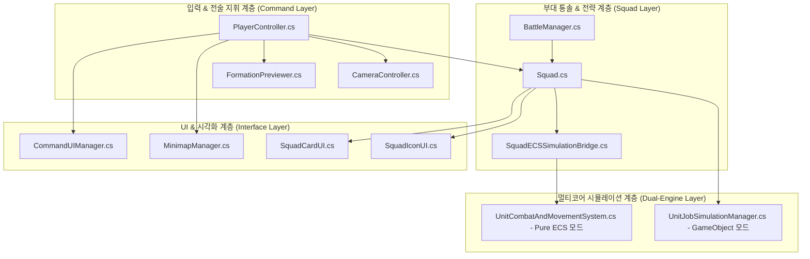

# 📚 MiniTotalWar2D 전체 시스템 아키텍처 & 문서 색인서 (README)

본 문서는 **MiniTotalWar2D** 프로젝트의 전체 C# 스크립트 및 시스템 아키텍처에 대한 종합 개요와 **3대 자료구조(Tree, Hash Table, Directed Graph)** 기반 가이드 문서 색인 맵을 제공합니다.

---

## 🌳 1. 전체 프로젝트 아키텍처 트리 맵 (Global Architecture Tree)

---

## 🗂️ 2. 스크립트 가이드 문서 해시 색인표 (Document Index Table)

> ⚡ 아래 표의 링크를 클릭하면 **아키텍처 트리, 메서드 색인표(줄 번호 링크), 호출 흐름도, 상세 수식/알고리즘**이 완비된 완전체 가이드 문서를 열람할 수 있습니다.

| 문서명 (Key) | 대응 C# 소스 파일 | 핵심 역할 & 기능 요약 (Value) |
| :--- | :--- | :--- |
| ⚔️ **[Squad.md](file:///c:/unityProject/MiniTotalWar2D/Docs/Squad.md)** | `Squad.cs` (2,827줄) | 부대 대형, 공간 정렬($O(N^2)$), 파동형 순차 출발, U자형 포위망, AI |
| 🎮 **[PlayerController.md](file:///c:/unityProject/MiniTotalWar2D/Docs/PlayerController.md)** | `PlayerController.cs` (3,430줄) | 13개 전술 단축키, 마우스 드래그 대형 변형(Alt/Ctrl), 그룹 잠금 |
| ⚡ **[UnitJobSimulationManager.md](file:///c:/unityProject/MiniTotalWar2D/Docs/UnitJobSimulationManager.md)** | `UnitJobSimulationManager.cs` (946줄) | 멀티코어 3대 Job(척력, 1.45m 자율 반격, 슬라이딩 굴절, 넉백/전투) |
| ⚡ **[UnitCombatAndMovementSystem.md](file:///c:/unityProject/MiniTotalWar2D/Docs/UnitCombatAndMovementSystem.md)** | `UnitCombatAndMovementSystem.cs` (594줄) | Pure ECS 공간 해시 그리드 타겟팅, 병렬 데미지 큐 및 넉백 시스템 |
| 💂 **[Unit.md](file:///c:/unityProject/MiniTotalWar2D/Docs/Unit.md)** | `Unit.cs` (648줄) | 개별 3D 유닛 라이프사이클, 슬롯 매핑, 피격/사망 및 네비메시 연동 |
| 🚩 **[BattleManager.md](file:///c:/unityProject/MiniTotalWar2D/Docs/BattleManager.md)** | `BattleManager.cs` (480줄) | 전장 시나리오 스폰, GameObject ⇄ Pure ECS 듀얼 모드 글로벌 관리 |
| 🗺️ **[Minimap.md](file:///c:/unityProject/MiniTotalWar2D/Docs/Minimap.md)** | `MinimapManager.cs` (395줄) | 3D ↔ 2D 좌표 변환 수학, 부대 마커, 카메라 시야각 사각틀 투영 |
| 🎥 **[CameraController.md](file:///c:/unityProject/MiniTotalWar2D/Docs/CameraController.md)** | `CameraController.cs` (318줄) | WASD 평면 + QE 고도 조절, Tab키 3D ↔ 2D 전술지도 전환, 부대 포커싱 |
| 👻 **[FormationPreviewer.md](file:///c:/unityProject/MiniTotalWar2D/Docs/FormationPreviewer.md)** | `FormationPreviewer.cs` (275줄) | 드래그 조작 시 지형 위 슬롯 도트 오브젝트 풀링 실시간 렌더링 |
| 🏷️ **[SquadIconUI.md](file:///c:/unityProject/MiniTotalWar2D/Docs/SquadIconUI.md)** | `SquadIconUI.cs` (286줄) | 3D 월드 부대 머리 위 깃발 아이콘, 조직력 게이지, 클릭 선택/돌격 |
| 🃏 **[SquadCardUI.md](file:///c:/unityProject/MiniTotalWar2D/Docs/SquadCardUI.md)** | `SquadCardUI.cs` (152줄) | 화면 하단 부대 카드 패널, `[G]` 잠금 뱃지, Shift/Ctrl 다중 선택 |
| 🎛️ **[CommandUI.md](file:///c:/unityProject/MiniTotalWar2D/Docs/CommandUI.md)** | `CommandUIManager.cs` (125줄) | 우하단 전술 명령 버튼 패널 동적 생성 및 핫키 표시 |
| 📜 **[CommandTypes.md](file:///c:/unityProject/MiniTotalWar2D/Docs/CommandTypes.md)** | `CommandTypes.cs` (38줄) | `UnitCommandState`, `SquadFormationType`, `UnitStance` 열거형 사전 |
| 📝 **[업데이트_내용.md](file:///c:/unityProject/MiniTotalWar2D/Docs/업데이트_내용.md)** | 전체 시스템 히스토리 | 프로젝트 전체 개발 일지 및 사용자 요구사항 기반 업데이트 기록부 |

---

## 🔄 문서 유지 관리 규칙 (Documentation Rules)

1. **사용자 요구 사항(User Request) 최상단 기록**: `Docs/업데이트_내용.md`에 새로운 항목을 추가할 때 사용자의 요청 원문을 가장 먼저 명시합니다.
2. **3대 자료구조 표준 템플릿 준수**: 개별 스크립트 문서는 **1) 트리 맵, 2) 해시 색인표(줄 번호 링크), 3) 유향 그래프** 3대 자료구조 형식을 유지합니다.
3. **소스 코드 100% 팩트 매핑**: 추측성 코딩 및 문서를 금지하며, 실제 C# 코드의 변수/함수/단축키와 1:1로 일치시킵니다.
