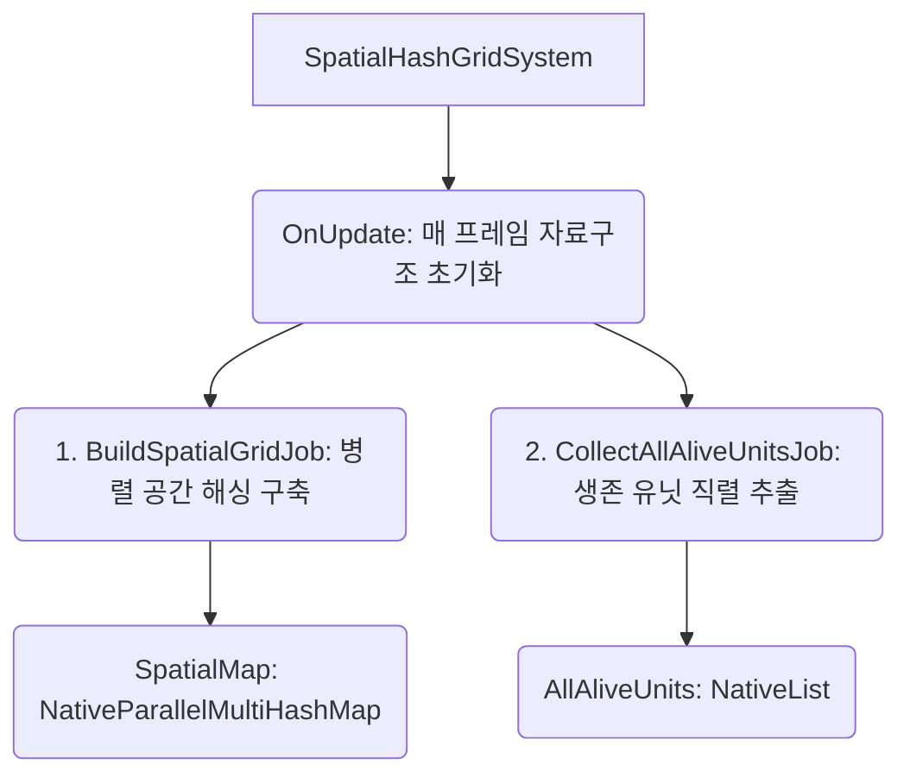
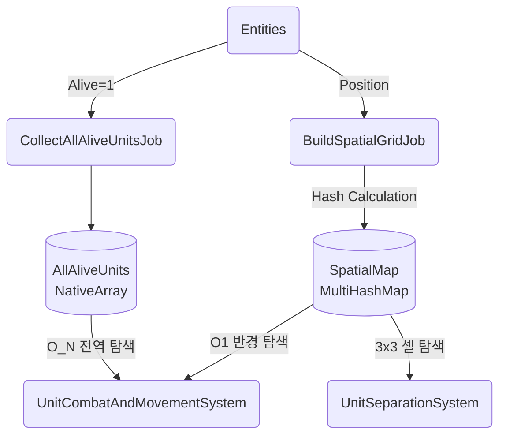

# 💡 SpatialHashGridSystem.cs 핵심 요약 & 역할 (Summary & Role)

ECS 환경에서 수만 기의 유닛 간 O(N^2) 탐색 비용을 O(1) 수준으로 극단적으로 낮추기 위해 2.0m 단위 균일 격자(Uniform Spatial Grid) 해싱을 구현하는 핵심 공간 분할 시스템입니다. 모든 유닛의 위치를 2D 평면 격자 좌표(int3)로 변환하고 고유 해시(Hash) 키를 부여하여 `NativeParallelMultiHashMap`에 저장합니다. 이후 이동, 전투, 겹침(Separation) 연산 시 인접한 3x3 ~ 5x5 그리드 셀만 빠르게 탐색할 수 있도록 공간 맵핑 데이터를 제공합니다.

## 🌳 1. 아키텍처 트리 맵 (Tree Map)



## 🗂️ 2. 해시 테이블 메서드/구조체 색인표 (Hash Table Index)

| Key (메서드/구조체) | Value (역할 및 특성) | Source |
| :--- | :--- | :--- |
| `EntitySpatialData` | 해시 맵에 저장되는 경량화된 엔티티 공간 및 상태 데이터 구조체 | `SpatialHashGridSystem.cs` |
| `BuildSpatialGridJob` | 모든 엔티티의 위치를 기반으로 해시 키를 계산하고 `SpatialMap`에 Multi-Add 하는 병렬 잡 | `SpatialHashGridSystem.cs` |
| `CollectAllAliveUnitsJob` | 전역 탐색(Global Search) 최적화를 위해 살아있는 유닛만 1차원 `NativeList`에 직렬로 적재하는 잡 | `SpatialHashGridSystem.cs` |
| `GetCellHash` | 좌표(float3)를 2.0m 단위 격자 좌표(int3)로 내림(`floor`)하여 고유 32bit 정수 해시를 반환 | `SpatialHashGridSystem.cs` |
| `HashCoords` | 소수(Prime Number) 곱셈 비트 XOR 연산을 통해 충돌(Collision)이 적은 해시 키 생성 | `SpatialHashGridSystem.cs` |

## 🔀 3. 유향 그래프 흐름도 (Directed Graph - Mermaid)



## ⚙️ 4. 주요 상태 변수, 데이터 구조체 & 인스펙터 옵션 (State, Structs & Inspector Fields)

*   **`CELL_SIZE` / `INV_CELL_SIZE`**: 격자 셀의 크기 (2.0m). 최적화된 나눗셈을 위해 역수(0.5f)를 곱셈 상수로 사용합니다.
*   **`NativeParallelMultiHashMap<int, EntitySpatialData> SpatialMap`**: O(1) 인접 공간 조회를 위한 코어 자료구조. 같은 해시(같은 2.0m 타일)에 여러 유닛이 들어갈 수 있도록 Multi Map 구조를 사용합니다.
*   **`NativeList<EntitySpatialData> AllAliveUnits`**: 타겟팅 과정에서 전역 선형 탐색이 필요한 경우(예: 목표 부대의 중심을 찾기 위해 O(N) 순회)를 위해 생존자만 압축하여 모아둔 고속 순회(Iteration) 배열입니다.

## 🛠️ 5. 핵심 알고리즘, 물리/전투 수학 공식 & 조작법 (Algorithms, Math & Controls)

*   **공간 좌표 양자화 (Quantization)**: 
    ```csharp
    int3 coord = new int3((int)math.floor(pos.x * INV_CELL_SIZE), 0, (int)math.floor(pos.z * INV_CELL_SIZE));
    ```
    위치를 2.0 단위로 나누어 정수형 그리드 인덱스로 매핑합니다.
*   **비트 XOR 해시 생성 (Prime XOR Hashing)**: 
    ```csharp
    int hash = unchecked((coord.x * 73856093) ^ (coord.z * 19349663));
    ```
    유명한 큰 소수(Large Primes)를 사용하여 X, Z 2차원 좌표를 단일 32비트 정수 해시로 안전하게 압축합니다. 충돌을 분산시킵니다.

## 🔗 6. 다른 스크립트와의 연동 관계 (Dependencies & Pipeline)

*   이 시스템은 모든 ECS 시스템 중에서 가장 먼저 실행(`[UpdateInGroup(..., OrderFirst = true)]`)되어야 합니다.
*   **`UnitSeparationSystem`** 및 **`UnitCombatAndMovementSystem`**이 이 시스템의 `SpatialMap`과 `AllAliveUnits` 배열에 `[ReadOnly]`로 의존하여 충돌 척력과 적군 포착 타겟팅을 수행합니다.
