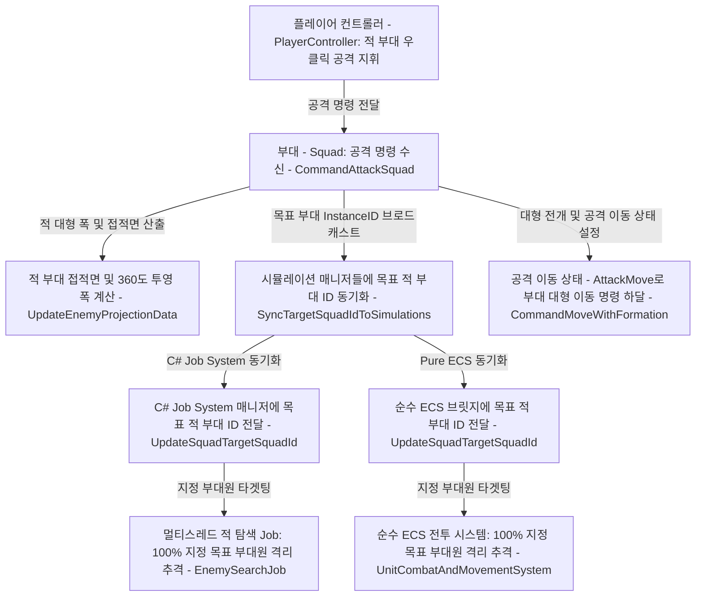
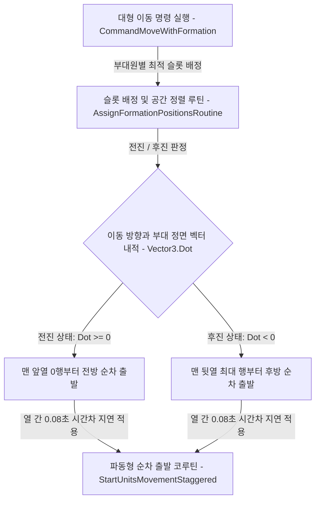

# ⚔️ [Squad.cs] 부대 지휘 & 대형 기동 시스템 아키텍처 가이드

> **원본 소스 파일**: [Squad.cs](file:///c:/unityProject/MiniTotalWar2D/Assets/Scripts/Squad.cs) (총 줄 수: 2,827줄)

---

## 💡 1. 핵심 요약 & 역할
수백~수천 명의 병사(Unit)들을 하나의 전술 부대로 통솔하여, **진형 배치(Formation), 공간 정렬(Spatial Sort), 방향성 순차 출발(Wave), 포위 기동(Envelopment), 멀티코어/ECS 상태 동기화 및 부대 AI**를 총괄하는 핵심 지휘 스크립트입니다.

---

## 🌳 2. 아키텍처 트리 맵 (Architecture Tree Map)

- 📁 **1. 생명주기 및 초기화 (Lifecycle & Initialization)**
  - `Start()`: 부대 컴포넌트 초기화 및 UI 생성
  - `OnDestroy()`: 부대 해체 및 리소스 정리
  - `InitializeSquadOnStart()`: 시작 시 부대원 자동 등록 및 초기 중심점 계산
- 📁 **2. 진형 슬롯 및 기하학 연산 (Formation & Geometry)**
  - 📂 2.1. 기본 슬롯 계산 (Standard Grid Slots)
    - `CalculateSlotLocalOffset()`: 대형 내 개별 슬롯 상대 좌표 계산
    - `CalculateSlotWorldPosition()`: 대형 내 개별 슬롯 월드 좌표 계산
    - `GetSlotLocalOffset()`: 진형 타입별 통합 오프셋 산출
  - 📂 2.2. 특수 진형 연산 (Special Formations)
    - `CalculateCurvedSlotOffset()`: Alt+좌클릭 2차 포물선 곡선 대형 계산
    - `CalculateEnvelopmentSlot()`: 전열 폭 비례 U자형 포위망 슬롯 계산
    - `CalculateOrganicDefensiveSlot()`: 피포위 수비 시 방어선 슬롯 계산
- 📁 **3. 이동 및 지휘 명령 (Movement & Command Dispatch)**
  - `CommandMoveWithFormation()`: 지정 목적지로 부대 대형 이동 명령
  - `CommandAttackSquad()`: 지정 적 부대 타겟팅 및 쇄도 포위 돌격
  - `CommandStop()`: 전 부대원 즉시 정지 및 진형 사수
  - `CommandCurvedFormation()`: 곡선 대형 전개 명령
  - `AddWaypoint()`, `ClearWaypoints()`: 다중 경유지(Waypoint) 대기열 관리
- 📁 **4. 순차 기동 및 공간 정렬 루틴 (Staggered Dispatch & Spatial Sort)**
  - `AssignFormationPositionsRoutine()`: $O(N^2)$ 공간 정렬 및 슬롯 배정 코루틴
  - `StartUnitsMovementStaggered()`: 전진/후진 방향성 열 단위 순차 출발 코루틴
- 📁 **5. 전투 추적, 포위 및 AI (Combat Tracking, Envelopment & AI)**
  - `UpdateTargetSquadTracking()`: 공격 중 목표 적 부대 실시간 추적 및 갱신
  - `UpdateEnemyProjectionData()`: 적 부대 접적면 및 360도 좌표 투영
  - `DetectEnvelopmentThreat()`: 적의 포위 위협 감지
  - `UpdateEnemySquadAI()`: 적군 부대의 1:1 전선 매칭 및 자율 의사결정 AI
  - `UpdatePostCombatAutoReform()`, `ReformSquadAfterCombat()`: 전투 종료 후 전열 재정비
- 📁 **6. 모드 전환 및 동기화 (Modes & Dual-Engine Sync)**
  - `ToggleRunMode()`, `SetRunMode()`: 달리기/걷기 모드 전환
  - `ToggleLooseFormation()`, `SetFormationType()`: 산개진/밀집진/특수진 전환
  - `SetAutoAttack()`, `SetStance()`: 자동 요격 및 부대 태세 전환
  - `SyncTargetSquadIdToSimulations()`: Job System 및 Pure ECS 양방향 동기화
  - `UpdateECSEntitiesTarget()`, `UpdateECSEntitiesSpeed()`: 순수 ECS 엔티티 1:1 동기화

---

## 🗂️ 3. 해시 테이블 메서드 색인표 (Method Fast-Index Table)

> ⚡ **에이전트 지침**: 코드 수정 전 아래 색인표에서 줄 번호 링크를 확인하고, `view_file`로 해당 범위만 직접 조회하여 작업하십시오.

| 메서드 / 프로퍼티 (Key) | 반환형 / 파라미터 | 핵심 역할 & 기능 요약 (Value) | 호출자 (Callers) | 소스 줄 번호 (Line Range) |
| :--- | :--- | :--- | :--- | :--- |
| `CalculateSlotLocalOffset` | `Vector3 (r, c, count, rows, cols)` | 열과 행에 따른 슬롯 상대 좌표 계산 | `RebuildGridStructure` | [Squad.cs#L216-L238](file:///c:/unityProject/MiniTotalWar2D/Assets/Scripts/Squad.cs#L216-L238) |
| `CalculateSlotWorldPosition` | `Vector3 (r, c, ..., center, rot)` | 중심점 및 회전각 기반 슬롯 월드 좌표 산출 | `AssignFormationPositions` | [Squad.cs#L240-L255](file:///c:/unityProject/MiniTotalWar2D/Assets/Scripts/Squad.cs#L240-L255) |
| `SetRunMode` | `void (bool run)` | 구보/제식보행 속도 전환 및 엔티티 동기화 | `PlayerController`, `R키` | [Squad.cs#L591-L608](file:///c:/unityProject/MiniTotalWar2D/Assets/Scripts/Squad.cs#L591-L608) |
| `SetFormationType` | `void (SquadFormationType type)` | 진형 형태(일자, 사각방진, 쐐기 등) 변경 | `CommandUI`, 단축키 | [Squad.cs#L674-L695](file:///c:/unityProject/MiniTotalWar2D/Assets/Scripts/Squad.cs#L674-L695) |
| `RebuildGridStructure` | `void (int targetCols, bool sort)` | 부대 열 수 변경에 따른 내부 대형 격자 재구축 | `PlayerController`, `Awake` | [Squad.cs#L697-L779](file:///c:/unityProject/MiniTotalWar2D/Assets/Scripts/Squad.cs#L697-L779) |
| `CommandMoveWithFormation` | `void (dest, rot, cols, sort, state)` | 부대 전체 대형 이동 명령 하달 | `PlayerController`, `Update` | [Squad.cs#L781-L844](file:///c:/unityProject/MiniTotalWar2D/Assets/Scripts/Squad.cs#L781-L844) |
| `CommandAttackSquad` | `void (Squad enemySquad)` | 지정 적 부대 타겟팅 및 포위 대형 쇄도 | `PlayerController` | [Squad.cs#L1386-L1426](file:///c:/unityProject/MiniTotalWar2D/Assets/Scripts/Squad.cs#L1386-L1426) |
| `SyncTargetSquadIdToSimulations` | `void (int targetSquadId)` | Job System & Pure ECS에 targetId 동기화 | `CommandAttackSquad`, `Tracking` | [Squad.cs#L1428-L1438](file:///c:/unityProject/MiniTotalWar2D/Assets/Scripts/Squad.cs#L1428-L1438) |
| `UpdateEnemyProjectionData` | `void (enemy, rot, center)` | 적 부대의 360도 투영 폭 및 접적면 계산 | `CommandAttackSquad`, `Tracking` | [Squad.cs#L1440-L1593](file:///c:/unityProject/MiniTotalWar2D/Assets/Scripts/Squad.cs#L1440-L1593) |
| `UpdateTargetSquadTracking` | `void ()` | 공격 중인 적 부대 위치 추적 및 슬롯 갱신 | `Update` | [Squad.cs#L1708-L1812](file:///c:/unityProject/MiniTotalWar2D/Assets/Scripts/Squad.cs#L1708-L1812) |
| `UpdateEnemySquadAI` | `void ()` | 적 부대의 정면 1:1 매칭 및 공격 의사결정 | `Update` | [Squad.cs#L1894-L2034](file:///c:/unityProject/MiniTotalWar2D/Assets/Scripts/Squad.cs#L1894-L2034) |
| `CalculateEnvelopmentSlot` | `bool (r, c, cols, rows, out pos, ...)` | 전열 폭 비례 U자형 포위망 슬롯 산출 | `AssignFormationPositions` | [Squad.cs#L2409-L2496](file:///c:/unityProject/MiniTotalWar2D/Assets/Scripts/Squad.cs#L2409-L2496) |
| `CalculateCurvedSlotOffset` | `Vector3 (r, c, cols, rows, type)` | 2차 곡선 대형 오프셋 계산 (u^2 * H) | `GetSlotLocalOffset` | [Squad.cs#L2503-L2600](file:///c:/unityProject/MiniTotalWar2D/Assets/Scripts/Squad.cs#L2503-L2600) |
| `GetFrontLineCenter` | `Vector3 ()` | 부대 맨 앞열(전열)의 물리적 중심 좌표 반환 | `UpdateEnemyTracking` | [Squad.cs#L2621-L2648](file:///c:/unityProject/MiniTotalWar2D/Assets/Scripts/Squad.cs#L2621-L2648) |
| `GetVisualCenter` | `Vector3 ()` | 생존 부대원 전체의 실제 평균 중심 좌표 | `PlayerController`, `AI` | [Squad.cs#L2650-L2679](file:///c:/unityProject/MiniTotalWar2D/Assets/Scripts/Squad.cs#L2650-L2679) |

---

## 🔀 4. 유향 그래프 흐름도 (Data & Call Flow Graph)

### 1) 부대 공격 명령 및 목표 부대 동기화 파이프라인

### 2) 순차 기동 및 방향성 열 단위 출발 흐름

---

## ⚙️ 5. 주요 상태 변수 및 설정 (State Variables)

| 변수명 | 타입 | 설명 |
| :--- | :--- | :--- |
| `members` | `List<Unit>` | 부대 소속 유닛 인스턴스 목록 |
| `currentTargetSquad` | `Squad` | 현재 공격 목표로 지정된 적 부대 |
| `currentCommandState` | `UnitCommandState` | 현재 명령 상태 (`Idle`, `Move`, `AttackMove`, `MeleeEngaged`) |
| `currentColumns` | `int` | 부대의 현재 가로 열 수 (기본 15열, 5~40열 가변) |
| `spacing` | `float` | 유닛 간 기본 격자 간격 (기본 1.2m, 산개진 시 2.4m) |
| `currentFormationType` | `SquadFormationType` | 현재 진형 형태 (`Line`, `Loose`, `Wedge`, `Diamond`, `Square`, `Circle`) |
| `isRunning` | `bool` | 부대 구보(달리기) 모드 활성화 여부 |
| `autoAttackEnabled` | `bool` | 적 접근 시 자동 선제 요격 허용 여부 (`V`키) |

---

## 🛠️ 6. 핵심 알고리즘 & 전술 메커니즘 상세 해설

### 1. 공간 정렬 알고리즘 ($O(N^2)$ Spatial Sorting)
- **목적**: 부대가 대열을 바꿀 때 유닛들이 서로 꼬이거나 교차하지 않고, 현재 자신의 위치에서 가장 가까운 최적의 슬롯으로 질서정연하게 이동하도록 배정합니다.
- **동작**:
  1. 슬롯의 2D 평면 좌표와 유닛들의 현재 좌표 간 유클리드 거리를 계산합니다.
  2. 행(Row) 단위로 전열부터 우선순위를 부여하여 최근접 슬롯을 그리디(Greedy) 매칭합니다.
  3. 대형 회전 각도가 45도 이상 크게 꺾일 때(`isLargeTurn = true`)만 공간 정렬을 수행하여 프레임 드랍을 방지합니다.

### 2. 방향성 열 단위 순차 출발 (Wave Staggered Movement)
- **목적**: 200명의 병사가 동시에 한꺼번에 출발하여 앞사람의 뒤통수를 들이받는 물리 충돌을 방지하고, 실제 군대 제식과 같은 유기적인 파동(Wave) 출발을 구현합니다.
- **동작**:
  - 목적지 방향 벡터와 부대 정면 벡터의 내적(`Vector3.Dot`)을 계산합니다.
  - **전진 (`Dot >= 0`)**: 맨 앞열(0행)부터 출발 신호를 보내고, 0.08초 간격으로 뒷열(1행, 2행...)로 순차 전달합니다.
  - **후진 (`Dot < 0`)**: 맨 뒷열부터 먼저 뒤로 물러나기 시작하여 전열의 퇴로를 확보합니다.

### 3. U자형 포위망 기동 (Envelopment Geometry)
- **목적**: 아군 부대의 전열 폭이 적 부대보다 넓을 때, 양 날개(Flank) 병사들이 적의 측면과 후방을 감싸 쥐는 포위 대형을 자동으로 형성합니다.
- **동작**:
  - `UpdateEnemyProjectionData()`로 적 부대의 360도 투영 폭을 실시간 측정합니다.
  - 아군 폭이 적 폭보다 1.2배 이상 넓을 경우, 양 끝단 열의 슬롯을 적 부대의 측면 및 후방을 향해 꺾어지는 둥근 U자 호 형태로 오프셋을 재계산합니다.

---

## 🔗 7. 다른 스크립트와의 연동 관계 (Dependencies)

- **[PlayerController.cs](file:///c:/unityProject/MiniTotalWar2D/Docs/PlayerController.md)**: 마우스/키보드 입력을 받아 부대 이동/공격/진형 명령을 직접 수신
- **[UnitJobSimulationManager.cs](file:///c:/unityProject/MiniTotalWar2D/Docs/UnitJobSimulationManager.md)**: 부대 이동 시 `UpdateUnitTargetPosition`, `UpdateSquadTargetSquadId`를 호출하여 Job System에 실시간 주입
- **[SquadECSSimulationBridge.cs](file:///c:/unityProject/MiniTotalWar2D/Assets/Scripts/ECS/SquadECSSimulationBridge.cs)**: Pure ECS 모드 활성화 시 순수 엔티티의 목표 위치 및 속도를 1:1로 동기화
- **[SquadIconUI.cs](file:///c:/unityProject/MiniTotalWar2D/Docs/SquadIconUI.md)** & **[SquadCardUI.cs](file:///c:/unityProject/MiniTotalWar2D/Docs/SquadCardUI.md)**: 부대 상태(체력, 병력 수, 선택 상태)를 UI에 실시간 전달
