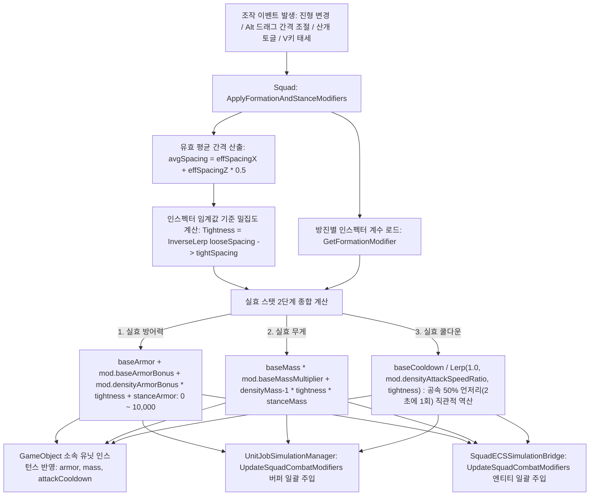
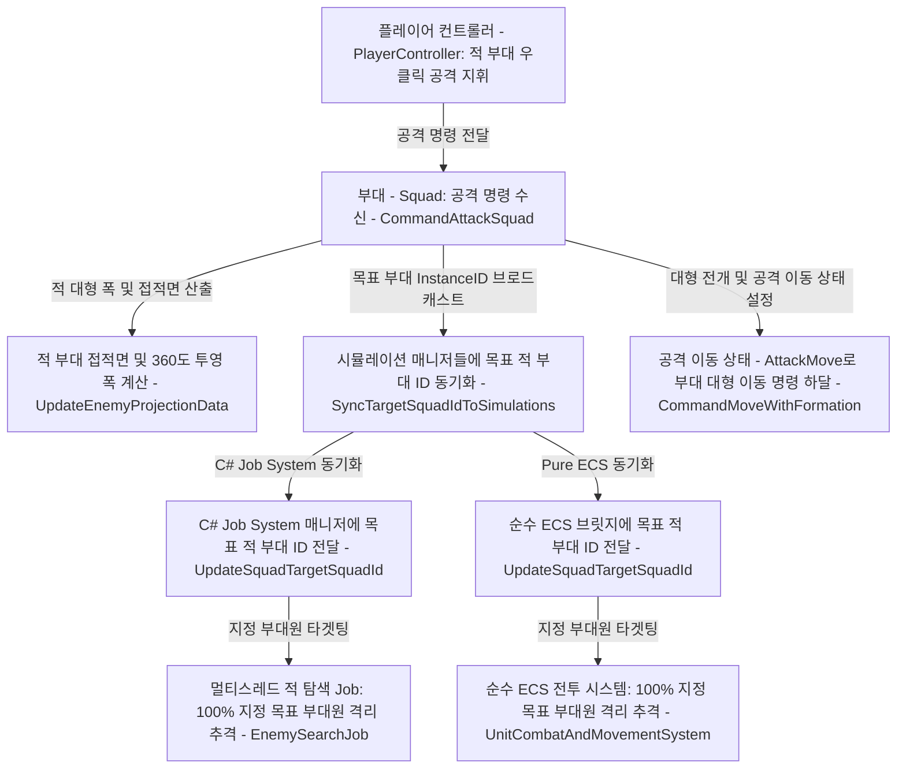

# ⚔️ [Squad.cs] 부대 지휘 & 대형 기동 시스템 아키텍처 가이드

> **원본 소스 파일**: [Squad.cs](file:///a:/Unity/MiniTotalWar2D/MiniTotalWar2D/Assets/Scripts/Squad.cs) (총 줄 수: 3,248줄)

---

## 💡 1. 핵심 요약 & 역할
수백~수천 명의 병사(Unit)들을 하나의 전술 부대로 통솔하여, **진형 배치(Formation), 방진 형성 기본 효과(Base)와 산개도 비례 추가 효과(Density Scaling)의 2단계 스탯 시스템, 간격 기반 연속 밀집도(Tightness) 계산, 공간 정렬(Spatial Sort), 방향성 순차 출발(Wave), 포위 기동(Envelopment), 멀티코어 Job 및 Pure ECS 듀얼 모드 실시간 동기화, 부대 AI**를 총괄하는 핵심 지휘 스크립트입니다.

---

## 🌳 2. 아키텍처 트리 맵 (Architecture Tree Map)

- 📁 **1. 생명주기 및 초기화 (Lifecycle & Initialization)**
  - `Start()`: 부대 컴포넌트 초기화, UI/미니맵 등록 및 초기 진형 실효 스탯 일괄 동기화
  - `OnDestroy()`: 부대 해체 및 리소스 정리 (부대 카드, 아이콘, 미니맵 마커 자동 철거)
  - `InitializeSquadOnStart()`: 시작 시 부대원 자동 등록 및 초기 중심점 계산
  - `HandleSquadWipedOut()`: 부대원 전멸 시 0명 확정, 매니저 등록 해제 및 부대 오브젝트 파괴 일괄 처리
- 📁 **2. 진형 슬롯 및 기하학 연산 (Formation & Geometry)**
  - 📂 2.1. 기본 슬롯 계산 (Standard Grid Slots)
    - `CalculateSlotLocalOffset()`: 대형 내 개별 슬롯 상대 좌표 계산
    - `CalculateSlotWorldPosition()`: 대형 내 개별 슬롯 월드 좌표 계산
    - `GetSlotLocalOffset()`: 진형 타입별 통합 오프셋 산출
  - 📂 2.2. 특수 진형 연산 (Special Formations)
    - `CalculateCurvedSlotOffset()`: Alt+좌클릭 2차 포물선 곡선 대형 계산
    - `CalculateEnvelopmentSlot()`: 전열 폭 비례 U자형 포위망 슬롯 계산
    - `CalculateOrganicDefensiveSlot()`: 피포위 수비 시 방어선 슬롯 계산
- 📁 **3. 이동 및 지휘 명령 (Movement & Command Dispatch)**
  - `CommandMoveWithFormation()`: 지정 목적지로 부대 대형 이동 명령 및 실효 스탯 최신화
  - `CommandAttackSquad()`: 지정 적 부대 타겟팅 및 쇄도 포위 돌격
  - `CommandStop()`: 전 부대원 즉시 정지 및 진형 사수
  - `CommandCurvedFormation()`: 곡선 대형 전개 명령
  - `AddWaypoint()`, `ClearWaypoints()`: 다중 경유지(Waypoint) 대기열 관리
- 📁 **4. 순차 기동 및 공간 정렬 루틴 (Staggered Dispatch & Spatial Sort)**
  - `AssignFormationPositionsRoutine()`: O(N^2) 공간 정렬 및 슬롯 배정 코루틴
  - `StartUnitsMovementStaggered()`: 전진/후진 방향성 열 단위 순차 출발 코루틴
- 📁 **5. 전투 추적, 포위 및 AI (Combat Tracking, Envelopment & AI)**
  - `UpdateTargetSquadTracking()`: 공격 중 목표 적 부대 실시간 추적 및 갱신
  - `UpdateEnemyProjectionData()`: 적 부대 접적면 및 360도 좌표 투영
  - `DetectEnvelopmentThreat()`: 적의 포위 위협 감지
  - `UpdateEnemySquadAI()`: 적군 부대의 1:1 전선 매칭 및 목표 부대 영구 고수(Sticky Target Lock) AI
  - `UpdatePostCombatAutoReform()`, `ReformSquadAfterCombat()`: 전투 종료 후 전열 재정비
- 📁 **6. 모드 전환 및 동기화 (Modes & Dual-Engine Sync)**
  - `ToggleRunMode()`, `SetRunMode()`: 달리기/걷기 모드 전환
  - `ToggleLooseFormation()`, `SetFormationType()`: 산개진/밀집진/특수진 전환 및 스탯 재계산
  - `SetAutoAttack()`, `SetStance()`: 자동 요격(V키 접촉 방어) 및 부대 태세 전환
  - `SyncTargetSquadIdToSimulations()`: Job System 및 Pure ECS 양방향 동기화
  - `UpdateECSEntitiesTarget()`, `UpdateECSEntitiesSpeed()`: 순수 ECS 엔티티 1:1 동기화
- 📁 **7. 🛡️ 방진 형성 및 산개도 인스펙터 스탯 시스템 (Formation & Density Inspector System)**
  - `FormationStatModifier`: 방진 형성 기본 효과(Base)와 산개도 비례 추가 효과(Density) 2단계 분리 구조체
  - `looseSpacingThreshold`, `tightSpacingThreshold`: 인스펙터에서 완전 산개/최대 밀집 간격 임계값 튜닝
  - `GetFormationModifier()`: 현재 방진 타입에 대응하는 튜닝 파라미터 반환
  - `GetFormationTightness()`: 인스펙터 임계값 기준 0.0(산개) ~ 1.0(초밀집) 연속 밀집도 계산
  - `ApplyFormationAndStanceModifiers()`: 실효 방어력(0~10,000), 무게, 공격 쿨다운(공속 최대 70% 둔화) 계산 후 유닛, C# Job, Pure ECS 3계층 일괄 동기화

---

## 🗂️ 3. 해시 테이블 메서드/구조체 색인표 (Method Fast-Index Table)

> ⚡ **에이전트 지침**: 코드 수정 전 아래 색인표에서 줄 번호 링크를 확인하고, `view_file`로 해당 범위만 직접 조회하여 작업하십시오.

| 메서드 / 구조체 (Key) | 반환형 / 파라미터 | 핵심 역할 & 기능 요약 (Value) | 호출자 (Callers) | 소스 줄 번호 (Line Range) |
| :--- | :--- | :--- | :--- | :--- |
| `FormationStatModifier` | `struct` | 1단계: 방진 기본 효과(방어력, 무게), 2단계: 산개도 비례 추가 효과(방어, 무게, 공속) 저장 | `Squad.cs`, `BattleManager.cs` | [Squad.cs#L85-L113](file:///a:/Unity/MiniTotalWar2D/MiniTotalWar2D/Assets/Scripts/Squad.cs#L85-L113) |
| `looseSpacingThreshold` | `float` | 완전 산개 판정 간격(m) - 이 간격 이상이면 밀집 보너스 0% | `GetFormationTightness` | [Squad.cs#L116](file:///a:/Unity/MiniTotalWar2D/MiniTotalWar2D/Assets/Scripts/Squad.cs#L116) |
| `tightSpacingThreshold` | `float` | 최대 밀집 판정 간격(m) - 이 간격 이하이면 밀집 보너스 100% | `GetFormationTightness` | [Squad.cs#L119](file:///a:/Unity/MiniTotalWar2D/MiniTotalWar2D/Assets/Scripts/Squad.cs#L119) |
| `GetFormationModifier` | `FormationStatModifier (type)` | 현재 방진 타입(Normal, Wedge, Square 등)별 인스펙터 계수 반환 | `ApplyFormationAndStanceModifiers` | [Squad.cs#L757-L768](file:///a:/Unity/MiniTotalWar2D/MiniTotalWar2D/Assets/Scripts/Squad.cs#L757-L768) |
| `GetFormationTightness` | `float ()` | 인스펙터 임계값 기준 0.0~1.0 연속 밀집도 산출 | `ApplyFormationAndStanceModifiers` | [Squad.cs#L770-L790](file:///a:/Unity/MiniTotalWar2D/MiniTotalWar2D/Assets/Scripts/Squad.cs#L770-L790) |
| `ApplyFormationAndStanceModifiers` | `void ()` | 방진 기본 + 산개도 비례 + 태세 결합 실효 스탯 산출 및 3계층 동기화 | `Start`, `RebuildGrid`, `CommandMove`, `SetAutoAttack` | [Squad.cs#L792-L860](file:///a:/Unity/MiniTotalWar2D/MiniTotalWar2D/Assets/Scripts/Squad.cs#L792-L860) |
| `MemberCount` | `int (get)` | 실시간 생존 부대원 수 반환 (Pure ECS / GameObject 완전 호환) | `UI`, `PlayerController`, `AI` | [Squad.cs#L42-L57](file:///a:/Unity/MiniTotalWar2D/MiniTotalWar2D/Assets/Scripts/Squad.cs#L42-L57) |
| `HandleSquadWipedOut` | `void ()` | 부대 전멸 시 0명 확정, 매니저 해제 및 오브젝트 파괴 일괄 처리 | `UpdateSquadCenter`, `OnUnitDied` | [Squad.cs#L2928-L2938](file:///a:/Unity/MiniTotalWar2D/MiniTotalWar2D/Assets/Scripts/Squad.cs#L2928-L2938) |
| `CalculateSlotLocalOffset` | `Vector3 (r, c, count, rows, cols)` | 열과 행에 따른 슬롯 상대 좌표 계산 | `RebuildGridStructure` | [Squad.cs#L216-L238](file:///a:/Unity/MiniTotalWar2D/MiniTotalWar2D/Assets/Scripts/Squad.cs#L216-L238) |
| `CalculateSlotWorldPosition` | `Vector3 (r, c, ..., center, rot)` | 중심점 및 회전각 기반 슬롯 월드 좌표 산출 | `AssignFormationPositions` | [Squad.cs#L240-L255](file:///a:/Unity/MiniTotalWar2D/MiniTotalWar2D/Assets/Scripts/Squad.cs#L240-L255) |
| `SetRunMode` | `void (bool run)` | 구보/제식보행 속도 전환 및 엔티티 동기화 | `PlayerController`, `R키` | [Squad.cs#L591-L608](file:///a:/Unity/MiniTotalWar2D/MiniTotalWar2D/Assets/Scripts/Squad.cs#L591-L608) |
| `SetFormationType` | `void (SquadFormationType type)` | 진형 형태(일자, 사각방진, 쐐기 등) 변경 및 스탯 갱신 | `CommandUI`, 단축키 | [Squad.cs#L862-L883](file:///a:/Unity/MiniTotalWar2D/MiniTotalWar2D/Assets/Scripts/Squad.cs#L862-L883) |
| `RebuildGridStructure` | `void (int targetCols, bool sort)` | 부대 열 수 변경에 따른 내부 대형 격자 재구축 및 스탯 갱신 | `PlayerController`, `Awake` | [Squad.cs#L885-L967](file:///a:/Unity/MiniTotalWar2D/MiniTotalWar2D/Assets/Scripts/Squad.cs#L885-L967) |
| `CommandMoveWithFormation` | `void (dest, rot, cols, sort, state)` | 부대 전체 대형 이동 명령 및 실효 스탯 최신화 | `PlayerController`, `Update` | [Squad.cs#L969-L1050](file:///a:/Unity/MiniTotalWar2D/MiniTotalWar2D/Assets/Scripts/Squad.cs#L969-L1050) |
| `CommandAttackSquad` | `void (Squad enemySquad)` | 지정 적 부대 타겟팅 및 포위 대형 쇄도 | `PlayerController`, `AI` | [Squad.cs#L1454-L1500](file:///a:/Unity/MiniTotalWar2D/MiniTotalWar2D/Assets/Scripts/Squad.cs#L1454-L1500) |
| `SyncTargetSquadIdToSimulations` | `void (int targetSquadId)` | Job System & Pure ECS(직접 주입 폴백) targetId 동기화 | `CommandAttackSquad`, `Tracking` | [Squad.cs#L1507-L1550](file:///a:/Unity/MiniTotalWar2D/MiniTotalWar2D/Assets/Scripts/Squad.cs#L1507-L1550) |
| `UpdateEnemyProjectionData` | `void (enemy, rot, center)` | 적 부대의 360도 투영 폭 및 접적면 계산 | `CommandAttackSquad`, `Tracking` | [Squad.cs#L1552-L1700](file:///a:/Unity/MiniTotalWar2D/MiniTotalWar2D/Assets/Scripts/Squad.cs#L1552-L1700) |
| `UpdateTargetSquadTracking` | `void ()` | 공격 중인 적 부대 위치 추적 및 슬롯 갱신 | `Update` | [Squad.cs#L1815-L1910](file:///a:/Unity/MiniTotalWar2D/MiniTotalWar2D/Assets/Scripts/Squad.cs#L1815-L1910) |
| `SetAutoAttack` | `void (bool enabled)` | 적 접근 시 자동 선제 요격 허용 및 접촉 방어(V키) 스탯 동기화 | `PlayerController`, `V키` | [Squad.cs#L1300-L1350](file:///a:/Unity/MiniTotalWar2D/MiniTotalWar2D/Assets/Scripts/Squad.cs#L1300-L1350) |
| `GetFrontLineCenter` | `Vector3 ()` | 부대 맨 앞열(전열)의 물리적 중심 좌표 반환 | `UpdateEnemyTracking` | [Squad.cs#L3000-L3040](file:///a:/Unity/MiniTotalWar2D/MiniTotalWar2D/Assets/Scripts/Squad.cs#L3000-L3040) |
| `GetVisualCenter` | `Vector3 ()` | 생존 부대원 전체의 실제 평균 중심 좌표 | `PlayerController`, `AI` | [Squad.cs#L3041-L3070](file:///a:/Unity/MiniTotalWar2D/MiniTotalWar2D/Assets/Scripts/Squad.cs#L3041-L3070) |

---

## 🔀 4. 유향 그래프 흐름도 (Data & Call Flow Graph)

### 1) 방진 형성 및 산개도 인스펙터 동기화 파이프라인

### 2) 부대 공격 명령 및 목표 부대 동기화 파이프라인

---

## ⚙️ 5. 주요 상태 변수 및 설정 (State Variables)

| 변수명 | 타입 | 기본값 | 상세 설명 |
| :--- | :--- | :--- | :--- |
| `looseSpacingThreshold` | `float` | 2.2f | 완전 산개 판정 간격(m) - 이 간격 이상이면 밀집 보너스 0% |
| `tightSpacingThreshold` | `float` | 0.7f | 최대 밀집 판정 간격(m) - 이 간격 이하이면 밀집 보너스 100% |
| `normalBonus` | `FormationStatModifier` | (500, 1.2x) / (1000, 1.5x, 0.50) | 일반 방진 기본(+5%, 1.2배) / 밀집(+10%, 1.5배, 공속 50%로 감소 - 2.0초당 1회) |
| `wedgeBonus` | `FormationStatModifier` | (200, 1.4x) / (500, 1.8x, 0.55) | 쐐기진 기본(+2%, 1.4배) / 밀집(+5%, 1.8배, 공속 55%로 감소 - 1.82초당 1회) |
| `squareBonus` | `FormationStatModifier` | (1000, 1.5x) / (1500, 2.0x, 0.50) | 사각방진 기본(+10%, 1.5배) / 밀집(+15%, 2.0배, 공속 50%로 감소 - 2.0초당 1회) |
| `circleBonus` | `FormationStatModifier` | (1200, 1.6x) / (1800, 2.2x, 0.45) | 원형진 기본(+12%, 1.6배) / 밀집(+18%, 2.2배, 공속 45%로 감소 - 2.22초당 1회) |
| `diamondBonus` | `FormationStatModifier` | (400, 1.3x) / (600, 1.6x, 0.52) | 마름모진 기본(+4%, 1.3배) / 밀집(+6%, 1.6배, 공속 52%로 감소 - 1.92초당 1회) |
| `bracingArmorBonus` | `int` | 2000 | 접촉 방어 태세(V키 꺼짐) 시 추가 방어력 (+20.00%) |
| `bracingMassMultiplier` | `float` | 1.8f | 접촉 방어 태세(V키 꺼짐) 시 무게 배율 (+80% 돌격 저지) |
| `baseArmor` | `int` | 0 | 유닛 프리팹 원본 기준 방어력 (0 ~ 10,000 만분율) |
| `baseMass` | `float` | 100f | 유닛 프리팹 원본 기준 무게 (밀림 저항력) |
| `baseAttackCooldown` | `float` | 1.0f | 유닛 프리팹 원본 기준 기본 공격 주기(초) |
| `currentFormationType` | `SquadFormationType` | Normal | 현재 선택된 부대 진형 (`Normal`, `Loose`, `Wedge`, `Diamond`, `Square`, `Circle`) |
| `isLooseFormation` | `bool` | false | 산개 대형 활성화 여부 (활성화 시 방진 보너스 0%, 자유 유닛 1.0배) |
| `autoAttackEnabled` | `bool` | true | 자동 요격 허용 여부 (`false` 시 접촉 방어 태세 - Bracing 발동) |

---

## 🛠️ 6. 핵심 알고리즘, 물리/전투 수학 공식 & 조작법

### 1. 방진 형성 기본 효과 vs 산개도 비례 추가 효과 2단계 공식
- **1단계: 방진 형성 기본 효과 (Base)**:
  - 방진을 형성하는 것만으로 부여되는 전술 대형 고유 이점.
  - `formationBaseArmor = isLoose ? 0 : mod.baseArmorBonus;`
  - `formationBaseMass = isLoose ? 1.0f : mod.baseMassMultiplier;`
  - 산개진(`isLooseFormation || formType == Loose`)에서는 사용자의 요구사항에 따라 0% 가산 및 1.0배(일반 자유 유닛과 동일)가 됩니다.
- **2단계: 산개도(밀집도) 비례 추가 효과 (Density Scaling)**:
  - 대형을 좁힐수록 병사들이 밀착하여 방어력과 무게가 상승하고, 행동 반경 축소로 공속이 둔화됨.
  - `densityArmorBonus = isLoose ? 0 : Mathf.RoundToInt(mod.densityArmorBonus * tightness);`
  - `densityMassMultiplier = isLoose ? 0f : ((mod.densityMassMultiplier - 1.0f) * tightness);`
  - `currentSpeedRatio = isLoose ? 1.0f : Mathf.Lerp(1.0f, mod.densityAttackSpeedRatio, tightness);`
  - `effectiveCooldown = baseAttackCooldown / Mathf.Max(0.01f, currentSpeedRatio);` (공속 직관화 역산)

### 2. 간격 기반 연속 밀집도 (Tightness Metric)
- `평균 간격 = (유효 횡간격 + 유효 종간격) * 0.5f`
- `Tightness = Mathf.Clamp01(Mathf.InverseLerp(looseSpacingThreshold, tightSpacingThreshold, 평균 간격))`
- **완전 산개 (`avgSpacing >= looseSpacingThreshold`)**: `Tightness = 0.0`
- **최대 밀집 (`avgSpacing <= tightSpacingThreshold`)**: `Tightness = 1.0`

### 3. 정수 만분율(0 ~ 10,000) 방어력 및 감쇄 공식
- `실효 피해량 = (armor >= 10000) ? 0f : Mathf.Max(1.0f, rawDamage * (1.0f - armor / 10000.0f));`
- 10,000 미만에서는 최소 1.0의 유효 피해를 보장하며, 10,000 달성 시 100% 무적 처리.

---

## 🔗 7. 다른 스크립트와의 연동 관계 (Dependencies)

- **[BattleManager.cs](file:///a:/Unity/MiniTotalWar2D/MiniTotalWar2D/Assets/Scripts/BattleManager.cs)**: 씬의 전역 매니저 인스펙터에서 전체 방진 및 산개도 계수를 일괄 조절하고 스폰 부대에 주입.
- **[Unit.cs](file:///a:/Unity/MiniTotalWar2D/MiniTotalWar2D/Assets/Scripts/Unit.cs)**: 기본 스탯(`baseArmor`, `baseMass`, `baseAttackCooldown`) 제공 및 실효 스탯 반영 수신.
- **[UnitEditor.cs](file:///a:/Unity/MiniTotalWar2D/MiniTotalWar2D/Assets/Editor/UnitEditor.cs)**: 0~10,000 만분율 방어력 인스펙터 슬라이더 및 실시간 감쇄율 UI 연동.
- **[UnitJobSimulationManager.cs](file:///a:/Unity/MiniTotalWar2D/MiniTotalWar2D/Assets/Scripts/UnitJobSimulationManager.cs)**: `UpdateSquadCombatModifiers`를 통해 C# Job System NativeArray 버퍼에 실효 스탯 일괄 주입.
- **[SquadECSSimulationBridge.cs](file:///a:/Unity/MiniTotalWar2D/MiniTotalWar2D/Assets/Scripts/ECS/SquadECSSimulationBridge.cs)**: Pure ECS `UnitCombatData` 컴포넌트에 실효 스탯 일괄 주입.
- **[PlayerController.cs](file:///a:/Unity/MiniTotalWar2D/MiniTotalWar2D/Assets/Scripts/PlayerController.cs)**: 진형 변경, 간격 드래그 조절, V키 태세 전환 명령 하달.
