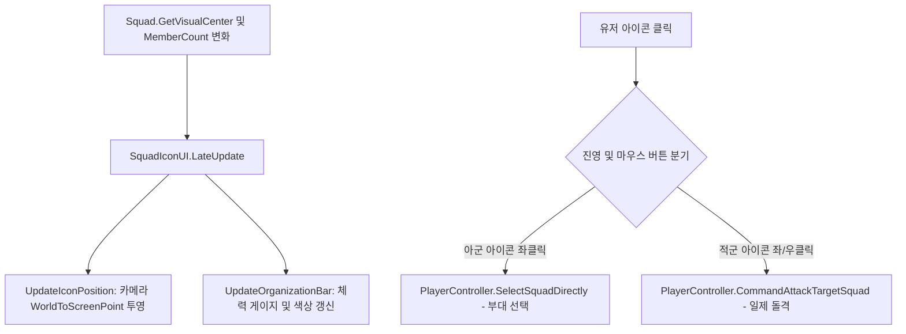

# 🏷️ [SquadIconUI.cs] 3D 월드 부대 머리 위 UI 시스템 가이드

> **원본 소스 파일**: [SquadIconUI.cs](file:///c:/unityProject/MiniTotalWar2D/Assets/Scripts/SquadIconUI.cs) (총 줄 수: 286줄), [SquadIconUIManager.cs](file:///c:/unityProject/MiniTotalWar2D/Assets/Scripts/SquadIconUIManager.cs)

---

## 💡 1. 핵심 요약 & 역할
전장 각 부대의 실제 중심 좌표(`GetVisualCenter()`)를 3D 스크린 좌표로 실시간 추적하여, **부대 머리 위 깃발 아이콘, 조직력(잔여 병력) 게이지 바, 진영/선택 색상 동기화 및 아이콘 클릭을 통한 아군 부대 선택 / 적군 부대 일제 돌격 공격 명령**을 처리하는 3D 월드 UI 컴포넌트입니다.

---

## 🌳 2. 아키텍처 트리 맵 (Architecture Tree Map)

- 📁 **1. 초기화 및 바인딩 (Initialization)**
  - `Awake()`, `Start()`, `OnDestroy()`: 컴포넌트 캐싱 및 버튼 리스너 바인딩
  - `Initialize(Squad squad)`: 대상 부대 바인딩, 초기 조직력 게이지 설정, 진영 색상(아군/적군) 지정
- 📁 **2. 실시간 위치 및 게이지 동기화 (`LateUpdate`)**
  - `UpdateIconPosition()`: `targetSquad.GetVisualCenter()`를 스크린 좌표(`WorldToScreenPoint`)로 변환하여 머리 위(`offset = (0, 40, 0)`)에 부드럽게 고정
  - `UpdateOrganizationBar()`: 잔여 병력 비율(`MemberCount / initialUnitCount`) 계산 및 `fillAmount` 적용
  - 동적 색상 전환:
    - **적군 부대**: 선명한 레드 (`#F24040`)
    - **아군 부대 (미선택)**: 기본 블루 (`#2E80F2`)
    - **아군 부대 (선택됨)**: 유닛 하이라이트와 일치하는 밝은 시안 형광 청록 (`#26EBFF`)
- 📁 **3. 마우스 인터랙션 및 지휘 (`OnPointerClick`)**
  - `OnPointerClick(PointerEventData)`:
    - **아군 아이콘 좌클릭**: 부대 선택 (`playerController.SelectSquadDirectly`, Shift 누름 시 다중 선택)
    - **적군 아이콘 좌클릭 / 우클릭**: 선택된 아군 부대가 해당 적 부대를 향해 일제 돌격 명령 발동 (`playerController.CommandAttackTargetSquad`)
  - `SetUIVisible(bool visible)`: 부대 전멸 또는 카메라 시야 밖 이탈 시 `CanvasGroup.alpha` 0으로 숨김

---

## 🗂️ 3. 해시 테이블 메서드 색인표 (Method Fast-Index Table)

> ⚡ **에이전트 지침**: 코드 수정 전 아래 색인표에서 줄 번호 링크를 확인하고, `view_file`로 해당 범위만 직접 조회하여 작업하십시오.

| 메서드 (Key) | 반환형 / 파라미터 | 핵심 역할 & 기능 요약 (Value) | 호출자 (Callers) | 소스 줄 번호 (Line Range) |
| :--- | :--- | :--- | :--- | :--- |
| `Initialize` | `void (Squad squad)` | 특정 부대와 1:1 바인딩 및 조직력 게이지 초기화 | `SquadIconUIManager` | [SquadIconUI.cs#L71-L120](file:///c:/unityProject/MiniTotalWar2D/Assets/Scripts/SquadIconUI.cs#L71-L120) |
| `UpdateOrganizationBar` | `void ()` | 잔여 병력 비율 및 선택/진영 상태별 색상 갱신 | `LateUpdate` | [SquadIconUI.cs#L133-L156](file:///c:/unityProject/MiniTotalWar2D/Assets/Scripts/SquadIconUI.cs#L133-L156) |
| `UpdateIconPosition` | `void ()` | 부대 중심점 월드 좌표를 스크린 좌표로 투영 | `LateUpdate` | [SquadIconUI.cs#L158-L216](file:///c:/unityProject/MiniTotalWar2D/Assets/Scripts/SquadIconUI.cs#L158-L216) |
| `OnPointerClick` | `void (PointerEventData eventData)` | 아이콘 좌클릭(선택/공격) / 우클릭(적 부대 즉시 돌격) 분기 | 유니티 이벤트 시스템 | [SquadIconUI.cs#L233-L253](file:///c:/unityProject/MiniTotalWar2D/Assets/Scripts/SquadIconUI.cs#L233-L253) |
| `OnSquadButtonClicked` | `void ()` | 아군 선택(Shift 다중선택) or 적군 돌격 명령 하달 | `Button.onClick` | [SquadIconUI.cs#L255-L285](file:///c:/unityProject/MiniTotalWar2D/Assets/Scripts/SquadIconUI.cs#L255-L285) |

---

## 🔀 4. 유향 그래프 흐름도 (Data & Call Flow Graph)

---

## ⚙️ 5. 주요 인스펙터 설정 변수

| 변수명 | 타입 | 기본값 | 설명 |
| :--- | :--- | :--- | :--- |
| `offset` | `Vector3` | `(0, 40, 0)` | 부대 중심점 기준 머리 위 스크린 픽셀 오프셋 |
| `organizationImage` | `Image` | - | 조직력(잔여 병력 수)을 나타내는 Vertical Filled 이미지 |

---

## 🔗 6. 다른 스크립트와의 연동 관계 (Dependencies)

- **[Squad.cs](file:///c:/unityProject/MiniTotalWar2D/Docs/Squad.md)**: `targetSquad.GetVisualCenter()`, `targetSquad.MemberCount`를 참조하여 위치 및 게이지 갱신
- **[PlayerController.cs](file:///c:/unityProject/MiniTotalWar2D/Docs/PlayerController.md)**: 아이콘 클릭 시 부대 선택(`SelectSquadDirectly`) 및 공격 지휘(`CommandAttackTargetSquad`) 호출
