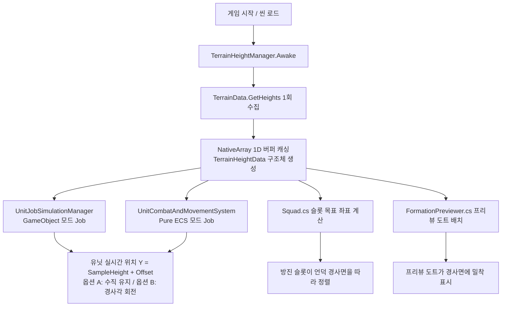

# ⛰️ TerrainHeightManager 가이드 문서

## 💡 핵심 요약 & 역할 (Summary & Role)
- **책임 영역**: 씬 내 `Terrain(터레인)`의 높이맵(Heightmap) 데이터를 런타임 시작 시 1회 고속 메모리(`NativeArray<float>`)로 캐싱하여, 멀티스레드 C# Job System 및 Pure ECS 시스템에서 수천~수만 기의 유닛이 0.05ms 안에 지형 굴곡을 따라 완벽 밀착 이동하도록 지원하는 핵심 지형 고도 공급자입니다.
- **주요 해결 과제**: Unity 내장 `Terrain.SampleHeight()`가 메인 스레드 전용 API라는 치명적 제약을 극복하고, Burst 멀티스레드와 100% 호환되는 순수 값 타입 구조체 `TerrainHeightData`를 통해 O(1) 초고속 쌍선형 보간(Bilinear Interpolation) 고도 및 법선(Normal) 계산을 제공합니다.

---

## 🌳 1. 아키텍처 트리 맵 (Tree Map)

```text
TerrainHeightManager (MonoBehaviour, Singleton)
├── 데이터 수집 및 캐싱 (Awake / InitializeTerrainData)
│   ├── Target Terrain 탐색 (Terrain.activeTerrain / FindFirstObjectByType)
│   ├── Heightmap 2D 배열 수집 (TerrainData.GetHeights)
│   └── 1D NativeArray 평탄화 (NativeArray<float>, Allocator.Persistent)
├── 런타임 고속 공급 구조체 (TerrainHeightData, Blittable Struct)
│   ├── O(1) 지형 높이 샘플링 (SampleHeight: Bilinear Interpolation)
│   ├── O(1) 지형 표면 법선 계산 (SampleNormal: Bilinear Gradient)
│   └── O(1) 지형 사선 차폐 검사 (CheckLineOfSight: LoS Raymarching)
├── 정적 헬퍼 API (메인 스레드 & 일반 컴포넌트용)
│   ├── SampleHeightFast(worldX, worldZ)
│   ├── SampleNormalFast(worldX, worldZ)
│   └── CheckLineOfSightFast(shooterPos, targetPos, ...)
└── 생명주기 관리 및 메모리 해제 (OnDestroy / OnApplicationQuit)
    └── NativeArray.Dispose()
```

---

## 🗂️ 2. 해시 테이블 메서드/구조체 색인표 (Hash Table Index)

| Key (메서드 / 구조체) | Role (역할 및 설명) | 의존성 |
| :--- | :--- | :--- |
| `TerrainHeightData` | Burst Job 및 ECS에 값 복사로 전달되는 Blittable 지형 데이터 구조체 | `Unity.Mathematics`, `Unity.Collections` |
| `TerrainHeightData.SampleHeight` | 월드 (X, Z) 좌표에 대한 지형 표면 높이(Y)를 O(1) 쌍선형 보간으로 계산 | `math.clamp`, `math.lerp` |
| `TerrainHeightData.SampleNormal` | 월드 (X, Z) 좌표에 대한 지형 표면 법선 벡터(Normal)를 O(1) 편미분으로 계산 | `math.normalize` |
| `TerrainHeightData.CheckLineOfSight` | 사수와 목표 사이의 직선 사선이 중간 언덕에 가려졌는지 O(1) 높이 샘플링으로 검사 | `math.lerp`, `SampleHeight` |
| `TerrainHeightManager.Instance` | 싱글톤 인스턴스 접근자 (미존재 시 자동 동적 생성) | `MonoBehaviour` |
| `TerrainHeightManager.InitializeTerrainData` | 터레인 높이맵을 1회 읽어 NativeArray에 복사/캐싱 | `TerrainData.GetHeights` |
| `TerrainHeightManager.SampleHeightFast` | 메인 스레드 및 일반 스크립트(`Squad`, `FormationPreviewer`)에서 호출하는 초고속 높이 샘플러 | `TerrainHeightData.SampleHeight` |
| `TerrainHeightManager.SampleNormalFast` | 메인 스레드에서 지형 법선 벡터를 샘플링하는 정적 함수 | `TerrainHeightData.SampleNormal` |
| `TerrainHeightManager.CheckLineOfSightFast` | 메인 스레드에서 사수-목표 간 사선 차폐 여부를 검사하는 정적 함수 | `TerrainHeightData.CheckLineOfSight` |

---

## 🔀 3. 유향 그래프 흐름도 (Directed Graph - Mermaid)



---

## ⚙️ 4. 주요 상태 변수, 데이터 구조체 & 인스펙터 옵션 (State, Structs & Inspector Fields)

| 변수 / 필드명 | 타입 | 기본값 | 상세 역할 및 설명 |
| :--- | :--- | :--- | :--- |
| `targetTerrain` | `Terrain` | null | 참조할 대상 터레인 (미지정 시 `Terrain.activeTerrain` 자동 탐색) |
| `cachedHeights` | `NativeArray<float>` | Allocator.Persistent | 하이트맵 해상도 제곱(Res × Res) 크기의 영구 네이티브 버퍼 |
| `heightData` | `TerrainHeightData` | isValid = 0 | Burst Job 및 ECS 시스템에 전달되는 Blittable 구조체 |
| `isDataReady` | `bool` | false | 하이트맵 캐시가 정상 구축되어 샘플링 가능한 상태인지 여부 |

---

## 🛠️ 5. 핵심 알고리즘, 물리/전투 수학 공식 & 조작법 (Algorithms, Math & Controls)

### 1. 지형 높이 쌍선형 보간 (Bilinear Interpolation)
- **정규화 좌표 변환**:
  - `u = clamp((worldX - originX) / sizeX, 0, 1)`
  - `v = clamp((worldZ - originZ) / sizeZ, 0, 1)`
- **그리드 인덱스 및 미세 계수**:
  - `fx = u * (res - 1)`, `fz = v * (res - 1)`
  - `x0 = (int)fx`, `z0 = (int)fz`, `x1 = x0 + 1`, `z1 = z0 + 1`
  - `tx = fx - x0`, `tz = fz - z0`
- **4점 가중치 보간**:
  - `h0 = lerp(h00, h10, tx)`
  - `h1 = lerp(h01, h11, tx)`
  - `worldY = originY + (lerp(h0, h1, tz) * sizeY)`

### 2. 지형 표면 법선 편미분 (Surface Normal Gradient)
- **X, Z 경사도(기울기) 편미분**:
  - `dh_dx = ((h10 - h00) * (1 - tz) + (h11 - h01) * tz) * sizeY / stepX`
  - `dh_dz = ((h01 - h00) * (1 - tx) + (h11 - h10) * tx) * sizeY / stepZ`
- **법선 벡터**:
  - `normal = normalize(-dh_dx, 1.0, -dh_dz)`

---

## 🔗 6. 다른 스크립트와의 연동 관계 (Dependencies & Pipeline)

1. **[UnitJobSimulationManager.cs](file:///c:/unityProject/MiniTotalWar2D/Assets/Scripts/UnitJobSimulationManager.cs)**:
   - 매 프레임 `TerrainHeightData`를 `UnitMovementAndCombatJob`에 전달하여 유닛의 이동 좌표 Y축을 지면에 밀착시키고, `alignToSlope == 1`일 때 법선 회전(옵션 B)을 적용합니다.
2. **[UnitCombatAndMovementSystem.cs](file:///c:/unityProject/MiniTotalWar2D/Assets/Scripts/ECS/Systems/UnitCombatAndMovementSystem.cs)**:
   - Pure ECS 환경에서 `UnitMovementCombatJob`에 `TerrainHeightData`를 전달하여 수만 기 엔티티를 지형 표면에 초고속으로 안착시킵니다.
3. **[Squad.cs](file:///c:/unityProject/MiniTotalWar2D/Assets/Scripts/Squad.cs)**:
   - 부대 이동 명령 및 슬롯 배치 시 `SampleHeightFast`를 호출하여 경사면을 따라 대열 슬롯을 배치합니다.
4. **[FormationPreviewer.cs](file:///c:/unityProject/MiniTotalWar2D/Assets/Scripts/FormationPreviewer.cs)**:
   - 드래그 프리뷰 시 도트의 고도를 실시간으로 보정하여 지형 표면에 정확히 표시합니다.
