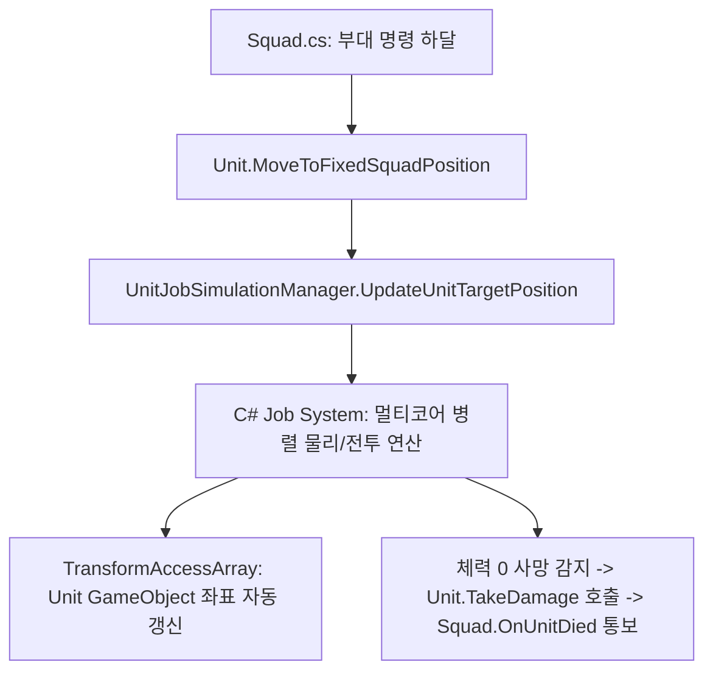

# 💂 [Unit.cs] 개별 3D 유닛 라이프사이클 & 상태 가이드

> **원본 소스 파일**: [Unit.cs](file:///c:/unityProject/MiniTotalWar2D/Assets/Scripts/Unit.cs) (총 줄 수: 약 650줄)

---

## 💡 1. 핵심 요약 & 역할
전장의 개별 3D 병사 인스턴스로, 체력/사망 처리, 부대 소속 슬롯 매핑, 선택 시 시각적 하이라이트(Projector), 그리고 무거운 물리 및 전투 연산을 **`UnitJobSimulationManager`에 위임하고 결과를 반영하는 3D 표현체** 역할을 수행합니다.

---

## 🌳 2. 아키텍처 트리 맵 (Architecture Tree Map)

- 📁 **1. 생명주기 및 시스템 등록 (Lifecycle & Registration)**
  - `Awake()`: 컴포넌트 초기화 및 NavMeshAgent 설정
  - `Start()`: `UnitJobSimulationManager`에 유닛 등록 (`RegisterUnit`)
  - `OnDestroy()`: 매니저에서 등록 해제 (`UnregisterUnit`)
- 📁 **2. 부대 대형 및 슬롯 연동 (Squad Formation Slots)**
  - `SetGridPosition()`, `SetGridIndices()`: 부대 내 행(Row)과 열(Col) 인덱스 설정
  - `SetInitialFormationPosition()`: 생성 시 초기 슬롯 좌표 및 오프셋 지정
  - `MoveToFixedSquadPosition()`: 부대 이동 명령 시 목표 좌표 갱신
  - `UpdateTargetPosition()`: 실시간 슬롯 좌표 및 회전 동기화
- 📁 **3. 단독 지휘 및 자유 유닛 이동 (Standalone Free Unit Commands)**
  - `MoveTo()`: 단독 단순 이동
  - `AttackMoveTo()`: 단독 공격 이동
  - `SetRunMode()`: 달리기/걷기 모드 및 속도 설정
- 📁 **4. 전투 및 상태 처리 (Combat & Health)**
  - `TakeDamage()`: 체력 차감, 사망 시 부대 알림(`OnUnitDied`) 및 오브젝트 정리
  - `SetSelected()`: 선택 표시 데칼/프로젝터 활성화/비활성화

---

## 🗂️ 3. 해시 테이블 메서드 색인표 (Method Fast-Index Table)

> ⚡ **에이전트 지침**: 코드 수정 전 아래 색인표에서 줄 번호 링크를 확인하고, `view_file`로 해당 범위만 직접 조회하여 작업하십시오.

| 메서드 (Key) | 반환형 / 파라미터 | 핵심 역할 & 기능 요약 (Value) | 호출자 (Callers) | 소스 줄 번호 (Line Range) |
| :--- | :--- | :--- | :--- | :--- |
| `SetInitialFormationPosition` | `void (squad, pos, offset, idx, r, c)` | 부대 생성 시 초기 슬롯 좌표와 격자 인덱스 배정 | `Squad.Awake` | [Unit.cs#L79-L101](file:///c:/unityProject/MiniTotalWar2D/Assets/Scripts/Unit.cs#L79-L101) |
| `Start` | `void ()` | Job System 시뮬레이션 매니저에 유닛 등록 | Unity Engine | [Unit.cs#L137-L150](file:///c:/unityProject/MiniTotalWar2D/Assets/Scripts/Unit.cs#L137-L150) |
| `MoveToFixedSquadPosition` | `void (squad, pos, offset, idx, rot, state)` | 부대 이동 명령 시 슬롯 목표 좌표 및 상태 전달 | `Squad.AssignFormation` | [Unit.cs#L428-L462](file:///c:/unityProject/MiniTotalWar2D/Assets/Scripts/Unit.cs#L428-L462) |
| `SetSelected` | `void (bool selected)` | 유닛 선택 시 녹색/청색 선택 링 하이라이트 토글 | `PlayerController` | [Unit.cs#L504-L533](file:///c:/unityProject/MiniTotalWar2D/Assets/Scripts/Unit.cs#L504-L533) |
| `TakeDamage` | `void (float amount)` | 피격 데미지 적용 및 체력 0 이하 시 사망 처리 | `UnitJobSimulationManager` | [Unit.cs#L535-L549](file:///c:/unityProject/MiniTotalWar2D/Assets/Scripts/Unit.cs#L535-L549) |
| `AttackMoveTo` | `void (Vector3 targetPos)` | 자유 유닛 개별 어택땅 명령 | `PlayerController` | [Unit.cs#L611-L635](file:///c:/unityProject/MiniTotalWar2D/Assets/Scripts/Unit.cs#L611-L635) |

---

## 🔀 4. 유향 그래프 흐름도 (Data & Call Flow Graph)

---

## ⚙️ 5. 주요 상태 변수 & 인스펙터 옵션 (Inspector Fields)

| 변수명 | 타입 | 기본값 | 상세 역할 & 튜닝 가이드 |
| :--- | :--- | :--- | :--- |
| `maxHp` | `float` | `100f` | 유닛 최대 체력 |
| `currentHp` | `float` | `100f` | 유닛 현재 실시간 체력 |
| `armor` | `int` | `0` | 기본 방어력 (0 ~ 10,000 만분율, 예: 2812 입력 시 28.12% 피해 감쇄) |
| `damage` | `float` | `10f` | 일반 백병전 기본 공격력 |
| `attackCooldown` | `float` | `1.0f` | 공격 주기(초) |
| `attackRange` | `float` | `1.45f` | 유닛 공격 유효 사거리 (검병: 1.45m, 장창병: 3.0m 권장) |
| `minAttackRange` | `float` | `0f` | 주무기 최소 사거리 (검병: 0m, 장창병: 1.2m~1.5m 권장. 0이면 사각지대 없음) |
| `optimalRangeMin` | `float` | `0f` | 주무기 최적 사거리(스위트스팟) 최소 기준거리 (이 거리 이상에서 100% 정상 데미지, 검병: 0m, 장창병: 1.8m~2.0m 권장) |
| `closeRangeDamageRatio` | `float` | `1.0f` | 최적 사거리 미만 품 안으로 파고든 적에게 주는 피해량 비율 (0.1~1.0, 검병: 1.0, 장창병: 0.35 권장) |
| `knockbackPower` | `float` | `1.0f` | 주무기 타격 시 적을 밀쳐내는 넉백 세기 배율 (검병: 1.0, 장창병: 2.0~2.5 권장) |
| `baseMeleeKnockback` | `float` | `0.45f` | 일반 평타(창 찌르기, 칼질) 시 발생하는 기본 저지 넉백 속도 (m/s) |
| `maxMeleeKnockbackCap` | `float` | `1.2f` | 다대일 집중 공격 시 누적될 수 있는 평타 넉백 속도 상한선 (m/s, 밀림 거리 약 9~15cm) |
| `useSidearm` | `bool` | `false` | 적 밀착 시 보조무기 자동 전환 여부 (검병: 체크 해제, 장창병: 체크 권장) |
| `sidearmSwitchDistance` | `float` | `1.2f` | 보조무기로 전환하는 적과의 거리 기준 (권장: 1.2m) |
| `sidearmAttackRange` | `float` | `1.0f` | 보조무기 유효 공격 사거리 (권장: 1.0m) |
| `sidearmDamage` | `float` | `4.0f` | 보조무기 1회 공격력 (권장: 4.0f) |
| `sidearmAttackCooldown` | `float` | `0.8f` | 보조무기 공격 주기 (연타: 0.8초 권장) |
| `sidearmKnockbackPower` | `float` | `0.1f` | 보조무기 넉백 세기 배율 (보조무기는 밀치는 힘이 매우 미미함: 0.1 권장) |
| `sidearmBaseKnockback` | `float` | `0.2f` | 보조무기 평타 타격 시 발생하는 기본 저지 넉백 속도 (m/s) |
| `sidearmMaxKnockbackCap` | `float` | `0.8f` | 다대일 집중 타격 시 누적될 수 있는 보조무기 넉백 속도 상한선 (m/s, 밀림 거리 약 5cm) |
| `combatStoppingDistance` | `float` | `1.05f` | 교전(백병전) 시 발을 멈추고 제자리에서 공격하는 정지 거리 (기본 보병: 1.05m, 장창병: 2.5m+) |
| `engagementOffset` | `float` | `0.40f` | 적을 향해 전진할 때 적 중심으로부터 유지할 목표 교전 간격 (기본 보병: 0.4m, 장창병: 2.0m+) |
| `walkSpeed` | `float` | `1.2f` | 기본 제식 걷기 속도 (m/s) |
| `runSpeed` | `float` | `2.8f` | 전술 구보(달리기) 속도 (m/s) |
| `chargeSpeed` | `float` | `4.8f` | 적을 향해 쇄도하는 돌격 이동 속도 (m/s) |
| `canReflectCharge` | `bool` | `false` | 돌격 반사(창벽 저지) 능력 보유 여부 (검병: false, 장창병: true) |
| `mass` | `float` | `100f` | 유닛 질량(kg, 넉백 및 충격량 계산용) |
| `chargeBonus` | `float` | `15f` | 돌격 충격 추가 데미지 기준 계수 (속도 비례 증가) |
| `maxChargeDamage` | `float` | `35f` | 첫 충돌 시 최대 돌격 데미지 한계치 |
| `knockdownSpeedThreshold` | `float` | `2.0f` | 넘어짐(무력화) 판정 넉백 속도 임계값 (m/s, 기본: 2.0m/s) |
| `knockdownDuration` | `float` | `3.0f` | 넘어짐 무력화 지속 시간 (초, 기본: 3.0초) |
| `isImmuneToKnockdown` | `bool` | `false` | 넘어짐/무력화 면역 불굴 특수능력 (체크 시 어떤 넉백 충격에도 넘어지지 않음) |

---

## 🛠️ 6. 핵심 알고리즘, 물리/전투 수학 공식 & 조작법

### 1) 거리별 무기 판정 및 데미지/넉백 파이프라인
- **적과의 거리**: `distToEnemy = |Position_unit - Position_enemy|`
- **보조무기 전환 조건**:
  - `useSidearm == true` AND `distToEnemy <= sidearmSwitchDistance`
  - 공격 사거리: `sidearmAttackRange`
  - 공격력: `sidearmDamage`
  - 넉백 세기: `microKnockbackSpeed * sidearmKnockbackPower` (보조무기의 미약한 타격력 반영)
- **주무기 공격 판정**:
  - 최소 사거리 사각지대 검사: `minAttackRange > 0.05f` AND `distToEnemy < minAttackRange` 일 경우 공격 불가 (Dead Zone)
  - 주무기 사거리 내(`distToEnemy <= attackRange`):
    - 최적 사거리(스위트스팟) 감쇠: `optimalRangeMin > 0.05f` AND `distToEnemy < optimalRangeMin` 일 경우 `Damage = Damage * closeRangeDamageRatio`
    - 넉백 세기: `knockbackSpeed * knockbackPower` (장창의 강한 저지력 반영)

### 2) 돌격 및 물리 충격량 상세 공식 (한국어 표준 정리)
1. **속도 비례 돌격 피해 공식**:
   - `돌격 추가 피해 = 돌격 보너스 계수 × (돌격 쇄도 속도 ÷ 4.8 m/s)`
   - `최종 충돌 피해 = Min(기본 공격력 + 돌격 추가 피해, 최대 돌격 피해 상한)`
   - 보병 기본 속도(4.8 m/s)에서는 설정한 보너스가 100% 정직하게 들어갑니다.
   - 기병 등 속도가 빠른 유닛(예: 8.0 m/s)은 `15.0 × (8.0 ÷ 4.8) = +25.0`으로 속도에 비례하여 데미지가 정직하게 상승합니다.
   - 1회 충돌 타격 후에는 충격량이 소진되어 일반 백병전 공격력으로 전환됩니다.
2. **돌격 반사 (창벽 방어 태세) 공식**:
   - `창벽 반사 피해 = 내 기본 공격력 + 적의 돌격 추가 피해`
   - **발동 조건**: `canReflectCharge == true` (인스펙터 체크) 상태에서 제자리 방어 시 발동.
   - 장창병 등 반사 보유 유닛은 적의 돌격 운동에너지를 역으로 반사하여 적에게 강력한 반사 피해를 주며 적의 돌격을 즉시 무력화합니다.
   - 검병 등 미보유 유닛(`canReflectCharge == false`)은 반사 피해를 주지 못하고 적의 돌격을 몸으로 받아냅니다.
3. **현실적인 충돌 넉백 속도, 질량비 및 상한선 (Velocity Cap) 공식**:
   - `평타 창 찌르기 넉백 = 0.45 × (내 질량 ÷ 상대방 질량) × 넉백 배율` (약 5~10cm 미세 주춤)
   - `전력 돌격 충돌 넉백 = 1.8 × (내 질량 ÷ 상대방 질량) × 넉백 배율` (약 20~25cm 충격 밀림)
   - **다대일 넉백 속도 상한 캡 (Velocity Cap)**:
     - 수십 명의 창병이 동시에 한 유닛을 찔러도 최종 넉백 속도가 평타 시 최대 `1.2 m/s`, 돌격 시 최대 `2.2 m/s`로 엄격히 클램프됩니다.
     - 이로 인해 검병이 수십 미터 튕겨나가지 않고, 약간의 주춤거림(10~25cm)을 딛고 1~2초 만에 창병 품 안(1.2m 이내)으로 돌파할 수 있습니다.
   - **검병의 창벽 돌파 및 압도 상성**:
     - 검병이 창병의 사거리를 뚫고 품 안(1.2m)으로 파고들면, 창병은 긴 주무기를 쓰지 못해 공격력 감쇠(35%)를 받거나 보조무기(단검)를 들게 되어 무력화되고, 검병의 강력한 칼질에 압도당합니다.
4. **넉백 넘어짐 및 무력화 (Knockdown / Stun) 시스템**:
   - **넘어짐 발동 조건**: `isImmuneToKnockdown == false` AND `전력 돌격 충돌 피격` AND `피격 넉백 속도 >= knockdownSpeedThreshold` (기본 2.0 m/s)
   - 일반 평타(창 찌르기)로는 넘어지지 않으며, 오직 전력 돌격 피격 시에만 쓰러집니다.
   - `knockdownDuration`(기본 3.0초, 인스펙터 조절 가능) 동안 이동 속도가 0으로 고정되고 공격이 일절 불가능합니다.
   - 살아있다면 지정된 시간(3초) 경과 후 정상 기립하여 대형 및 전열로 복귀합니다.
   - **불굴 면역 특수능력 (`isImmuneToKnockdown == true`)**: 체크된 유닛(정예 중보병, 중기병, 괴수 등)은 아무리 강력한 충격을 받아도 쓰러지지 않고 즉시 반격합니다.
5. **넉백 물리 감쇠 (초당 8.0 m/s²)**:
   - 밀려난 속도는 초당 8.0m/s² 비율로 감쇠하며 0.1~0.2초 내에 즉시 소멸하여 안정적인 백병전 거리를 형성합니다.

---

## 🔗 7. 다른 스크립트와의 연동 관계 (Dependencies & Pipeline)

| 대상 스크립트 | 상호작용 및 파이프라인 연계 관계 |
| :--- | :--- |
| `UnitJobSimulationManager.cs` | GameObject 유닛의 모든 무기/넉백 파라미터(`UnitJobData`)를 읽어 멀티코어로 백병전 시뮬레이션 수행 |
| `UnitCombatAndMovementSystem.cs` | Pure ECS 모드 활성화 시 GPU Instancing 엔티티의 `UnitCombatData` 컴포넌트를 통해 동일한 무기/넉백 공식 실행 |
| `BattleManager.cs` | 프리팹 인스펙터의 유닛 무기 설정을 읽어 부대 생성 시 ECS 엔티티에 동기화 주입 |
| `SquadECSSimulationBridge.cs` | 실시간 유닛 엔티티 등록 시 `Unit.cs`의 신규 무기 스탯을 `UnitCombatData`로 1:1 변환 매핑 |

