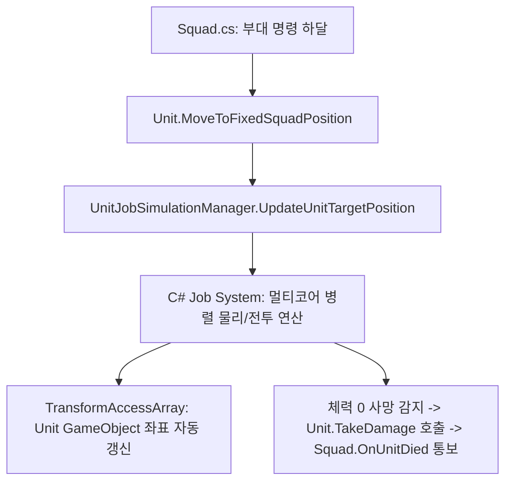

# 💂 [Unit.cs] 개별 3D 유닛 라이프사이클 & 상태 가이드

> **원본 소스 파일**: [Unit.cs](file:///c:/unityProject/MiniTotalWar2D/Assets/Scripts/Unit.cs) (총 줄 수: 약 650줄)

---

## 💡 1. 핵심 요약 & 역할
전장의 개별 3D 병사 인스턴스로, 체력/사망 처리, 부대 소속 슬롯 매핑, 선택 시 시각적 하이라이트(Projector), 그리고 무거운 물리 및 전투 연산을 **`UnitJobSimulationManager`에 위임하고 결과를 반영하는 3D 표현체** 역할을 수행합니다.

---

## 🌳 2. 아키텍처 트리 맵 (Architecture Tree Map)

- 📁 **1. 생명주기 및 시스템 등록 (Lifecycle & Registration)**
  - `Awake()`: 컴포넌트 초기화 및 NavMeshAgent 설정
  - `Start()`: `UnitJobSimulationManager`에 유닛 등록 (`RegisterUnit`)
  - `OnDestroy()`: 매니저에서 등록 해제 (`UnregisterUnit`)
- 📁 **2. 부대 대형 및 슬롯 연동 (Squad Formation Slots)**
  - `SetGridPosition()`, `SetGridIndices()`: 부대 내 행(Row)과 열(Col) 인덱스 설정
  - `SetInitialFormationPosition()`: 생성 시 초기 슬롯 좌표 및 오프셋 지정
  - `MoveToFixedSquadPosition()`: 부대 이동 명령 시 목표 좌표 갱신
  - `UpdateTargetPosition()`: 실시간 슬롯 좌표 및 회전 동기화
- 📁 **3. 단독 지휘 및 자유 유닛 이동 (Standalone Free Unit Commands)**
  - `MoveTo()`: 단독 단순 이동
  - `AttackMoveTo()`: 단독 공격 이동
  - `SetRunMode()`: 달리기/걷기 모드 및 속도 설정
- 📁 **4. 전투 및 상태 처리 (Combat & Health)**
  - `TakeDamage()`: 체력 차감, 사망 시 부대 알림(`OnUnitDied`) 및 오브젝트 정리
  - `SetSelected()`: 선택 표시 데칼/프로젝터 활성화/비활성화

---

## 🗂️ 3. 해시 테이블 메서드 색인표 (Method Fast-Index Table)

> ⚡ **에이전트 지침**: 코드 수정 전 아래 색인표에서 줄 번호 링크를 확인하고, `view_file`로 해당 범위만 직접 조회하여 작업하십시오.

| 메서드 (Key) | 반환형 / 파라미터 | 핵심 역할 & 기능 요약 (Value) | 호출자 (Callers) | 소스 줄 번호 (Line Range) |
| :--- | :--- | :--- | :--- | :--- |
| `SetInitialFormationPosition` | `void (squad, pos, offset, idx, r, c)` | 부대 생성 시 초기 슬롯 좌표와 격자 인덱스 배정 | `Squad.Awake` | [Unit.cs#L79-L101](file:///c:/unityProject/MiniTotalWar2D/Assets/Scripts/Unit.cs#L79-L101) |
| `Start` | `void ()` | Job System 시뮬레이션 매니저에 유닛 등록 | Unity Engine | [Unit.cs#L137-L150](file:///c:/unityProject/MiniTotalWar2D/Assets/Scripts/Unit.cs#L137-L150) |
| `MoveToFixedSquadPosition` | `void (squad, pos, offset, idx, rot, state)` | 부대 이동 명령 시 슬롯 목표 좌표 및 상태 전달 | `Squad.AssignFormation` | [Unit.cs#L428-L462](file:///c:/unityProject/MiniTotalWar2D/Assets/Scripts/Unit.cs#L428-L462) |
| `SetSelected` | `void (bool selected)` | 유닛 선택 시 녹색/청색 선택 링 하이라이트 토글 | `PlayerController` | [Unit.cs#L504-L533](file:///c:/unityProject/MiniTotalWar2D/Assets/Scripts/Unit.cs#L504-L533) |
| `TakeDamage` | `void (float amount)` | 피격 데미지 적용 및 체력 0 이하 시 사망 처리 | `UnitJobSimulationManager` | [Unit.cs#L535-L549](file:///c:/unityProject/MiniTotalWar2D/Assets/Scripts/Unit.cs#L535-L549) |
| `AttackMoveTo` | `void (Vector3 targetPos)` | 자유 유닛 개별 어택땅 명령 | `PlayerController` | [Unit.cs#L611-L635](file:///c:/unityProject/MiniTotalWar2D/Assets/Scripts/Unit.cs#L611-L635) |

---

## 🔀 4. 유향 그래프 흐름도 (Data & Call Flow Graph)

