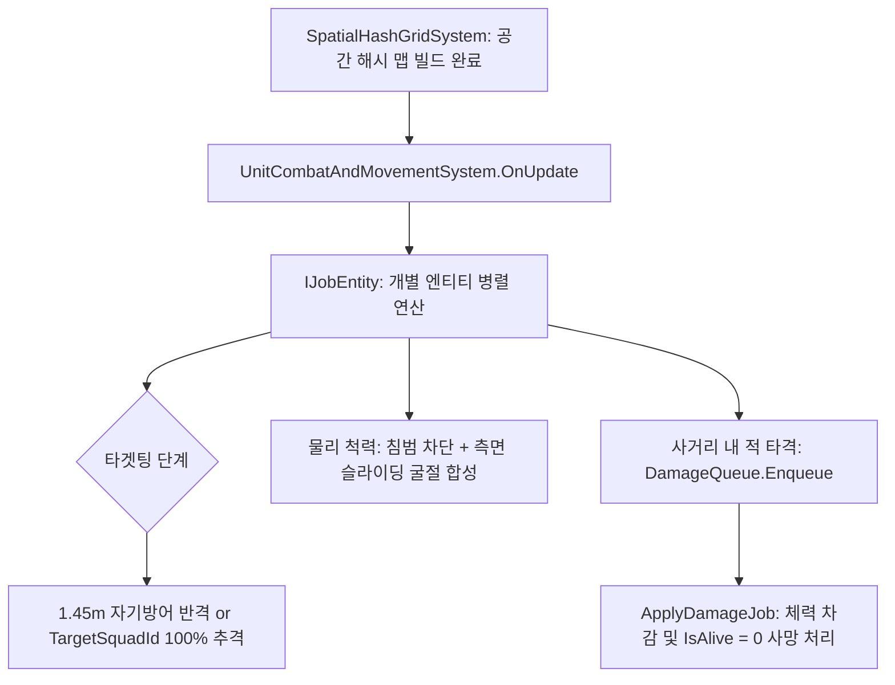

# ⚡ [UnitCombatAndMovementSystem.cs] Pure ECS 이동 & 전투 시스템 가이드

> **원본 소스 파일**: [UnitCombatAndMovementSystem.cs](file:///c:/unityProject/MiniTotalWar2D/Assets/Scripts/ECS/Systems/UnitCombatAndMovementSystem.cs) (총 줄 수: 594줄), [UnitECSComponents.cs](file:///c:/unityProject/MiniTotalWar2D/Assets/Scripts/ECS/Components/UnitECSComponents.cs) (총 줄 수: 81줄)

---

## 💡 1. 핵심 요약 & 역할
수만 명($1,200 \sim 50,000$기)의 초대규모 군단을 150~220+ FPS로 초고속 시뮬레이션하는 **순수 ECS(Pure ECS) 모드의 핵심 시스템**으로, 공간 해시 그리드(Spatial Hash Grid) 기반 타겟팅, 넉백/백병전 타격 판정 및 NativeQueue 기반 병렬 데미지 처리를 총괄합니다.

---

## 🌳 2. 아키텍처 트리 맵 (Architecture Tree Map)

- 📁 **1. 시스템 수명주기 및 쿼리 (System Lifecycle & Query)**
  - `OnCreate()`: 시스템 초기화, 컴포넌트 룩업 및 공간 쿼리 캐싱
  - `OnUpdate()`: 매 프레임 병렬 Job 스케줄링 및 데미지 일괄 적용
- 📁 **2. 순수 ECS 데이터 구조체 (`UnitECSComponents.cs`)**
  - `UnitEntityTag`: 진영(`Faction`), 소속부대(`SquadId`), 생존(`IsAlive`), 격자 인덱스(`Row`, `Col`, `SlotIndex`)
  - `UnitMovementData`: 위치(`Position`), 회전(`Rotation`), 속도(`Velocity`), 목표좌표(`TargetPosition`), 가속도(`Acceleration`)
  - `UnitCombatData`: 체력(`CurrentHp`), 공격력(`Damage`), 넉백속도(`KnockbackVelocity`), 질량(`Mass`), 목표적부대(`TargetSquadId`)
  - `UnitSeparationData`: 개인 척력 반경(`PersonalRadius`), 누적 척력(`SeparationForce`)
  - `DamageEvent`: 병렬 스레드 간 충돌/피격 데미지 큐 이벤트 구조체
- 📁 **3. 병렬 연산 파이프라인 (Execution Pipeline)**
  - 📂 3.1. 공간 해시 타겟팅 (Spatial Hash Targeting)
    - 지정 목표 부대(`TargetSquadId`) 최우선 100% 격리 탐색
    - 1.45m 코앞 근접 적 우선 자기방어 반격
    - 12m 공간 그리드 요격 및 자유유닛 전역 탐색
  - 📂 3.2. 상태 전이 및 속도 제어 (State & Movement)
    - 단순 이동(Move=1) 시 교전 즉시 이탈
    - 공격 이동(AttackMove=2) 시 200명 전원 쇄도
    - 선회 5도 불감대 및 가속도 보간
  - 📂 3.3. 물리 척력 및 틈새 슬라이딩 (Separation & Deflection)
    - 전방 침범 100% 차단 (유닛 겹침 Stacking 방지)
    - 측면 굴절 벡터(Deflection) 합성으로 틈새 전진
  - 📂 3.4. 백병전 타격 판정 (Melee Damage Enqueue)
    - 돌격 보너스 및 넉백 물리량 계산 후 `DamageQueue` Enqueue
  - 📂 3.5. 데미지 적용 Job (`ApplyDamageJob`)
    - 메인 스레드 안전 데미지 차감 및 체력 0 이하 시 사망 처리 (`IsAlive = 0`)

---

## 🗂️ 3. 해시 테이블 메서드 및 구조체 색인표 (Fast-Index Table)

> ⚡ **에이전트 지침**: 코드 수정 전 아래 색인표에서 줄 번호 링크를 확인하고, `view_file`로 해당 범위만 직접 조회하여 작업하십시오.

| 식별자 (Key) | 종류 / 반환형 | 핵심 역할 & 기능 요약 (Value) | 실행 단계 | 소스 줄 번호 (Line Range) |
| :--- | :--- | :--- | :--- | :--- |
| `DamageEvent` | `struct` | 피격 대상 엔티티, 데미지, 넉백 방향/속도 데이터 | 전체 시스템 공유 | [UnitCombatAndMovementSystem.cs#L11-L18](file:///c:/unityProject/MiniTotalWar2D/Assets/Scripts/ECS/Systems/UnitCombatAndMovementSystem.cs#L11-L18) |
| `OnCreate` | `void (ref state)` | 컴포넌트 룩업 및 엔티티 쿼리 초기화 | 시스템 생성 시 | [UnitCombatAndMovementSystem.cs#L28-L38](file:///c:/unityProject/MiniTotalWar2D/Assets/Scripts/ECS/Systems/UnitCombatAndMovementSystem.cs#L28-L38) |
| `OnUpdate` | `void (ref state)` | 공간 맵 빌드 대기, IJobEntity 및 ApplyDamageJob 실행 | 매 프레임 | [UnitCombatAndMovementSystem.cs#L40-L77](file:///c:/unityProject/MiniTotalWar2D/Assets/Scripts/ECS/Systems/UnitCombatAndMovementSystem.cs#L40-L77) |
| `Execute` | `void (entity, tag, mov, combat, sep)` | 개별 엔티티의 타겟팅, 이동, 슬라이딩, 전투 판정 일괄 실행 | `IJobEntity` 병렬 스레드 | [UnitCombatAndMovementSystem.cs#L92-L554](file:///c:/unityProject/MiniTotalWar2D/Assets/Scripts/ECS/Systems/UnitCombatAndMovementSystem.cs#L92-L554) |
| `ApplyDamageJob` | `struct : IJob` | NativeQueue에 누적된 데미지 이벤트를 소비하여 체력 차감 및 사망 처리 | `IJob` 단일 스레드 | [UnitCombatAndMovementSystem.cs#L558-L588](file:///c:/unityProject/MiniTotalWar2D/Assets/Scripts/ECS/Systems/UnitCombatAndMovementSystem.cs#L558-L588) |

---

## 🔀 4. 유향 그래프 흐름도 (Data & Call Flow Graph)

---

## ⚙️ 5. 핵심 ECS 컴포넌트 명세 (`UnitECSComponents.cs`)

| 컴포넌트 | 주요 필드 | 설명 |
| :--- | :--- | :--- |
| `UnitEntityTag` | `Faction`, `SquadId`, `IsFreeUnit`, `IsAlive`, `SlotIndex`, `Row`, `Col` | 진영(아군 1/적군 0), 소속 부대 ID, 생존 상태, 진형 슬롯 격자 좌표 |
| `UnitMovementData` | `Position`, `Rotation`, `Velocity`, `TargetPosition`, `MoveSpeed`, `CurrentSpeed` | 월드 좌표, 쿼터니언 회전, 현재 이동 속도 및 부대 지정 목표 좌표 |
| `UnitCombatData` | `CurrentHp`, `MaxHp`, `Damage`, `AttackCooldown`, `TargetSquadId`, `KnockbackVelocity` | 전투 능력치, 쿨다운 타이머, 지휘관 지정 목표 적 부대 ID, 넉백 벡터 |
| `UnitSeparationData` | `PersonalRadius`, `SeparationForce` | 충돌 반경(부대원 1.0m, 자유유닛 1.15m), 주변 유닛 밀어내기 척력 벡터 |
