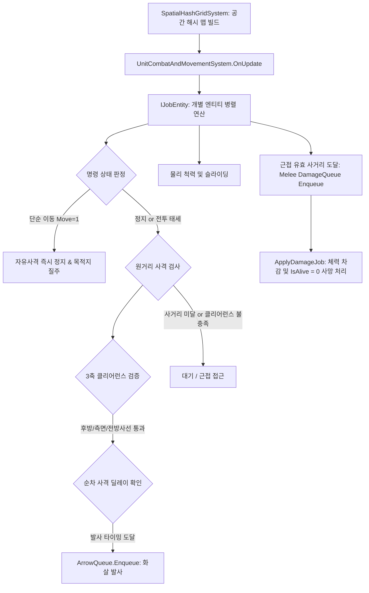

# ⚡ [UnitCombatAndMovementSystem.cs] Pure ECS 이동 & 전투 시스템 가이드

> **원본 소스 파일**: [UnitCombatAndMovementSystem.cs](file:///c:/unityProject/MiniTotalWar2D/Assets/Scripts/ECS/Systems/UnitCombatAndMovementSystem.cs) (총 줄 수: 959줄), [UnitECSComponents.cs](file:///c:/unityProject/MiniTotalWar2D/Assets/Scripts/ECS/Components/UnitECSComponents.cs) (총 줄 수: 142줄)

---

## 💡 1. 핵심 요약 & 역할 (Summary & Role)
수만 명(1,200 ~ 50,000기)의 초대규모 군단을 150~220+ FPS로 초고속 시뮬레이션하는 **순수 ECS(Pure ECS) 모드의 핵심 시스템**입니다. 공간 해시 그리드(Spatial Hash Grid) 기반 타겟팅, 넉백/백병전 타격 판정(1.45m 유효 사거리), 원거리 무기 3축 클리어런스(후방 백스윙 공간, 측면 간격, 전방 사선/언덕 경사면 여유고) 및 순차 사격(Rolling Volley), NativeQueue 기반 병렬 데미지 처리를 총괄합니다.

---

## 🌳 2. 아키텍처 트리 맵 (Tree Map)

- 📁 **1. 시스템 수명주기 및 쿼리 (System Lifecycle & Query)**
  - `OnCreate()`: 시스템 초기화, 컴포넌트 룩업 및 공간 쿼리 캐싱
  - `OnUpdate()`: 매 프레임 병렬 Job 스케줄링 및 데미지 일괄 적용
- 📁 **2. 순수 ECS 데이터 구조체 (`UnitECSComponents.cs`)**
  - `UnitEntityTag`: 진영(`Faction`), 소속부대(`SquadId`), 생존(`IsAlive`), 격자 인덱스(`Row`, `Col`, `SlotIndex`)
  - `UnitMovementData`: 위치(`Position`), 회전(`Rotation`), 속도(`Velocity`), 목표좌표(`TargetPosition`), 가속도(`Acceleration`)
  - `UnitCombatData`: 체력(`CurrentHp`), 공격력(`Damage`), 넉백속도(`KnockbackVelocity`), 질량(`Mass`), 목표적부대(`TargetSquadId`), 타겟위치캐시(`CachedEnemyPos`), 탐색타이머(`TargetSearchTimer`), 3축 클리어런스 및 순차사격 필드
  - `UnitSeparationData`: 개인 척력 반경(`PersonalRadius`), 누적 척력(`SeparationForce`)
  - `DamageEvent`: 병렬 스레드 간 충돌/피격 데미지 큐 이벤트 구조체
- 📁 **3. 병렬 연산 파이프라인 (Execution Pipeline)**
  - 📂 3.1. 공간 해시 타겟팅 및 0.1초 주기화 캐싱 (Targeting & 10Hz Staggered Cache)
    - 0.1초 주기(`TargetSearchTimer >= 0.1f`)로만 전체 유닛/부대 맵을 탐색하여 `CachedEnemyPos` 갱신
    - 0.1초 사이 프레임은 무거운 순회 루프 100% 생략(Skip) 후 캐시 위치 즉시 사용
    - 지정 목표 부대(`TargetSquadId`) 최우선 100% 격리 탐색
    - 정면 축 우선 1:1 정렬 타겟팅(`Frontal Alignment Scoring`): 횡방향 편차 페널티를 부여하여 내 정면 적 우선 락온
    - 1.45m 코앞 근접 적 우선 자기방어 반격
    - 30m 공간 그리드 요격 및 자유유닛 전역 탐색
  - 📂 3.2. 상태 전이 및 속도 제어 (State & Movement)
    - 단순 이동(Move=1) 시 교전 즉시 이탈 및 목적지 최우선 질주
    - 🏹 원거리 자유사격 이동 보장: 단순 이동 명령(`Move = 1`) 수행 중 목적지 미도달(`distToDest > stoppingDistance`) 시 사격을 엄격히 금지하고 이동 우선 보장. 목적지 도착 정지 시 자유사격 재개.
    - 공격 이동(AttackMove=2) 시 2단계 메커니즘:
      - 3.0m 밖: `TargetPosition`(방진 슬롯)을 유지하며 방패벽 대열 유지 평행 돌격
      - 3.0m 이내 / 백병전: `enemyPos`를 향해 슬롯을 풀고 적진으로 쇄도하여 난전 개시
    - 선회 5도 불감대, 가속도 보간 및 `RotateTowards` 쿼터니언 항시 정규화(`math.normalize`) 보장
  - 📂 3.3. 원거리 사격 및 3축 클리어런스 판정 (Ranged Combat & 3-Axis Clearance)
    - 🚨 백병전 교전 중(`CurrentState == 3`)이거나 5m 이내 적 진입 시 사격 100% 금지
    - 📐 3축 클리어런스 검증:
      - 1) 후방 공간: 최후열이거나 견착 무기(`MinRearSpacing == 0`), 또는 부대 세로 간격 충족 시 통과
      - 2) 측면 공간: 부대 가로 간격이 `MinLateralSpacing` 충족 시 통과
      - 3) 전방 사선 & 언덕 경사면: 1열 통과, 체커보드 2열 틈새 직사 통과, 3열 이상은 `slopeDy + elevationDy >= HeadClearanceMargin` 충족 시 통과
    - ⏱️ 순차 사격(Rolling Volley): `EnableSequentialFire` 활성화 시 행 인덱스 기반 `tag.Row * SequentialRowDelay` 시간차 발사
    - 🏹 일제사격 탄도학: 전방 적 백병전 시에만 고각 곡사(`hasAlly = 1`), 기준 탄도 공유 + 사수 행(`tag.Row`)당 약 1.2도 미세 분산(Rank Offset)
  - 📂 3.4. 물리 척력 및 틈새 슬라이딩 (Separation & Deflection)
    - 전방 침범 100% 차단 (유닛 겹침 Stacking 방지)
    - 측면 굴절 벡터(Deflection) 합성으로 틈새 전진
  - 📂 3.5. 백병전 타격 판정 (Melee Damage Enqueue)
    - 돌격 보너스 및 넉백 물리량 계산 후 `DamageQueue` Enqueue
  - 📂 3.6. 데미지 적용 Job (`ApplyDamageJob`)
    - 메인 스레드 안전 데미지 차감 및 체력 0 이하 시 사망 처리 (`IsAlive = 0`)

---

## 🗂️ 3. 해시 테이블 메서드 및 구조체 색인표 (Hash Table Index)

| 식별자 (Key) | 종류 / 반환형 | 핵심 역할 & 기능 요약 (Value) | 실행 단계 | 소스 줄 번호 (Line Range) |
| :--- | :--- | :--- | :--- | :--- |
| `DamageEvent` | `struct` | 피격 대상 엔티티, 데미지, 넉백 방향/속도 데이터 | 전체 시스템 공유 | [UnitCombatAndMovementSystem.cs#L11-L18](file:///c:/unityProject/MiniTotalWar2D/Assets/Scripts/ECS/Systems/UnitCombatAndMovementSystem.cs#L11-L18) |
| `OnCreate` | `void (ref state)` | 컴포넌트 룩업 및 엔티티 쿼리 초기화 | 시스템 생성 시 | [UnitCombatAndMovementSystem.cs#L28-L38](file:///c:/unityProject/MiniTotalWar2D/Assets/Scripts/ECS/Systems/UnitCombatAndMovementSystem.cs#L28-L38) |
| `OnUpdate` | `void (ref state)` | 공간 맵 빌드 대기, IJobEntity 및 ApplyDamageJob 실행 | 매 프레임 | [UnitCombatAndMovementSystem.cs#L40-L77](file:///c:/unityProject/MiniTotalWar2D/Assets/Scripts/ECS/Systems/UnitCombatAndMovementSystem.cs#L40-L77) |
| `Execute` | `void (entity, tag, mov, combat, sep)` | 개별 엔티티의 타겟팅, 이동, 사격 클리어런스, 슬라이딩, 전투 판정 일괄 실행 | `IJobEntity` 병렬 스레드 | [UnitCombatAndMovementSystem.cs#L92-L610](file:///c:/unityProject/MiniTotalWar2D/Assets/Scripts/ECS/Systems/UnitCombatAndMovementSystem.cs#L92-L610) |
| `ApplyDamageJob` | `struct : IJob` | NativeQueue에 누적된 데미지 이벤트를 소비하여 체력 차감 및 사망 처리 | `IJob` 단일 스레드 | [UnitCombatAndMovementSystem.cs#L615-L645](file:///c:/unityProject/MiniTotalWar2D/Assets/Scripts/ECS/Systems/UnitCombatAndMovementSystem.cs#L615-L645) |

---

## 🔀 4. 유향 그래프 흐름도 (Directed Graph - Mermaid)

```mermaid
flowchart TD
    A[SpatialHashGridSystem: 공간 해시 맵 빌드] --> B[UnitCombatAndMovementSystem.OnUpdate]
    B --> C[IJobEntity: 개별 엔티티 병렬 연산]
    C --> D{명령 상태 판정}
    D -->|단순 이동 Move=1| E[자유사격 즉시 정지 & 목적지 질주]
    D -->|정지 or 전투 태세| F{원거리 사격 검사}
    F --> G{3축 클리어런스 검증}
    G -->|후방/측면/전방사선 통과| H{순차 사격 딜레이 확인}
    H -->|발사 타이밍 도달| I[ArrowQueue.Enqueue: 화살 발사]
    F -->|사거리 미달 or 클리어런스 불충족| J[대기 / 근접 접근]
    C --> K[물리 척력 및 슬라이딩]
    C --> L[근접 유효 사거리 도달: Melee DamageQueue Enqueue]
    L --> M[ApplyDamageJob: 체력 차감 및 IsAlive = 0 사망 처리]
```

---

## ⚙️ 5. 주요 상태 변수, 데이터 구조체 & 인스펙터 옵션 (State, Structs & Inspector Fields)

### `UnitCombatData` 컴포넌트 (`UnitECSComponents.cs`)
| 필드명 | 타입 | 기본값 | 상세 역할 |
| :--- | :--- | :--- | :--- |
| `MinRearSpacing` | `float` | 0.8m / 0.0m | 후방 최소 필요 거리. 활(0.8m)/투창(1.0m)은 후방 공간 필요, 쇠뇌/총(0.0m)은 밀착 허용 |
| `MinLateralSpacing` | `float` | 0.75m | 측면 최소 필요 거리. 활 시위 및 사격 자세를 위한 좌우 대형 간격 |
| `HeadClearanceMargin` | `float` | 0.45m | 전열 머리 위 안전 여유 고도. 사선 클리어런스 기준선 |
| `AllowStaggeredRank2DirectFire` | `int` | 1 | 체커보드(엇갈림) 대형 시 2열의 전방 1열 사이 틈새 직사 허용 여부 (1=허용, 0=불허) |
| `EnableSequentialFire` | `int` | 1 | 순차 사격(Rolling Volley) 활성화 여부 (1=On, 0=Off) |
| `SequentialRowDelay` | `float` | 0.4초 | 순차 사격 시 행(Row)간 발사 지연 시간 |
| `SquadSpacingX` | `float` | 1.0m | 소속 부대 가로 실효 간격 (`spacingX * widthMultiplier`) |
| `SquadSpacingZ` | `float` | 1.0m | 소속 부대 세로 실효 간격 (`spacingZ * lengthMultiplier`) |
| `TotalRows` | `int` | 1 | 소속 부대 총 행(Row) 수 (최후열 판정용) |
| `IsStaggeredFormation` | `int` | 0 / 1 | 부대 체커보드 대형 적용 여부 (1=적용, 0=완전 직렬) |

---

## 🛠️ 6. 핵심 알고리즘, 물리/전투 수학 공식 & 조작법 (Algorithms, Math & Controls)

### 1) 3축 공간 및 사선 클리어런스 (3-Axis Clearance Algorithm)
- **후방 공간 검사 (Rear)**:
  `isBackRow = (tag.Row >= combat.TotalRows - 1)`
  `rearClear = isBackRow || (combat.MinRearSpacing <= 0.01f) || (combat.SquadSpacingZ >= combat.MinRearSpacing)`
- **측면 공간 검사 (Lateral)**:
  `lateralClear = (combat.MinLateralSpacing <= 0.01f) || (combat.SquadSpacingX >= combat.MinLateralSpacing)`
- **전방 사선 및 언덕 경사면 검사 (Front LoS & Hill Slope)**:
  - 1열 (`tag.Row == 0`): 무조건 통과 (`frontClear = true`)
  - 체커보드 2열 (`tag.Row == 1 && IsStaggered == 1 && AllowStaggeredRank2 == 1`): 틈새 직사 통과 (`frontClear = true`)
  - 3열 이상 또는 직렬 2열:
    - 사수와 1열 간격: `distToFront = tag.Row * math.max(0.5f, combat.SquadSpacingZ)`
    - 언덕 지면 고도 우위: `slopeDy = (currentPos.y - enemyPos.y) * (distToFront / distToEnemy)`
    - 탄도 앙각 고도 상승치: `elevationDy = distToFront * math.tan(baseAngle)`
      - 곡사(`TrajectoryMode == 1`): `baseAngle = math.lerp(0.26f, 0.61f, distRatio)` (약 15° ~ 35°)
      - 직사(`TrajectoryMode == 0`): `baseAngle = 0.035f` (약 2°)
    - 총 사선 여유고: `totalClearance = slopeDy + elevationDy`
    - 통과 조건: `frontClear = (totalClearance >= combat.HeadClearanceMargin)`

### 2) 순차 사격 (Rolling Volley) 타이밍 공식
- 각 행별 발사 지연 오프셋: `rowTimingOffset = (combat.EnableSequentialFire == 1) ? (tag.Row * combat.SequentialRowDelay) : 0f`
- 발사 가능 시각: `CurrentTime >= combat.LastRangedAttackTime + combat.RangedAttackCooldown + rowTimingOffset`
- 발사 시 갱신: `combat.LastRangedAttackTime = CurrentTime - rowTimingOffset` (부대 전체 기준 주기 동기화)

---

## 🔗 7. 다른 스크립트와의 연동 관계 (Dependencies & Pipeline)

- **[Unit.cs](file:///c:/unityProject/MiniTotalWar2D/Assets/Scripts/Unit.cs)**: 유닛 프리팹의 원거리 3축 클리어런스 인스펙터 필드 정의
- **[Squad.cs](file:///c:/unityProject/MiniTotalWar2D/Assets/Scripts/Squad.cs)**: 부대 순차 사격 토글(`enableSequentialFire`), 행간 딜레이(`sequentialRowDelay`) 및 실효 간격 동기화
- **[SquadECSSimulationBridge.cs](file:///c:/unityProject/MiniTotalWar2D/Assets/Scripts/ECS/SquadECSSimulationBridge.cs)**: 부대 상태 변경 시 ECS 엔티티의 `UnitCombatData` 버퍼로 10개 클리어런스 파라미터 실시간 전달
- **[UnitJobSimulationManager.cs](file:///c:/unityProject/MiniTotalWar2D/Assets/Scripts/UnitJobSimulationManager.cs)**: GameObject ⇄ Pure ECS 듀얼 모드 간 100% 동일한 연산 공식 공유
- **[ArrowSimulationManager.cs](file:///c:/unityProject/MiniTotalWar2D/Assets/Scripts/ArrowSimulationManager.cs)**: `ArrowQueue`에서 Enqueue된 화살 발사 커맨드를 받아 GPU 인스턴싱 투사체 시뮬레이션 수행
