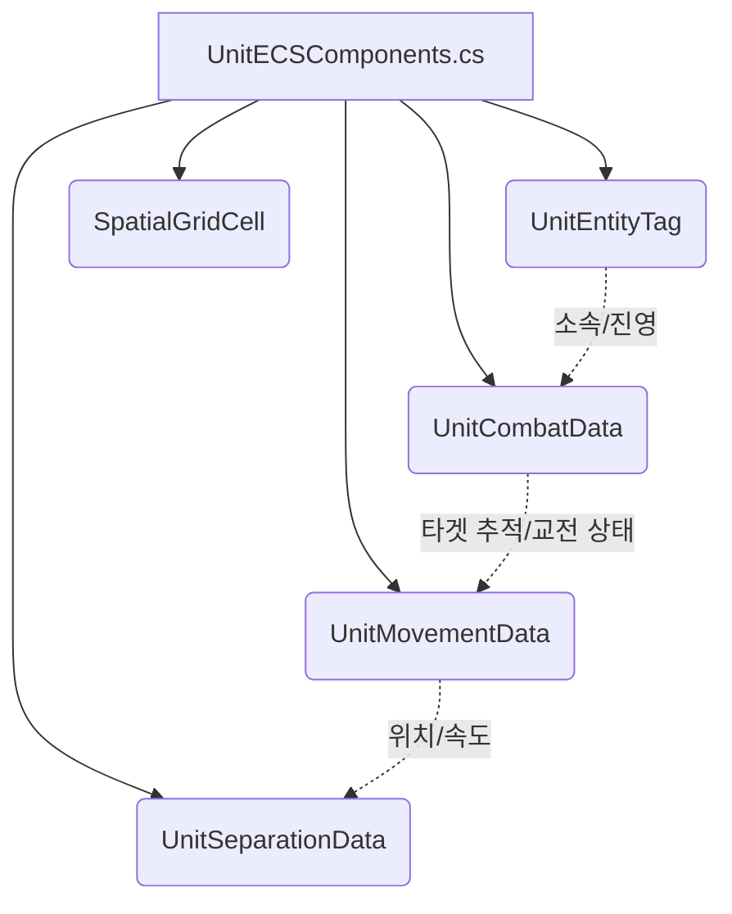
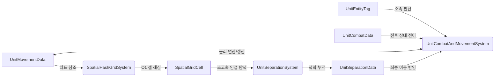

# 💡 UnitECSComponents.cs 핵심 요약 & 역할 (Summary & Role)

순수 ECS 기반 토탈워 전투 시뮬레이션을 구현하기 위해 필요한 핵심 데이터(Data Components) 구조체들을 정의하는 파일입니다. 이 컴포넌트들은 Unity ECS의 `IComponentData`를 상속받아 메모리 상에 연속적으로 배치(Contiguous Memory)되며, Burst Compiler와 Job System에 의해 멀티스레드 환경에서 초고속으로 접근 및 처리됩니다. 부대 식별, 이동 상태, 전투 능력치, 공간 분할 해시 셀, 척력(Separation) 데이터 등을 포함합니다.

## 🌳 1. 아키텍처 트리 맵 (Tree Map)

## 🗂️ 2. 해시 테이블 메서드/구조체 색인표 (Hash Table Index)

| Key (구조체) | Value (역할 및 특성) | Source |
| :--- | :--- | :--- |
| `UnitEntityTag` | 유닛의 진영, 소속 부대, 생존 여부 등 불변/상태성 식별 태그 | `UnitECSComponents.cs` |
| `UnitMovementData` | 유닛의 위치, 회전, 속도, 목표 위치 및 가속도 물리 데이터 | `UnitECSComponents.cs` |
| `UnitCombatData` | 체력, 데미지, 공격 범위, 교전 상태, 지정 목표 부대 등 전투 데이터 | `UnitECSComponents.cs` |
| `UnitSeparationData` | 유닛 겹침 방지용 개인 반경 및 누적 척력(Separation Force) 벡터 | `UnitECSComponents.cs` |
| `SpatialGridCell` | 공간 해시 그리드(Spatial Hash Grid) 최적화를 위한 셀 해시 및 좌표 | `UnitECSComponents.cs` |

## 🔀 3. 유향 그래프 흐름도 (Directed Graph - Mermaid)

## ⚙️ 4. 주요 상태 변수, 데이터 구조체 & 인스펙터 옵션 (State, Structs & Inspector Fields)

*   **`UnitEntityTag`**
    *   `int Faction`: 진영 구분 (1 = 아군, 0 = 적군)
    *   `int SquadId`: 소속 부대의 고유 ID (GameObject의 `GetInstanceID()`)
    *   `int IsFreeUnit`: 1 = 대열을 무시하는 자유 유닛, 0 = 방패벽 방진 유닛
    *   `int IsAlive`: 1 = 생존, 0 = 사망
*   **`UnitMovementData`**
    *   `float3 TargetPosition`: 부대 슬롯 또는 적군 추격 목표 좌표
    *   `int IsCharging`: 1 = 목표를 향해 돌격 중(4.8m/s 가속), 0 = 일반 이동
*   **`UnitCombatData`**
    *   `int CurrentState`: 현재 유닛의 전투 AI 상태 머신 (0=Idle, 1=Move, 2=AttackMove, 3=MeleeEngaged)
    *   `Entity TargetEntity`: 유닛이 현재 고정(Lock-on)하여 추격/반격 중인 대상 적의 엔티티
    *   `int TargetSquadId`: 부대 차원에서 지휘관이 락온(CommandAttackSquad)한 목표 적 부대의 ID
*   **`UnitSeparationData`**
    *   `float PersonalRadius`: 충돌 반경 (일반: 1.0m, 자유: 1.15m)

## 🛠️ 5. 핵심 알고리즘, 물리/전투 수학 공식 & 조작법 (Algorithms, Math & Controls)

*   **구조체의 정렬(Alignment) 및 메모리 레이아웃**: 모든 ECS 데이터 구조체는 `IComponentData`를 구현하는 `Blittable` 타입(값 타입)으로 구성되어, Archetype Chunk 내에 캐시 라인(Cache Line) 적중률을 극대화합니다.
*   **Boolean 최적화**: 메모리 패킹 및 Burst Compiler의 벡터화(SIMD) 효율을 높이기 위해 `bool` 대신 `int` (1/0)을 사용하여 `IsAlive`, `IsCharging` 등의 플래그를 관리합니다.

## 🔗 6. 다른 스크립트와의 연동 관계 (Dependencies & Pipeline)

*   **`SquadECSSimulationBridge.cs`**: GameObject 기반 부대 지휘 스크립트(`Squad.cs`)에서 발생한 명령(명령 상태, 목표 위치, TargetSquadId 등)을 ECS의 컴포넌트(`UnitMovementData`, `UnitCombatData`)로 주입(Injection)하는 브릿지 역할을 합니다.
*   **`UnitCombatAndMovementSystem.cs`**: 이 컴포넌트들을 읽어들여 실제 전투 알고리즘, 이동, 돌격, 타겟 유지 로직을 병렬로 연산합니다.
