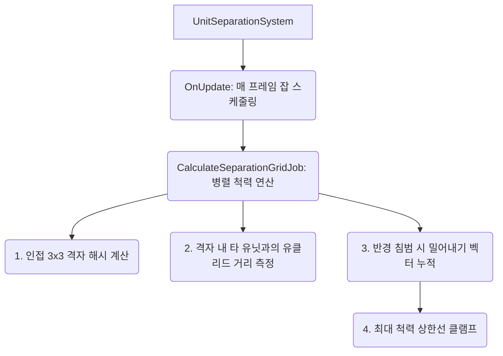
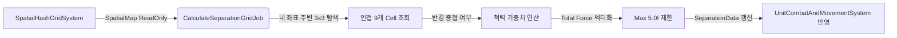

# 💡 UnitSeparationSystem.cs 핵심 요약 & 역할 (Summary & Role)

ECS 환경에서 수만 기의 유닛이 하나의 점(Target)으로 모여들 때 모델들이 겹치는 현상(Overlapping)을 방지하는 군중 척력(Crowd Separation) 물리 시스템입니다. Boids 알고리즘의 Separation 요소를 고도로 최적화한 형태로, `SpatialHashGridSystem`이 제공하는 공간 맵(`SpatialMap`)을 활용하여 O(1) 속도로 인접 3x3 셀(9개 타일)만을 검색해 겹침 정도에 따른 반발력 벡터를 계산합니다.

## 🌳 1. 아키텍처 트리 맵 (Tree Map)



## 🗂️ 2. 해시 테이블 메서드/구조체 색인표 (Hash Table Index)

| Key (구조체) | Value (역할 및 특성) | Source |
| :--- | :--- | :--- |
| `UnitSeparationSystem` | 매 프레임 해시 맵핑 이후 실행되어 `CalculateSeparationGridJob`을 스케줄링 | `UnitSeparationSystem.cs` |
| `CalculateSeparationGridJob` | 3x3 셀을 탐색하여 자신과 반경이 겹치는 유닛들을 서로 밀어내는 벡터 누적 | `UnitSeparationSystem.cs` |

## 🔀 3. 유향 그래프 흐름도 (Directed Graph - Mermaid)



## ⚙️ 4. 주요 상태 변수, 데이터 구조체 & 인스펙터 옵션 (State, Structs & Inspector Fields)

*   **`float myRadius` / `targetRadius`**: 충돌 검사 반경. 자유 유닛은 1.15m, 일반 방진 유닛은 1.00m를 사용합니다.
*   **`float3 totalSep`**: 누적된 최종 반발력 벡터입니다. (이동 벡터에 더해져 부드럽게 유닛을 밀어냅니다)
*   **동일 부대 아군 예외 반경 (`0.65f`)**: 만약 같은 부대(SquadId) 소속의 아군이라면 척력 반경을 0.65m로 크게 완화하여 방패벽 진형이 서로 빽빽하게 파고들고 결집할 수 있도록 허용합니다.

## 🛠️ 5. 핵심 알고리즘, 물리/전투 수학 공식 & 조작법 (Algorithms, Math & Controls)

*   **침투 깊이 비례 반발력 (Penetration Boost)**:
    ```csharp
    float overlap = targetRadius - dist;
    float penetrationBoost = 1.3f + (overlap * overlap * 25.0f);
    totalSep += (diff / dist) * (weight * penetrationBoost);
    ```
    단순한 선형 반발력이 아닌, 침투된 깊이(Overlap)의 제곱에 비례하여 기하급수적으로 강력하게 밀어내는 물리 저항(Restitution Force) 공식을 적용하여 유닛 겹침을 절대적으로 방어합니다.
*   **완전 중첩 시 특이점(Singularity) 해결**: 두 유닛이 0.001m 이내로 정확히 겹칠 경우 (Zero-Division 오류), 유닛의 `Entity.Index`를 활용하여 임의의 난수 각도를 생성해 인위적으로 사방으로 튕겨냅니다.

## 🔗 6. 다른 스크립트와의 연동 관계 (Dependencies & Pipeline)

*   이 시스템은 반드시 **`SpatialHashGridSystem`** 직후에 실행(`[UpdateAfter]`)되어 최신 `SpatialMap`을 보장받아야 합니다.
*   여기서 계산된 `SeparationForce` 데이터는 다음 단계인 **`UnitCombatAndMovementSystem`**에서 `desiredDir`에 합산되어 유닛의 최종 물리 이동 경로를 틀어버리게 됩니다.
