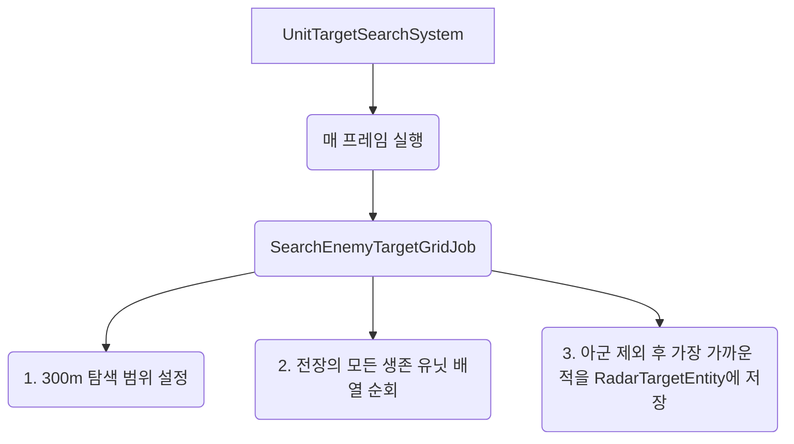

# 💡 UnitTargetSearchSystem.cs 핵심 요약 & 역할 (Summary & Role)

**이 시스템은 유닛의 "레이더(Radar)" 또는 "넓은 시야" 역할을 담당합니다.** 
방패를 맞대고 싸우는 1.45m 거리의 **"직접 교전(Melee Combat)"과는 별개로**, 300m(또는 그 이상의 DetectRange)라는 광활한 전장 범위 내에서 가장 가까운 적을 찾아내는 백그라운드 탐색 시스템입니다. 

🚨 **[중요한 과거 버그 및 구조적 최적화 내역]**
1. **타겟 덮어쓰기 분리**: 이전에는 레이더가 찾은 적을 근접 전투 타겟(`TargetEntity`)에 덮어씌워 유닛들이 바들거리며 산개하는 치명적 버그가 있었습니다. 현재는 레이더 전용 타겟(`RadarTargetEntity`)으로 완벽히 분리되었습니다.
2. **O(N) 전역 탐색으로 아키텍처 변경**: 기존에는 2.0m 단위의 좁은 격자(Spatial Grid)를 사용해 최대 12m까지만 탐색이 제한되어 원거리 적이 짤리는 현상이 있었습니다. 사용자님의 300m 전역 탐색 요청에 따라, 현재는 `AllAliveUnits` 배열을 직접 순회하는 **O(N) 전역 탐색 방식**으로 변경되었습니다. Burst Compiler의 병렬 최적화 덕분에 300m든 1000m든 성능 저하 없이 초고속으로 적을 찾아냅니다.

## 🌳 1. 아키텍처 트리 맵 (Tree Map)



## 🗂️ 2. 해시 테이블 메서드/구조체 색인표 (Hash Table Index)

| Key (구조체) | Value (역할 및 특성) | Source |
| :--- | :--- | :--- |
| `UnitTargetSearchSystem` | 전역 탐색 기반의 레이더망 시스템 스케줄러 | `UnitTargetSearchSystem.cs` |
| `SearchEnemyTargetGridJob` | `AllAliveUnits` 1차원 배열을 O(N)으로 병렬 순회하여 최단 거리의 적을 찾아내는 코어 잡 | `UnitTargetSearchSystem.cs` |

## 🔀 3. 유향 그래프 흐름도 (Directed Graph - Mermaid)

```mermaid
flowchart LR
    Map[SpatialHashGridSystem] -->|AllAliveUnits 전역 배열 제공| Job(SearchEnemyTargetGridJob)
    Job -->|Math.max(DetectRange, 300m)| Radius[기본 300m 광역 레이더 가동]
    Radius --> Search[전역 유닛 O_N 직렬 순회]
    Search --> Filter[아군, 시체 제외 -> 진짜 적군만 통과]
    Filter --> Math[가장 가까운 거리 계산]
    Math --> Target[RadarTargetEntity에 결과 저장]
```

## ⚙️ 4. 주요 상태 변수, 데이터 구조체 & 인스펙터 옵션 (State, Structs & Inspector Fields)

*   **`float radarRange`**: `DetectRange`와 `300.0f` 중 더 큰 값을 선택합니다. 유닛의 기본 시야가 좁더라도, 이 시스템을 통해 최소 300m 반경의 전장을 탐색할 수 있습니다.
*   **`float minSqrDist` (최소 거리 제곱)**: 탐색 시작 전 `radarRange`의 제곱 값으로 초기화됩니다. 300m 바깥에 있는 적은 거리 계산 결과에서 자동으로 도태되어 무시됩니다.
*   **`Entity RadarTargetEntity`**: 이 광역 레이더 시스템이 최종적으로 찾아낸 "전장 내 가장 가까운 적"의 정보가 저장되는 전용 변수입니다.

## 🛠️ 5. 핵심 알고리즘, 물리/전투 수학 공식 & 조작법 (Algorithms, Math & Controls)

*   **배열 기반 O(N) 전역 순회 (Array Iteration)**:
    과거에는 격자망(Grid)을 타고 넘어다녔기 때문에 넓은 범위를 찾을 때 오히려 연산량이 기하급수적으로 폭증하는 한계가 있었습니다. 이를 해결하기 위해 공간 해싱을 포기하고, 메모리에 일렬로 예쁘게 정렬된 `AllAliveUnits` 배열을 0번부터 끝까지 단순 반복문(`for`)으로 훑습니다. CPU 캐시 적중률(Cache Hit)이 극대화되어, 수백 미터 단위의 광역 탐색 시에는 이 방식이 압도적으로 빠릅니다.
*   **초고속 적군 필터링**: 
    `if (other.Entity == entity || other.Faction == myFaction) continue;`
    거리를 계산하기 전에 "나 자신"과 "같은 팀(아군)"은 즉시 패스합니다.

## 🔗 6. 다른 스크립트와의 연동 관계 (Dependencies & Pipeline)

*   **`UnitCombatAndMovementSystem.cs`와의 독립성**: 
    `RadarTargetEntity`를 사용하므로 근접 교전 시스템(`TargetEntity`)과 충돌하지 않습니다.
*   **`SpatialHashGridSystem.cs`에 대한 의존도 변경**:
    기존에는 `SpatialMap`에 의존했으나, 이제는 `AllAliveUnits` 배열만 제공받습니다. 향후 **궁수(Archer) 부대의 300m 장거리 자동 사격 레이더망**이나, 기병대의 우회 기동 AI를 만들 때 필수적인 광역 감지 기반으로 작동합니다.
